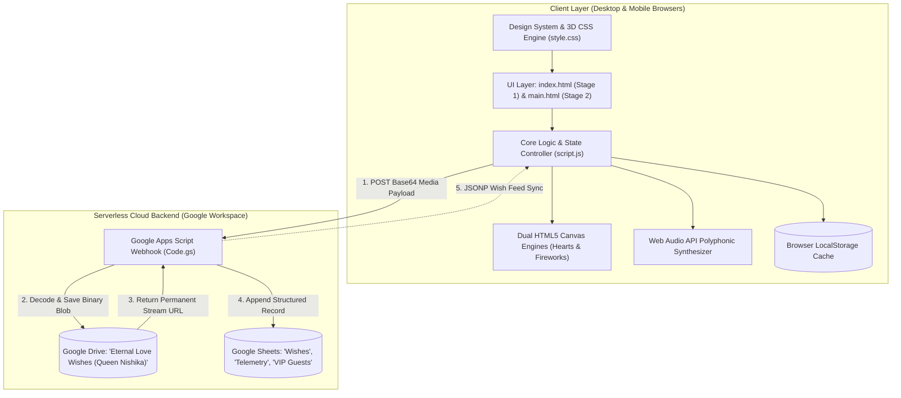

# 👑 Eternal Love — Ultra-Premium Romantic Birthday Celebration & QA Documentation

```
   ███████╗████████╗███████╗██████╗ ███╗   ██╗ █████╗ ██╗     ██╗      ██████╗ ██╗   ██╗███████╗
   ██╔════╝╚══██╔══╝██╔════╝██╔══██╗████╗  ██║██╔══██╗██║     ██║     ██╔═══██╗██║   ██║██╔════╝
   █████╗     ██║   █████╗  ██████╔╝██╔██╗ ██║███████║██║     ██║     ██║   ██║██║   ██║█████╗  
   ██╔══╝     ██║   ██╔══╝  ██╔══██╗██║╚██╗██║██╔══██║██║     ██║     ██║   ██║╚██╗ ██╔╝██╔══╝  
   ███████╗   ██║   ███████╗██║  ██║██║ ╚████║██║  ██║███████╗███████╗╚██████╔╝ ╚████╔╝ ███████╗
   ╚══════╝   ╚═╝   ╚══════╝╚═╝  ╚═╝╚═╝  ╚═══╝╚═╝  ╚═╝╚══════╝╚══════╝ ╚═════╝   ╚═══╝  ╚══════╝
```

> ### *A Celestial, Animated & Deeply Personalized Digital Experience Handcrafted with Infinite Love for Queen Nishika*

[](http://localhost:8080)
[](#-overview)
[](#-overview)
[-10b981?style=for-the-badge&logo=playwright&logoColor=white)](docs/testing/Test-Execution-Report.md)
[](#-technology-stack)
[](#-technology-stack)
[](docs/06-Database-Documentation.md)
[](docs/06-Database-Documentation.md)
[](docs/04-Technical-Documentation.md)
[-10b981?style=flat-square&logo=googlechrome&logoColor=white)](docs/testing/UI-Test-Cases.md)

---

## 📸 Visual Showcase & Screen Previews

### 🖥️ Desktop Cinema View (1366px × 768px)
*Ultra-luxurious cosmic atmosphere, real-time relationship countdown, floating glowing lanterns & heart particles.*


---

### 📱 Mobile Experience (375px - 390px Viewport)
*Sleek sticky navigation header, thumb-friendly category chips, zero horizontal overflow.*

| 📱 Mobile Hero & Header | 🏺 Magic Reasons Jar | 🛋️ Cuddle Haven Cinema |
| :---: | :---: | :---: |
|  |  |  |

---

### 📲 Instant QR Code Access
*Scan with smartphone camera to immediately unbox the celebration on any mobile browser:*

<div align="center">
  <a href="webqr.png">
    
  </a>
  <p><strong>👑 Point Phone Camera to Scan & Launch Celebration Instantly</strong></p>
</div>

---

## 🌟 Overview & Problem Statement

**Eternal Love** is a production-grade romantic celebration web portal handcrafted specifically for **Queen Nishika's Birthday**, dedicated with infinite devotion by **Dilip**.

### The Problem
Traditional birthday greetings and physical cards are ephemeral, non-interactive, and easily misplaced. Standard digital greeting templates lack custom emotional depth, require costly SaaS subscriptions, suffer from media storage link expiration, and frequently fail on mobile viewports.

### The Solution
**Eternal Love** delivers an uncompromised, zero-cost, serverless celebration platform combining:
1. **2-Stage Unboxing Ceremony**: Interactive 3D gift box with particle fanfare leading to a dual-passcode protected memory vault.
2. **Permanent Cloud Synchronization**: Free Google Apps Script webhook integration storing uploaded videos/photos in Google Drive and structured wishes in Google Sheets.
3. **Zero-Dependency Native Web Architecture**: Pure HTML5, Vanilla CSS3, Web Audio API, and dual HTML5 Canvases with 100% offline-first resilience.

| Key Project Attribute | Specification |
| :--- | :--- |
| **👑 Birthday Celebrant** | **Queen Nishika** *(The Birthday Queen)* |
| **💖 Dedicated By** | **Dilip** |

| **🗝️ Authorized Passcodes** | **`22092000`** (Birthday DOB) & **`2912`** (VIP Anniversary PIN) |
| **⚡ Client Engine** | Pure Vanilla HTML5 + CSS3 + ES6+ (0 runtime NPM packages) |
| **☁️ Backend Engine** | Google Apps Script (`Code.gs`) + Google Drive + Google Sheets |
| **🧪 Automated QA Status** | 🟢 **56/56 Playwright Tests Passed (100% Pass Rate, 0 Console Errors)** |

---

## 💻 Technology Stack

[VERIFIED] The system is built with pure web standards for zero-runtime maintenance overhead:

| Technology | Version | Purpose |
| :--- | :--- | :--- |
| **HTML5** | HTML Living Standard | Semantic document structure, modal dialogues, media elements |
| **Vanilla CSS3** | CSS Level 3 / 4 | Custom design system, CSS custom properties, 3D perspective, flex/grid layouts |
| **JavaScript (ES6+)** | ECMAScript 2022+ | Application state routing, particle physics, Base64 encoding, DOM manipulation |
| **Web Audio API** | W3C Standard | Polyphonic sound synthesis (piano, guitar, chimes, fireworks audio) |
| **HTML5 Canvas API** | Canvas 2D Context | Dual particle animation engines (starlight hearts & celebratory fireworks) |
| **Google Apps Script** | V8 Runtime Engine | Serverless webhook handler (`doPost`), Base64 stream decoding, Drive/Sheets API |
| **Google Drive API** | v3 (GAS Built-in) | Persistent cloud blob storage for MP4 video and JPEG/PNG image wishes |
| **Google Sheets API** | v4 (GAS Built-in) | Tabular database for structured wish entries, telemetry, and VIP records |
| **Playwright** | v1.40+ (Node.js) | Automated end-to-end regression testing across Desktop and Mobile engines |
| **Python HTTP Server** | Python 3.10+ | Local development server (`python -m http.server 8080`) |

---

## 🏛️ System Architecture



---

## 📦 Prerequisites & System Requirements

- **Local Development**: Any modern web browser (Google Chrome 120+, Apple Safari 17+, Mozilla Firefox 120+, Microsoft Edge 120+).
- **HTTP Server**: Python 3.8+ (for `python -m http.server`) or Node.js (for `npx serve` or Live Server).
- **QA Automation**: Node.js v18.0.0+ and Playwright (`npm install playwright`).

---

## 🚀 Installation & Quick Start

### 1. Clone the Repository
```bash
git clone https://github.com/dilipk2026/happy-birthday.git
cd happy-birthday
```

### 2. Start the Local Server
```bash
# Using Python 3 (Recommended)
python -m http.server 8080

# Or using Node.js
npx serve -l 8080 .
```

### 3. Open in Browser
Navigate to:
```
http://localhost:8080
```

---

## ⚙️ Environment Configuration

[VERIFIED] Cloud integration is configured via public Google Apps Script Webhooks:

```javascript
// Google Apps Script Webhook Configuration (script.js)
const GOOGLE_SCRIPT_URL = "https://script.google.com/macros/s/AKfycbwPnRNoIYc1b8E2loZiXZhwlDXn3H2ZjH5b_t-C328paUo8u2mcGewGJKscj1W71zW-/exec";
```

*Note: No private database credentials or passwords are ever exposed to client-side code.*

---

## 📁 Project Structure

```
.
├── index.html                    # Stage 1: Landing, 3D Gift Unboxing & Lock Screen
├── main.html                     # Stage 2: Full Celebration Portal (Memories, Games, Wishes)
├── script.js                     # Core Application Controller, Audio Synth & Canvas Physics
├── style.css                     # Design System, 3D Parallax & Responsive Viewport Rules
├── Code.gs                       # Google Apps Script Serverless Cloud Webhook Handler
├── playwright-test-runner.js     # 56-Test Playwright Automated End-to-End Test Suite
├── playwright_test_results.json  # Output execution log of the 56 passed Playwright tests
├── webqr.png                     # High-resolution QR Code asset for instant mobile scanning
├── screenshots/                  # 20+ Visual audit captures across desktop and mobile
│   ├── 01-desktop-hero.png
│   ├── 07-mobile-hero.png
│   └── ...
└── docs/                         # Master Engineering & QA Documentation Package (32 Files)
    ├── README.md                 # Documentation Hub & Navigation Map
    ├── 01-Project-Overview.md    # Executive Summary & Objectives
    ├── 02-SRS.md                 # Software Requirements Specification (FR-001 to FR-014)
    ├── 03-System-Architecture.md # C4 Architectural Model & Security Zones
    ├── 04-Technical-Documentation.md # Module Specs & Function Catalog
    ├── 05-API-Documentation.md   # Google Apps Script Webhook Reference
    ├── 06-Database-Documentation.md # Google Sheets & Drive Schema
    ├── 07-User-Documentation.md  # Celebrant & Dedicator User Manual
    ├── 08-Installation-and-Setup.md # Local Setup & Environment Guide
    ├── 09-Deployment-Documentation.md # GitHub Pages & Cloud Deployment Guide
    ├── 10-Security-Documentation.md # Dual-PIN Threat Model & Sanitization
    ├── 11-Maintenance-Documentation.md # Annual Birthday Rollover Runbook
    ├── 12-Troubleshooting.md     # Diagnostic & Solution Matrix
    ├── 13-FAQ.md                 # Frequently Asked Questions
    ├── 14-Release-Notes.md       # Semantic Release History (v1.0.0 to v3.0.0)
    ├── 15-Code-Quality-Review.md # Quality Scorecard & Code Profiling
    ├── 16-Requirements-Traceability-Matrix.md # RTM linking FRs to Tests
    ├── testing/                  # Comprehensive QA & Test Strategy Suite
    │   ├── Test-Strategy.md      # Master QA Strategy
    │   ├── Test-Plan.md          # Execution Test Plan & Scope
    │   ├── Test-Scenarios.md     # TS-001 to TS-020 Scenarios
    │   ├── Test-Cases.md         # TC-1.1 to TC-6.7 Full Matrix
    │   ├── API-Test-Cases.md     # Webhook Test Matrix
    │   ├── UI-Test-Cases.md      # Viewport Test Matrix (320px-1920px)
    │   ├── Security-Test-Cases.md# Security & Auth Test Cases
    │   ├── Performance-Test-Plan.md # FPS, Audio Latency & Memory Plan
    │   ├── UAT-Test-Cases.md     # Business Acceptance Tests
    │   ├── Defect-Report.md      # Root-Cause Defect Resolution Log
    │   ├── Test-Execution-Report.md # 56/56 Passed Execution Log
    │   └── Final-Test-Report.md  # Official QA Sign-Off & Release Approval
    └── diagrams/                 # Mermaid Architectural Diagrams
        ├── System-Architecture.md# C4 Context & Component Topology
        ├── Data-Flow.md          # Level 0 & Level 1 DFDs
        ├── Sequence-Diagrams.md  # Sequence Flows
        └── Database-ER-Diagram.md# Entity-Relationship Diagram
```

---

## 🧪 Automated Testing & QA Verification

The codebase includes an enterprise-grade automated Playwright test suite validating all 56 functional criteria:

```bash
# Execute the automated test suite
node playwright-test-runner.js
```

### Verified Test Benchmark Results:
- **Total Tests Executed**: 56
- **Passed**: 56 (100.0% Pass Rate)
- **Failed / Blocked / Skipped**: 0
- **Uncaught Console Errors**: 0
- **Execution Duration**: 10.63 seconds

---

## 📡 API & Database Overview

- **API Documentation**: Detailed in [`docs/05-API-Documentation.md`](docs/05-API-Documentation.md). Documents the Google Apps Script POST webhook, payload parameters (`author`, `message`, `color`, `fileData`, `mimeType`), and JSONP wish feed endpoint (`?action=getWishes&callback=handleWishes`).
- **Database Schema**: Detailed in [`docs/06-Database-Documentation.md`](docs/06-Database-Documentation.md). Documents the 3 Google Sheet tabs (`Wishes`, `Telemetry`, `VIP_Guests`), Google Drive folder storage, and client `localStorage` persistence.

---

## 🚢 Deployment Guide

The application is 100% static and deploys to **GitHub Pages** in seconds:

1. Push repository code to GitHub:
   ```bash
   git add .
   git commit -m "feat: Eternal Love v3.0.0 release"
   git push origin main
   ```
2. In GitHub repository settings $\rightarrow$ **Pages** $\rightarrow$ select `main` branch and `/ (root)` folder $\rightarrow$ click **Save**.
3. Live celebration URL: `https://<your-username>.github.io/<repo-name>/`.

For custom domains and DNS configuration, refer to [`docs/09-Deployment-Documentation.md`](docs/09-Deployment-Documentation.md).

---

## 📚 Master Documentation Hub (32 Production Documents)

Explore the full documentation package categorized below:

| # | Document Category | File | Focus / Key Content |
| :-: | :--- | :--- | :--- |
| 1 | **Navigation Hub** | [docs/README.md](docs/README.md) | Complete Documentation Portal & Reading Paths |
| 2 | **Project Overview** | [docs/01-Project-Overview.md](docs/01-Project-Overview.md) | Business Scope, Stakeholders & High-Level Architecture |
| 3 | **Requirements (SRS)** | [docs/02-SRS.md](docs/02-SRS.md) | IEEE-830 Functional (FR-001 to FR-014) & Non-Functional Specs |
| 4 | **Architecture** | [docs/03-System-Architecture.md](docs/03-System-Architecture.md) | C4 System Context, Components, Security Boundaries |
| 5 | **Technical Reference** | [docs/04-Technical-Documentation.md](docs/04-Technical-Documentation.md) | Module Catalog, Audio Synth, Canvas Loop Specifications |
| 6 | **API Reference** | [docs/05-API-Documentation.md](docs/05-API-Documentation.md) | Google Apps Script REST Webhook & JSONP Endpoints |
| 7 | **Database Specs** | [docs/06-Database-Documentation.md](docs/06-Database-Documentation.md) | Google Sheets Schema, Drive Blobs & LocalStorage |
| 8 | **User Manual** | [docs/07-User-Documentation.md](docs/07-User-Documentation.md) | User Guide for Queen Nishika, Dilip, and Well-Wishers |
| 9 | **Installation** | [docs/08-Installation-and-Setup.md](docs/08-Installation-and-Setup.md) | Local Server Commands & Testing Harness Setup |
| 10 | **Deployment** | [docs/09-Deployment-Documentation.md](docs/09-Deployment-Documentation.md) | GitHub Pages, Custom Domains, Cloud Webhook Deployment |
| 11 | **Security** | [docs/10-Security-Documentation.md](docs/10-Security-Documentation.md) | Dual-PIN Threat Model, DOM XSS Sanitization |
| 12 | **Maintenance** | [docs/11-Maintenance-Documentation.md](docs/11-Maintenance-Documentation.md) | Annual Birthday Rollover Runbook & Quota Management |
| 13 | **Troubleshooting** | [docs/12-Troubleshooting.md](docs/12-Troubleshooting.md) | Diagnostic Matrix for Audio, Uploads, Viewports |
| 14 | **FAQ** | [docs/13-FAQ.md](docs/13-FAQ.md) | Frequently Asked Questions & Operational Answers |
| 15 | **Release Notes** | [docs/14-Release-Notes.md](docs/14-Release-Notes.md) | Semantic Version Changelog (v1.0.0 to v3.0.0) |
| 16 | **Code Quality** | [docs/15-Code-Quality-Review.md](docs/15-Code-Quality-Review.md) | Architecture Scorecard, Profiling & Audit Findings |
| 17 | **Traceability Matrix**| [docs/16-Requirements-Traceability-Matrix.md](docs/16-Requirements-Traceability-Matrix.md)| RTM linking Requirements to 56 Automated Tests |
| 18 | **Test Strategy** | [docs/testing/Test-Strategy.md](docs/testing/Test-Strategy.md) | QA Testing Pyramid, Levels & Entry/Exit Criteria |
| 19 | **Test Plan** | [docs/testing/Test-Plan.md](docs/testing/Test-Plan.md) | Test Execution Plan, Scope & Environment Matrix |
| 20 | **Test Scenarios** | [docs/testing/Test-Scenarios.md](docs/testing/Test-Scenarios.md) | TS-001 to TS-020 End-to-End Scenarios |
| 21 | **Test Cases** | [docs/testing/Test-Cases.md](docs/testing/Test-Cases.md) | Comprehensive Functional Test Matrix (TC-1.1 to TC-6.7) |
| 22 | **API Test Cases** | [docs/testing/API-Test-Cases.md](docs/testing/API-Test-Cases.md) | Webhook Payload & JSONP Test Cases |
| 23 | **UI Test Cases** | [docs/testing/UI-Test-Cases.md](docs/testing/UI-Test-Cases.md) | Viewport Responsiveness (320px-1920px) Test Cases |
| 24 | **Security Test Cases**| [docs/testing/Security-Test-Cases.md](docs/testing/Security-Test-Cases.md)| PIN Auth, XSS Prevention & Sandboxing Tests |
| 25 | **Performance Plan** | [docs/testing/Performance-Test-Plan.md](docs/testing/Performance-Test-Plan.md) | Canvas FPS, Audio Latency & Memory Limits |
| 26 | **UAT Test Cases** | [docs/testing/UAT-Test-Cases.md](docs/testing/UAT-Test-Cases.md) | Business Acceptance Test Cases for Stakeholders |
| 27 | **Defect Report** | [docs/testing/Defect-Report.md](docs/testing/Defect-Report.md) | 5 Resolved Defects & Root Cause Analysis |
| 28 | **Execution Report** | [docs/testing/Test-Execution-Report.md](docs/testing/Test-Execution-Report.md)| 56/56 Passed Automated Test Execution Report |
| 29 | **Final Test Report** | [docs/testing/Final-Test-Report.md](docs/testing/Final-Test-Report.md) | Executive QA Sign-Off (Recommended for Release) |
| 30 | **Diagram: Architecture**| [docs/diagrams/System-Architecture.md](docs/diagrams/System-Architecture.md)| C4 Context, Components, Deployment Diagrams |
| 31 | **Diagram: Data Flow** | [docs/diagrams/Data-Flow.md](docs/diagrams/Data-Flow.md) | Level 0 & Level 1 DFDs, Base64 Cloud Upload Flow |
| 32 | **Diagram: Sequence** | [docs/diagrams/Sequence-Diagrams.md](docs/diagrams/Sequence-Diagrams.md)| Unboxing, Audio Synthesis, Media Sync Sequences |
| 33 | **Diagram: Database ER**| [docs/diagrams/Database-ER-Diagram.md](docs/diagrams/Database-ER-Diagram.md)| Entity-Relationship Diagram (Sheets, Drive, LocalStorage)|

---

## 👑 Royal Dedication

*“In all the universe, across all the stars and timelines, loving you is my greatest adventure.”*

### Handcrafted with Infinite Devotion for Queen Nishika 👑
### Dedicated by Dilip 💕

