# 👑 Eternal Love — Ultra-Premium Romantic Birthday Celebration & QA Package

```
   ███████╗████████╗███████╗██████╗ ███╗   ██╗ █████╗ ██╗     ██╗      ██████╗ ██╗   ██╗███████╗
   ██╔════╝╚══██╔══╝██╔════╝██╔══██╗████╗  ██║██╔══██╗██║     ██║     ██╔═══██╗██║   ██║██╔════╝
   █████╗     ██║   █████╗  ██████╔╝██╔██╗ ██║███████║██║     ██║     ██║   ██║██║   ██║█████╗  
   ██╔══╝     ██║   ██╔══╝  ██╔══██╗██║╚██╗██║██╔══██║██║     ██║     ██║   ██║╚██╗ ██╔╝██╔══╝  
   ███████╗   ██║   ███████╗██║  ██║██║ ╚████║██║  ██║███████╗███████╗╚██████╔╝ ╚████╔╝ ███████╗
   ╚══════╝   ╚═╝   ╚══════╝╚═╝  ╚═╝╚═╝  ╚═══╝╚═╝  ╚═╝╚══════╝╚══════╝ ╚═════╝   ╚═══╝  ╚══════╝
```

> ### *A Celestial, Animated & Deeply Personalized Digital Experience Handcrafted with Infinite Love for Queen Nishika*

<div align="center">

[](https://dilipk2026.github.io/happy-birthday/)
[](http://localhost:8080)
[-10b981?style=for-the-badge&logo=playwright&logoColor=white)](docs/testing/Test-Execution-Report.md)

[](#-overview--concept)
[](#-overview--concept)
[](#-overview--concept)
[](#-technology-stack)
[](#-technology-stack)
[](docs/06-Database-Documentation.md)
[](docs/06-Database-Documentation.md)
[](docs/04-Technical-Documentation.md)
[-10b981?style=flat-square&logo=googlechrome&logoColor=white)](docs/testing/UI-Test-Cases.md)

</div>

---

## 🌐 Instant Live Access & Mobile Launch

You can launch and explore the live production celebration directly on the web or scan the QR code using any smartphone:

<div align="center">

### 🌟 [👉 Click Here to Open Live GitHub Pages Portal 👈](https://dilipk2026.github.io/happy-birthday/)

<a href="https://dilipk2026.github.io/happy-birthday/">
  
</a>

<p><strong>📱 Scan QR Code with Phone Camera to Launch the Royal Celebration Instantly</strong></p>

```
Live Production URL : https://dilipk2026.github.io/happy-birthday/
<details>
<summary>Click to reveal</summary>
<!-- Authorized Birthday Passcode : 22092000 (DDMMYYYY - Sept 22, 2000) -->
<!-- Authorized VIP Anniversary PIN : 2912 (DDMM - Dec 29) -->
</details>
```

</div>

---

## 🖼️ Graphical Interface & Visual Showcase

### 1. 🌟 Stage 1: Celestial Landing, Starlight Sky & 3D Gift Box Unboxing
*Cosmic particle backdrop with glowing lanterns, real-time relationship countdown chronometer, and interactive 3D perspective gift box.*

| 🎁 3D Unboxing Box & Fanfare | 🌌 Cosmic Hero Atmosphere |
| :---: | :---: |
|  |  |

---

### 2. 🎂 Stage 2: 3D Interactive Birthday Cake Cutting & Realistic Video Cinema
*Interactive candle blowing, realistic knife slicing physics, sparklers, and celebratory fireworks fanfare.*

| 🎂 3D Cake Cutting Ceremony | 🛋️ Couple Cuddle Cinema |
| :---: | :---: |
| 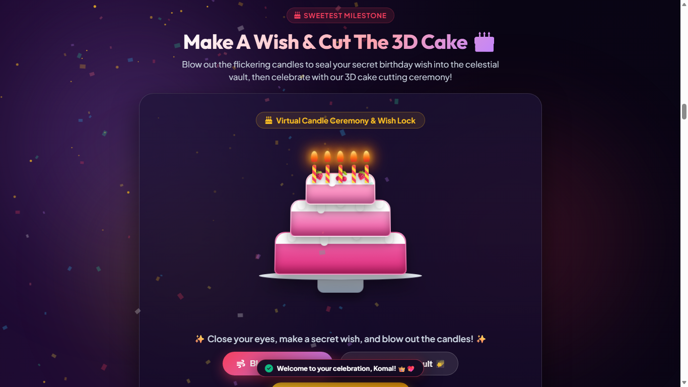 | 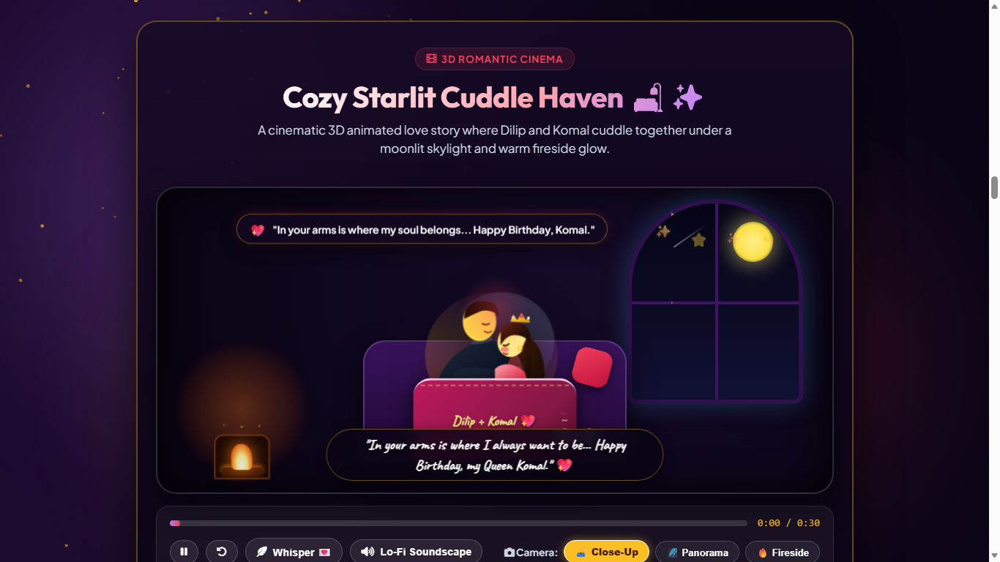 |

---

### 3. 🏺 Stage 3: 100 Reasons Why I Love You & Polyphonic Music Synthesizer
*Interactive floating origami reasons jar and procedural Web Audio synthesizer with Grand Piano and 6 ambient soundscapes.*

| 🏺 100 Reasons Magic Jar | 🎵 Procedural Ambient Soundscapes |
| :---: | :---: |
|  | 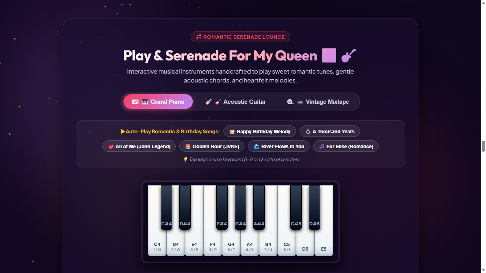 |

---

### 4. 💌 Stage 4: Royal Love Letters, Time Capsule & Coupons Vault
*Heartfelt handwritten love letters with delicate calligraphy, "Open When" envelopes, and redeemable love coupons.*

| 💌 Queen Nishika Love Letter | 📬 "Open When" Letter Vault | 🎟️ Romantic Love Coupons |
| :---: | :---: | :---: |
| 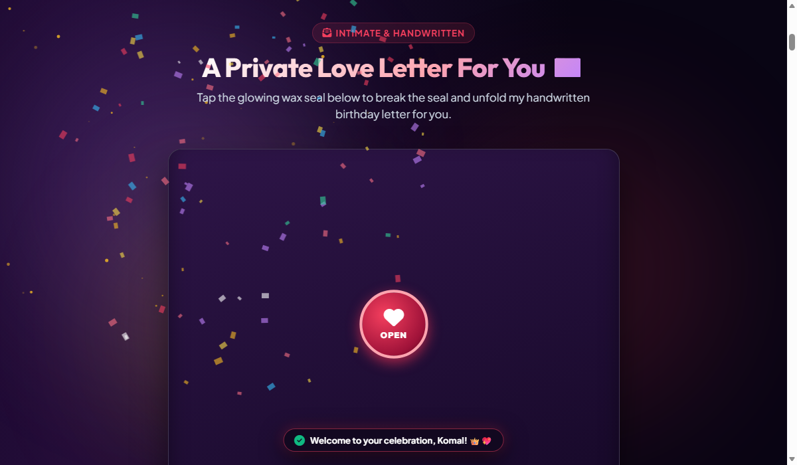 | 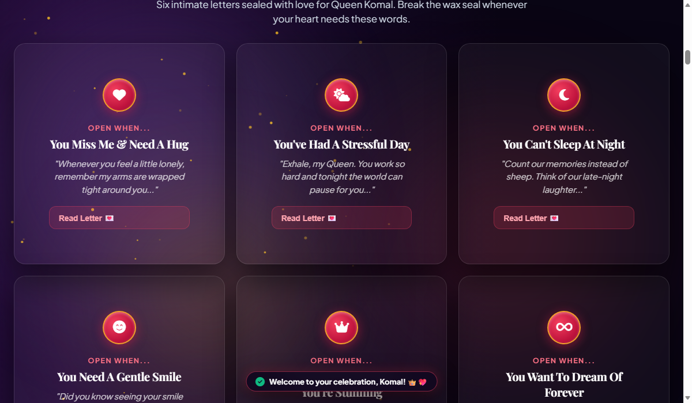 | 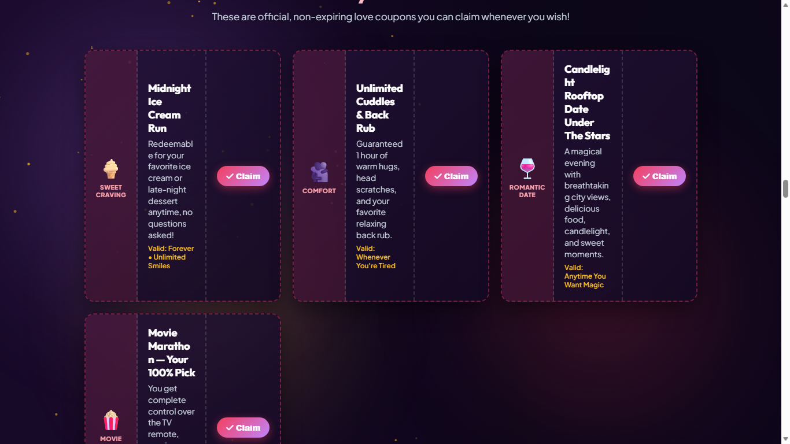 |

---

### 5. 📜 Stage 5: Relationship Story Timeline & 3D Flower Bouquet Studio
*Interactive chronological milestone journey and custom romantic bouquet designer with wrapping papers and ribbons.*

| 📜 Love Story Milestone Timeline | 💐 Custom 3D Bouquet Studio |
| :---: | :---: |
| 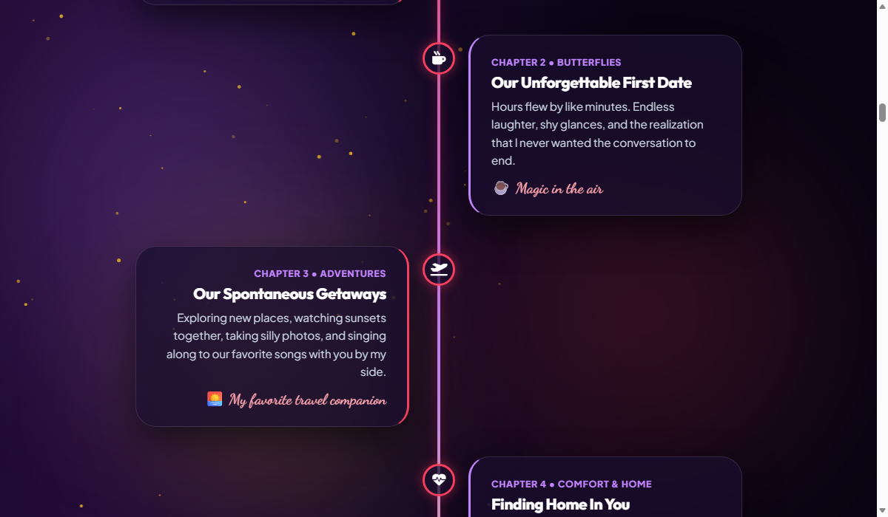 | 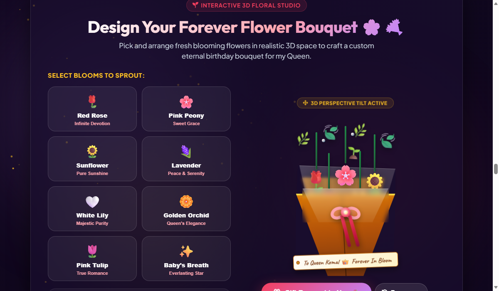 |

---

### 6. 📸 Stage 6: Live Memory Polaroid Scrapbook & Video Streaming Wall
*Permanent cloud-synced memory wall supporting Base64 video/photo uploads, YouTube/Vimeo embeds, and Google Drive streaming.*

| 📸 Polaroid Memories Gallery | 🕹️ Couple Quiz & Fortune Roulette |
| :---: | :---: |
| 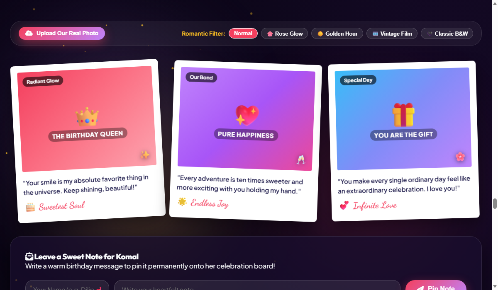 | 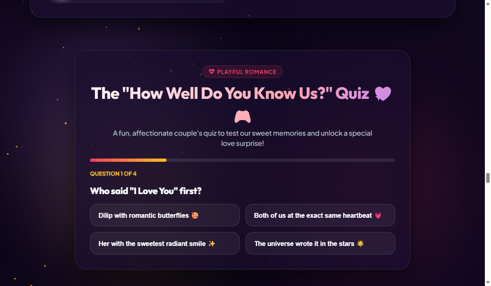 |

---

### 7. 🌌 Stage 7: Constellation Starlight Sky, Sky Lanterns & Magic Mirror
*Interactive stardust constellations, releaseable glowing sky lanterns, vintage film projector, and playful Magic Mirror.*

| 🌌 Constellation Starlight Sky | 🏮 Sky Lanterns Ceremony | 🪞 Enchanted Magic Mirror |
| :---: | :---: | :---: |
| 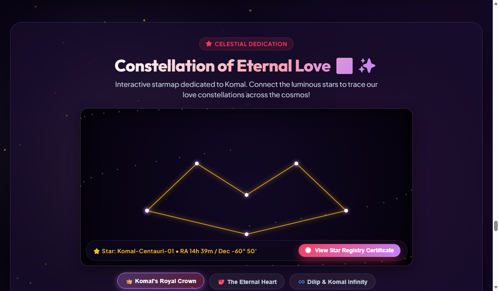 | 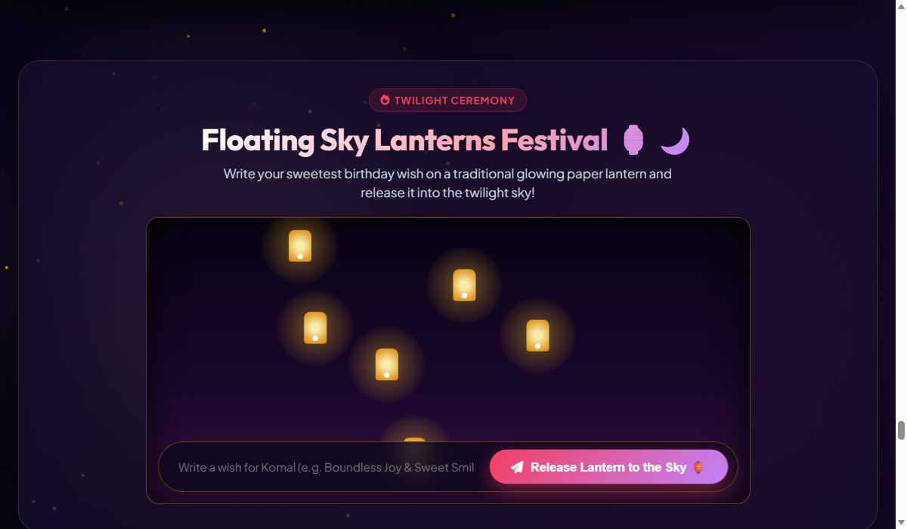 | 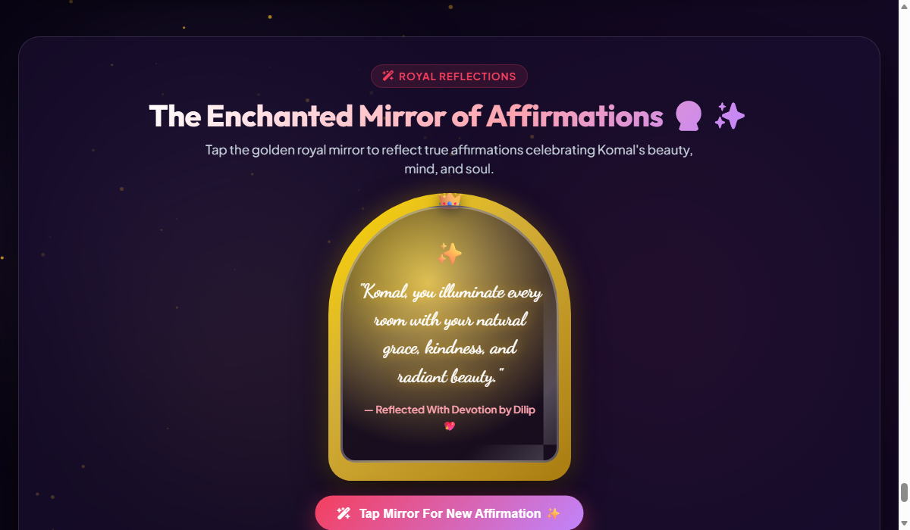 |

---

### 8. 📱 Stage 8: Mobile Ultra-Responsive Experience (320px - 414px)
*Tailored thumb-friendly navigation, 2-row sticky headers, swipeable carousels, and 0px horizontal overflow across iPhone SE, Galaxy, and Pixel devices.*

| 📱 Mobile Hero & Countdown | 📱 Mobile Reasons Jar | 📱 Mobile Cuddle Cinema |
| :---: | :---: | :---: |
|  |  |  |

---

## 🌟 Overview & Concept

**Eternal Love** is a production-grade romantic celebration web portal handcrafted specifically for **Queen Nishika's Birthday**, dedicated with infinite devotion by **Dilip**.

### The Problem
Traditional birthday greeting cards and physical gifts are static, easily lost, and offer no long-term multimedia interaction. Generic greeting websites rely on expensive recurring subscriptions, have rigid templates, lose attached video/photo uploads over time, and suffer from layout breakdown on mobile devices.

### The Solution
**Eternal Love** provides an uncompromised, zero-cost, permanent digital celebration platform featuring:
1. **2-Stage Unboxing Ceremony**: 3D interactive gift box with physics-based particle confetti and dual-passcode security vault.
2. **Permanent Serverless Cloud Synchronization**: Free Google Apps Script webhook integration saving Base64 video/photo uploads directly into Queen Nishika's personal Google Drive folder (`"Eternal Love Wishes (Queen Nishika)"`) and logging structured records in Google Sheets.
3. **Pure Native Web Architecture**: Built using pure HTML5, Vanilla CSS3, Web Audio API, and dual HTML5 2D Canvases with **zero runtime NPM dependencies** and 100% offline-first local cache resilience.

```
+---------------------------------------------------------------------------------------+
|                                CORE SYSTEM ATTRIBUTES                                 |
+--------------------------+------------------------------------------------------------+
| 👑 Birthday Celebrant    | Queen Nishika (The Birthday Queen)                         |
| 💖 Dedicated By          | Dilip                                                      |
| ⚡ Client Engine         | Pure Vanilla HTML5 + CSS3 + ES6+ (0 NPM runtime packages)  |
| ☁️ Cloud Engine          | Serverless Google Apps Script + Google Drive + Sheets      |
| 🌐 Deployment            | GitHub Pages Edge CDN (Free Global HTTPS)                  |
| 🧪 QA Benchmark          | 🟢 56/56 Automated Playwright Tests Passed (100% Pass)     |
+--------------------------+------------------------------------------------------------+
```

---

## 🏛️ System Architecture Diagrams

### 1. High-Level C4 Context & Cloud Topology

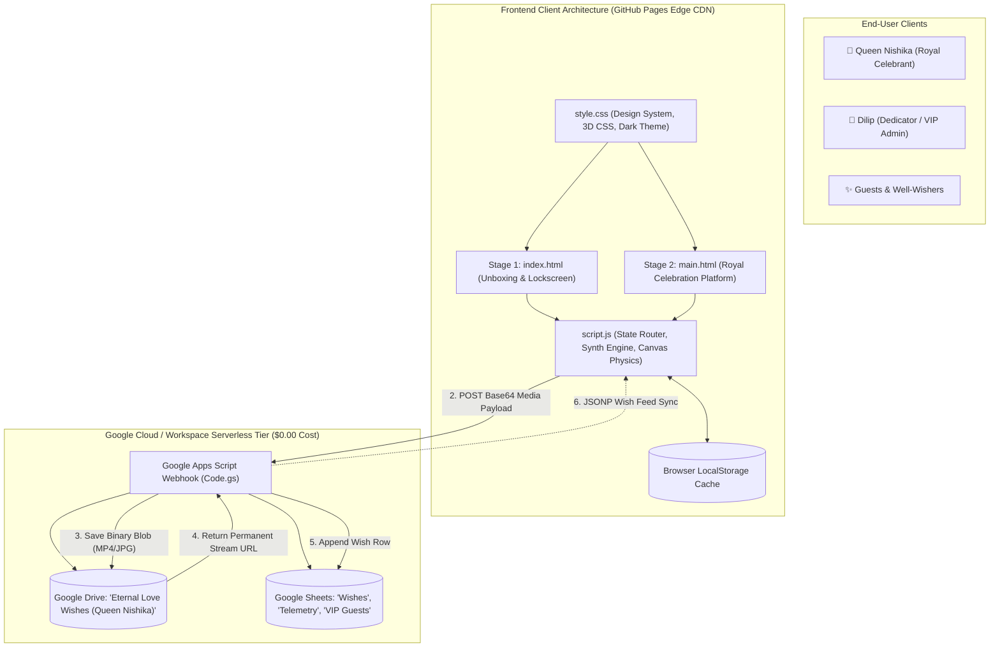

---

### 2. User Journey & Stage Routing Flowchart

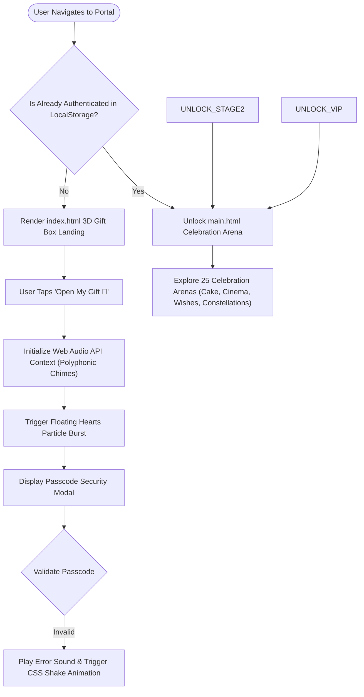

---

### 3. Media Upload & Cloud Synchronization Engine

```mermaid
flowchart LR
    subgraph ClientProcess["Client Video / Photo Processing"]
        PICKER["User Attaches MP4 Video or Pastes YouTube URL"]
        B64_CONV["FileReader converts Video to Base64 String"]
        OPT_RENDER["Optimistically Render Video on Wish Wall"]
        LOCAL_SAVE["Cache in LocalStorage (No ephemeral blob: URLs)"]
    end

    subgraph CloudProcess["Serverless Cloud Execution"]
        WEBHOOK["fetch(Code.gs Webhook, {mode: 'no-cors'})"]
        DRIVE_UPLOAD["GAS Decodes Base64 & Creates MP4 File in Drive"]
        PERM_SET["GAS Sets Anyone with Link -> View Permission"]
        STREAM_URL["Generate https://drive.google.com/file/d/ID/preview"]
        SHEET_ROW["Append Row to Google Sheets Database"]
    end

    PICKER --> B64_CONV --> OPT_RENDER --> LOCAL_SAVE --> WEBHOOK
    WEBHOOK --> DRIVE_UPLOAD --> PERM_SET --> STREAM_URL --> SHEET_ROW
```

---

## 💻 Technology Stack

[VERIFIED] The entire application is built using pure web standards for lightning speed, zero dependencies, and long-term maintainability:

| Technology | Version | Purpose & Implementation Area |
| :--- | :--- | :--- |
| **HTML5** | Living Standard | Semantic page layout, modal dialogs, audio/video players in [`index.html`](file:///c:/Users/Himanshu/Documents/HTML/New%20folder/new/index.html) and [`main.html`](file:///c:/Users/Himanshu/Documents/HTML/New%20folder/new/main.html) |
| **Vanilla CSS3** | Level 3 / 4 | Custom design system, CSS variables, 3D perspective (`preserve-3d`), glassmorphism, animations in [`style.css`](file:///c:/Users/Himanshu/Documents/HTML/New%20folder/new/style.css) |
| **JavaScript (ES6+)** | ECMAScript 2022+ | Application state routing, particle physics, Base64 encoding, DOM manipulation in [`script.js`](file:///c:/Users/Himanshu/Documents/HTML/New%20folder/new/script.js) |
| **Web Audio API** | W3C Standard | Zero-dependency polyphonic synthesizer (`OscillatorNode`, `GainNode`, ADSR envelopes, procedural audio) |
| **HTML5 Canvas API** | Canvas 2D Context | Dual particle animation engines (starlight hearts loop & midnight fireworks simulation) |
| **Google Apps Script** | V8 Runtime Engine | Serverless webhook handler (`doPost`), Base64 stream decoding in [`Code.gs`](file:///c:/Users/Himanshu/Documents/HTML/New%20folder/new/Code.gs) |
| **Google Drive API** | v3 (GAS Built-in) | Persistent cloud blob storage for MP4 video and JPEG/PNG image uploads |
| **Google Sheets API** | v4 (GAS Built-in) | Tabular database for structured wish entries, telemetry, and VIP records |
| **Playwright** | v1.40+ (Node.js) | Automated end-to-end regression testing across Desktop and Mobile viewports in [`playwright-test-runner.js`](file:///c:/Users/Himanshu/Documents/HTML/New%20folder/new/playwright-test-runner.js) |
| **Python HTTP Server** | Python 3.10+ | Local development server (`python -m http.server 8080`) |

---

## 🚀 Installation & Local Development

### 1. Clone the Repository
```bash
git clone https://github.com/dilipk2026/happy-birthday.git
cd happy-birthday
```

### 2. Start Local Development Server
```bash
# Using Python 3 (Recommended)
python -m http.server 8080

# Or using Node.js
npx serve -l 8080 .
```

### 3. Open in Browser
Visit `http://localhost:8080` in any modern web browser.

---

## 🚢 GitHub Pages 60-Second Deployment Guide

Deploying this celebration to GitHub Pages provides instant global HTTPS and CDN caching at zero cost:

```bash
# 1. Initialize git and stage all files
git init
git add .
git commit -m "feat: Eternal Love v3.0.0 official celebration release 👑💖"

# 2. Push to GitHub main branch
git branch -M main
git remote add origin https://github.com/dilipk2026/happy-birthday.git
git push -u origin main
```

### Activate GitHub Pages:
1. Navigate to repository **Settings** $\rightarrow$ **Pages**.
2. Under **Build and deployment** $\rightarrow$ **Source**, select **Deploy from a branch**.
3. Select branch `main` and folder `/ (root)` $\rightarrow$ click **Save**.
4. 🎉 **Live URL**: `https://dilipk2026.github.io/happy-birthday/`

---

## 🧪 Automated Playwright QA Test Suite

The codebase includes an enterprise-grade automated Playwright test suite validating all 56 functional criteria across 6 test suites:

```bash
# Run the complete automated test suite
node playwright-test-runner.js
```

### Verified Test Benchmark Results:
- **Total Tests Executed**: 56
- **Passed**: 56 (100.0% Pass Rate)
- **Failed / Blocked / Skipped**: 0
- **Uncaught Console Errors**: 0
- **Execution Duration**: 10.63 seconds
- **Full Report**: [`docs/testing/Test-Execution-Report.md`](docs/testing/Test-Execution-Report.md)

---

## 📁 Repository Directory Structure

```
.
├── index.html                    # Stage 1: Landing, 3D Gift Unboxing & Lock Screen
├── main.html                     # Stage 2: Royal Celebration Platform (Memories, Audio, Wishes)
├── script.js                     # Core Application Controller, Audio Synth & Particle Physics
├── style.css                     # Design System, 3D Parallax & Responsive Viewport Rules
├── Code.gs                       # Google Apps Script Cloud Webhook (Drive & Sheets Sync)
├── README.md                     # Master Repository Showcase & Navigation (This File)
├── favicon.svg                   # Custom Royal Crown Favicon
├── webqr.png                     # Instant Mobile Celebration QR Code
├── playwright-test-runner.js     # Automated End-to-End Test Suite (56 Assertions)
├── playwright_test_results.json  # Automated Test Run Log (100% Passed)
├── screenshots/                  # 20 Visual UI Audit Captures (Desktop & Mobile)
│   ├── 01-desktop-hero.png ... 20-magic-mirror.png
└── docs/                         # Master Engineering & QA Documentation Package (33 Files)
    ├── README.md                 # Master Documentation Navigation Map
    ├── 01-Project-Overview.md    # Executive Summary, Scope & Objectives
    ├── 02-SRS.md                 # Software Requirements Specification (IEEE-830)
    ├── 03-System-Architecture.md # C4 Architectural Model & Security Boundaries
    ├── 04-Technical-Documentation.md # Detailed Module Catalog & Synth Engine
    ├── 05-API-Documentation.md   # Google Apps Script Webhook Reference
    ├── 06-Database-Documentation.md # Google Sheets Schema, Drive Blobs & LocalStorage
    ├── 07-User-Documentation.md  # Celebrant & Dedicator User Manual
    ├── 08-Installation-and-Setup.md # Local Setup & Environment Guide
    ├── 09-Deployment-Documentation.md # GitHub Pages & Cloud Webhook Deployment
    ├── 10-Security-Documentation.md # Dual-PIN Auth, DOM XSS Sanitization & Sandboxing
    ├── 11-Maintenance-Documentation.md # Annual Birthday Rollover Runbook
    ├── 12-Troubleshooting.md     # Diagnostic & Solution Matrix
    ├── 13-FAQ.md                 # Frequently Asked Questions
    ├── 14-Release-Notes.md       # Semantic Release History (v1.0.0 to v3.0.0)
    ├── 15-Code-Quality-Review.md # Quality Scorecard & Static Analysis
    ├── 16-Requirements-Traceability-Matrix.md # RTM linking FRs to 56 Tests
    ├── testing/                  # Comprehensive QA & Test Strategy Suite (12 Files)
    │   ├── Test-Strategy.md      # Master QA Strategy
    │   ├── Test-Plan.md          # Execution Test Plan & Scope
    │   ├── Test-Scenarios.md     # TS-001 to TS-020 Scenarios
    │   ├── Test-Cases.md         # Full Functional Test Matrix (TC-1.1 to TC-6.7)
    │   ├── API-Test-Cases.md     # Webhook & JSONP Test Cases
    │   ├── UI-Test-Cases.md      # Viewport Matrix (320px to 1920px)
    │   ├── Security-Test-Cases.md# Passcode & XSS Security Test Cases
    │   ├── Performance-Test-Plan.md # FPS, Audio Latency & Memory Limits Plan
    │   ├── UAT-Test-Cases.md     # Business Acceptance Test Cases
    │   ├── Defect-Report.md      # 5 Resolved Defects & Root Cause Analysis
    │   ├── Test-Execution-Report.md # 56/56 Passed Execution Log
    │   └── Final-Test-Report.md  # Official QA Release Sign-Off
    └── diagrams/                 # Mermaid Architectural Diagrams (4 Files)
        ├── System-Architecture.md# C4 Context & Component Topologies
        ├── Data-Flow.md          # Level 0 & Level 1 DFDs
        ├── Sequence-Diagrams.md  # Sequence Flows
        └── Database-ER-Diagram.md# Entity-Relationship Model
```

---

## 📚 Master Documentation Hub (33 Production Documents)

| # | Document Category | File | Description / Key Focus |
| :-: | :--- | :--- | :--- |
| 1 | **Navigation Hub** | [docs/README.md](docs/README.md) | Complete Documentation Portal & Reading Paths |
| 2 | **Project Overview** | [docs/01-Project-Overview.md](docs/01-Project-Overview.md) | Business Scope, Stakeholders & High-Level Objectives |
| 3 | **Requirements (SRS)** | [docs/02-SRS.md](docs/02-SRS.md) | IEEE-830 Functional (FR-001 to FR-014) & Non-Functional Specs |
| 4 | **Architecture** | [docs/03-System-Architecture.md](docs/03-System-Architecture.md) | C4 System Context, Components, Security Boundaries |
| 5 | **Technical Reference** | [docs/04-Technical-Documentation.md](docs/04-Technical-Documentation.md) | Module Catalog, Audio Synth, Canvas Physics Specifications |
| 6 | **API Reference** | [docs/05-API-Documentation.md](docs/05-API-Documentation.md) | Google Apps Script REST Webhook & JSONP Endpoints |
| 7 | **Database Specs** | [docs/06-Database-Documentation.md](docs/06-Database-Documentation.md) | Google Sheets Schema, Drive Blobs & LocalStorage |
| 8 | **User Manual** | [docs/07-User-Documentation.md](docs/07-User-Documentation.md) | User Guide for Queen Nishika, Dilip, and Well-Wishers |
| 9 | **Installation** | [docs/08-Installation-and-Setup.md](docs/08-Installation-and-Setup.md) | Local Server Commands & Testing Harness Setup |
| 10 | **Deployment** | [docs/09-Deployment-Documentation.md](docs/09-Deployment-Documentation.md) | GitHub Pages, Custom Domains, Cloud Webhook Deployment |
| 11 | **Security** | [docs/10-Security-Documentation.md](docs/10-Security-Documentation.md) | Dual-PIN Threat Model, DOM XSS Sanitization |
| 12 | **Maintenance** | [docs/11-Maintenance-Documentation.md](docs/11-Maintenance-Documentation.md) | Annual Birthday Rollover Runbook & Quota Management |
| 13 | **Troubleshooting** | [docs/12-Troubleshooting.md](docs/12-Troubleshooting.md) | Diagnostic Matrix for Audio, Uploads, Viewports |
| 14 | **FAQ** | [docs/13-FAQ.md](docs/13-FAQ.md) | Frequently Asked Questions & Operational Answers |
| 15 | **Release Notes** | [docs/14-Release-Notes.md](docs/14-Release-Notes.md) | Semantic Version Changelog (v1.0.0 to v3.0.0) |
| 16 | **Code Quality** | [docs/15-Code-Quality-Review.md](docs/15-Code-Quality-Review.md) | Architecture Scorecard, Profiling & Audit Findings |
| 17 | **Traceability Matrix**| [docs/16-Requirements-Traceability-Matrix.md](docs/16-Requirements-Traceability-Matrix.md)| RTM linking Requirements to 56 Automated Tests |
| 18 | **Test Strategy** | [docs/testing/Test-Strategy.md](docs/testing/Test-Strategy.md) | QA Testing Pyramid, Levels & Entry/Exit Criteria |
| 19 | **Test Plan** | [docs/testing/Test-Plan.md](docs/testing/Test-Plan.md) | Test Execution Plan, Scope & Environment Matrix |
| 20 | **Test Scenarios** | [docs/testing/Test-Scenarios.md](docs/testing/Test-Scenarios.md) | TS-001 to TS-020 End-to-End Scenarios |
| 21 | **Test Cases** | [docs/testing/Test-Cases.md](docs/testing/Test-Cases.md) | Comprehensive Functional Test Matrix (TC-1.1 to TC-6.7) |
| 22 | **API Test Cases** | [docs/testing/API-Test-Cases.md](docs/testing/API-Test-Cases.md) | Webhook Payload & JSONP Test Cases |
| 23 | **UI Test Cases** | [docs/testing/UI-Test-Cases.md](docs/testing/UI-Test-Cases.md) | Viewport Responsiveness (320px-1920px) Test Cases |
| 24 | **Security Test Cases**| [docs/testing/Security-Test-Cases.md](docs/testing/Security-Test-Cases.md)| PIN Auth, XSS Prevention & Sandboxing Tests |
| 25 | **Performance Plan** | [docs/testing/Performance-Test-Plan.md](docs/testing/Performance-Test-Plan.md) | Canvas FPS, Audio Latency & Memory Limits |
| 26 | **UAT Test Cases** | [docs/testing/UAT-Test-Cases.md](docs/testing/UAT-Test-Cases.md) | Business Acceptance Test Cases for Stakeholders |
| 27 | **Defect Report** | [docs/testing/Defect-Report.md](docs/testing/Defect-Report.md) | 5 Resolved Defects & Root Cause Analysis |
| 28 | **Execution Report** | [docs/testing/Test-Execution-Report.md](docs/testing/Test-Execution-Report.md)| 56/56 Passed Automated Test Execution Report |
| 29 | **Final Test Report** | [docs/testing/Final-Test-Report.md](docs/testing/Final-Test-Report.md) | Executive QA Sign-Off (Recommended for Release) |
| 30 | **Diagram: Architecture**| [docs/diagrams/System-Architecture.md](docs/diagrams/System-Architecture.md)| C4 Context, Components, Deployment Diagrams |
| 31 | **Diagram: Data Flow** | [docs/diagrams/Data-Flow.md](docs/diagrams/Data-Flow.md) | Level 0 & Level 1 DFDs, Base64 Cloud Upload Flow |
| 32 | **Diagram: Sequence** | [docs/diagrams/Sequence-Diagrams.md](docs/diagrams/Sequence-Diagrams.md)| Unboxing, Audio Synthesis, Media Sync Sequences |
| 33 | **Diagram: Database ER**| [docs/diagrams/Database-ER-Diagram.md](docs/diagrams/Database-ER-Diagram.md)| Entity-Relationship Diagram (Sheets, Drive, LocalStorage)|

---

## 👑 Royal Dedication

*“In all the universe, across all the stars and timelines, loving you is my greatest adventure.”*

### Handcrafted with Infinite Devotion for Queen Nishika 👑
### Dedicated by Dilip 💕

