# 👑 Eternal Love — Ultra-Premium Romantic Celebration Platform ✨

<div align="center">

```
   ███████╗████████╗███████╗██████╗ ███╗   ██╗ █████╗ ██╗         ██╗      ██████╗ ██╗   ██╗███████╗
   ██╔════╝╚══██╔══╝██╔════╝██╔══██╗████╗  ██║██╔══██╗██║         ██║     ██╔═══██╗██║   ██║██╔════╝
   █████╗     ██║   █████╗  ██████╔╝██╔██╗ ██║███████║██║         ██║     ██║   ██║██║   ██║█████╗  
   ██╔══╝     ██║   ██╔══╝  ██╔══██╗██║╚██╗██║██╔══██║██║         ██║     ██║   ██║╚██╗ ██╔╝██╔══╝  
   ███████╗   ██║   ███████╗██║  ██║██║ ╚████║██║  ██║███████╗    ███████╗╚██████╔╝ ╚████╔╝ ███████╗
   ╚══════╝   ╚═╝   ╚══════╝╚═╝  ╚═╝╚═╝  ╚═══╝╚═╝  ╚═╝╚══════╝    ╚══════╝ ╚═════╝   ╚═══╝  ╚══════╝
```

<p align="center">
  <strong>🌟 A Celestial, 3D Interactive & Emotionally Resonant Digital Celebration Handcrafted for Queen Nishika 💖</strong>
</p>

[](https://dilipk2026.github.io/happy-birthday/)
[](#-high-performance-zero-lag-engine)
[](#-mobile-first-experience)

<p align="center">
  
  
  
  
  
  
</p>

---

### 🗺️ Quick Navigation

[✨ Live Access](#-instant-live-access--qr-launch) • [🔑 Passcodes](#-vip-access-credentials--passcodes) • [📸 Visual Gallery](#-graphical-visual-showcase) • [🎬 Hover Cinema](#-interactive-hover-pop-out-fullscreen-cinema) • [💎 Core Features](#-interactive-feature-matrix) • [🎨 Comic Sans](#-bespoke-comic-sans-typography) • [🎵 Sound Engine](#-dual-mode-web-audio-synthesizer) • [☁️ Google Sheets](#️-google-sheets--cloud-backend) • [🚀 Quick Start](#-local-development--instant-hosting)

---

</div>

## 🌐 Instant Live Access & QR Launch

Access the production deployment live in any modern web browser or scan directly with your mobile camera:

<div align="center">

### 🌟 [👉 Click Here to Open Live Celebration Portal 👈](https://dilipk2026.github.io/happy-birthday/)

<a href="https://dilipk2026.github.io/happy-birthday/">
  
</a>

<br/>
<kbd>📱 Scan QR Code with Phone Camera or Tap the Image Above</kbd>
<br/><br/>

```http
🌐 Production URL: https://dilipk2026.github.io/happy-birthday/
```

</div>

---

## 🔑 VIP Access Credentials & Passcodes

The platform features an intelligent dual-stage router with time-locked portals and interactive holographic keypads:

<div align="center">

| Portal Stage | Passcode / PIN | Description & Romantic Clue | Access Direct Link |
|:---|:---:|:---|:---:|
| **🔒 Pre-Launch VIP PIN** | `2912` | *4-Digit Anniversary Date Keypad* | [Enter Live Portal](https://dilipk2026.github.io/happy-birthday/) |
| **🎂 Royal Birthday Key** | `22092000` | *8-Digit Birthdate (`DDMMYYYY` - 22/09/2000)* | [Enter Celebration](https://dilipk2026.github.io/happy-birthday/main.html?preview=true) |
| **⚡ Instant Bypass URL** | `?preview=true` | *Instant Full Access & Preview Parameter* | [Direct Preview Link](https://dilipk2026.github.io/happy-birthday/main.html?preview=true) |

</div>

<details>
<summary><strong>🔍 Click to Expand: Passcode Authentication Workflow & Logic</strong></summary>

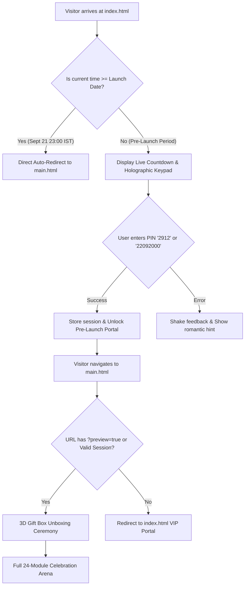

</details>

---

## 📸 Graphical Visual Showcase

Experience all 11 stages of the live celebration platform:

<div align="center">

### 🚀 1. Pre-Launch Portal & Holographic VIP Keypad
*Real-time celestial countdown clock to September 21, 2026 with glassmorphic VIP keypad for early unboxing.*

[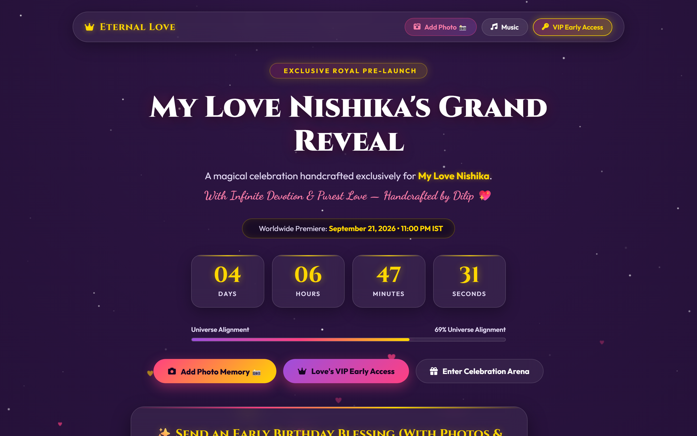](screenshots/01-prelaunch-portal.png)

---

### 📝 2. Comic Sans Sticky Notes Wall & Live Wishes
*Interactive draggable sticky notes board rendered in Comic Sans MS with live guest submissions and floating hearts.*

[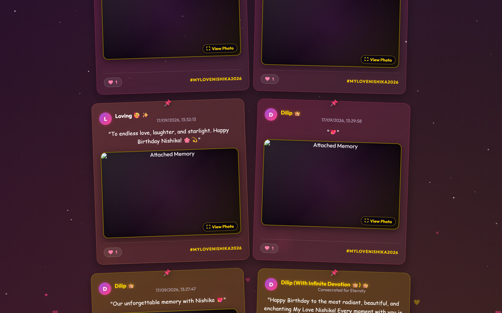](screenshots/02-prelaunch-sticky-wall.png)

---

### 🎁 3. 3D Royal Gift Box Unboxing Experience
*Procedurally rendered 3D gift box with animated satin ribbons, particle glows, and celebratory sound effects.*

[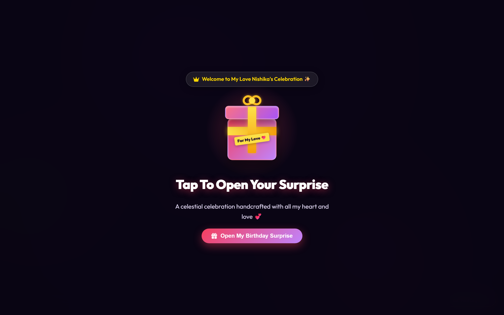](screenshots/03-unboxing-welcome.png)

---

### 👑 4. Royal Celebration Hero & Dynamic Relationship Clock
*Crowning hero banner featuring live relationship counter tracking every year, day, hour, minute, and second of love.*

[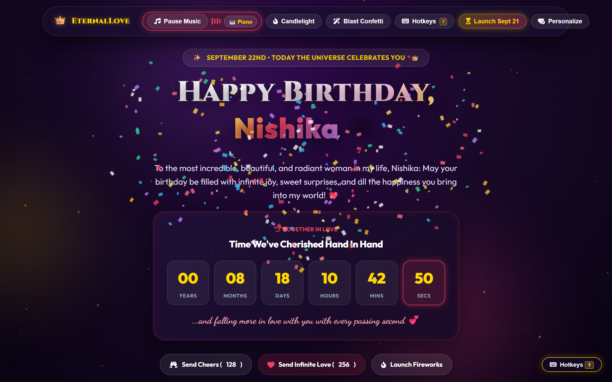](screenshots/04-celebration-hero.png)

---

### 🎂 5. Interactive 3D Cake Cutting Ceremony
*Procedural multi-tier cake with real-time slicing knife physics, audio chimes, and microphone/tap candle blowing.*

[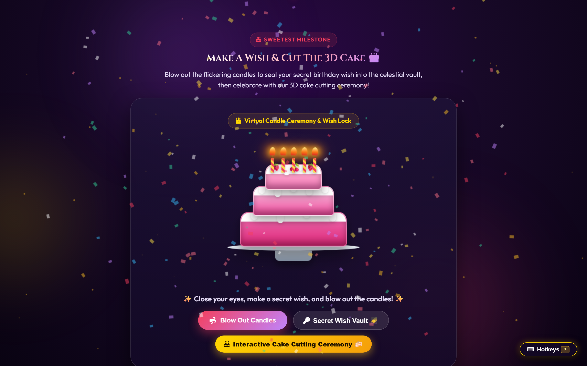](screenshots/05-cake-cutting-ceremony.png)

---

### 🍯 6. 100 Reasons Why I Love You Interactive Glass Jar
*Interactive 3D glass candy jar containing 100 categorized reasons with random pull animations and full-screen modal cards.*

[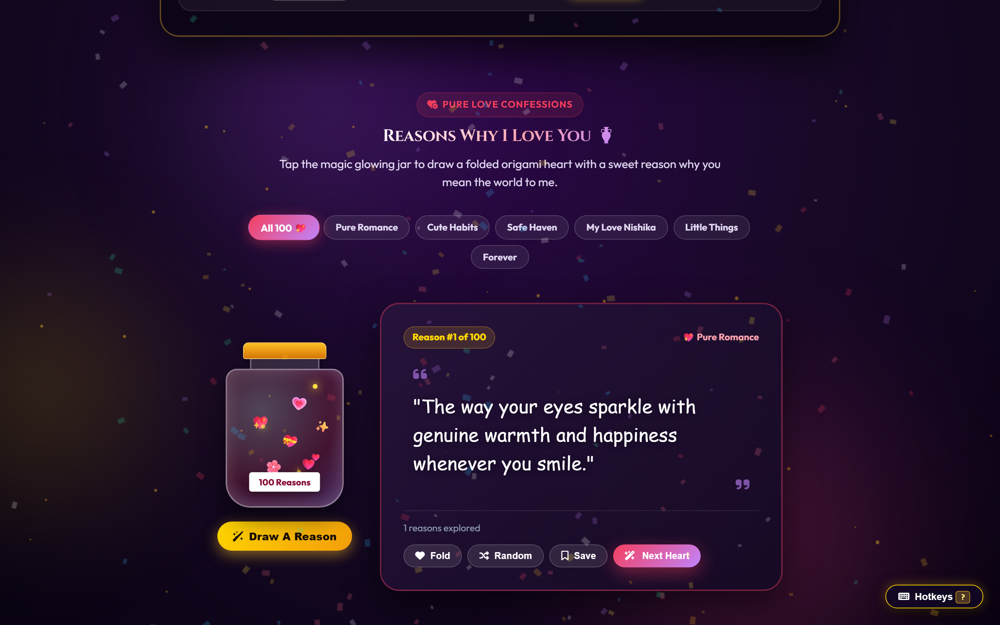](screenshots/06-love-reasons-jar.png)

---

### 📜 7. Wax-Sealed Handwritten Royal Love Letter
*Royal gold-stamped parchment letter with realistic typewriter revelation effect and Comic Sans MS handwriting.*

[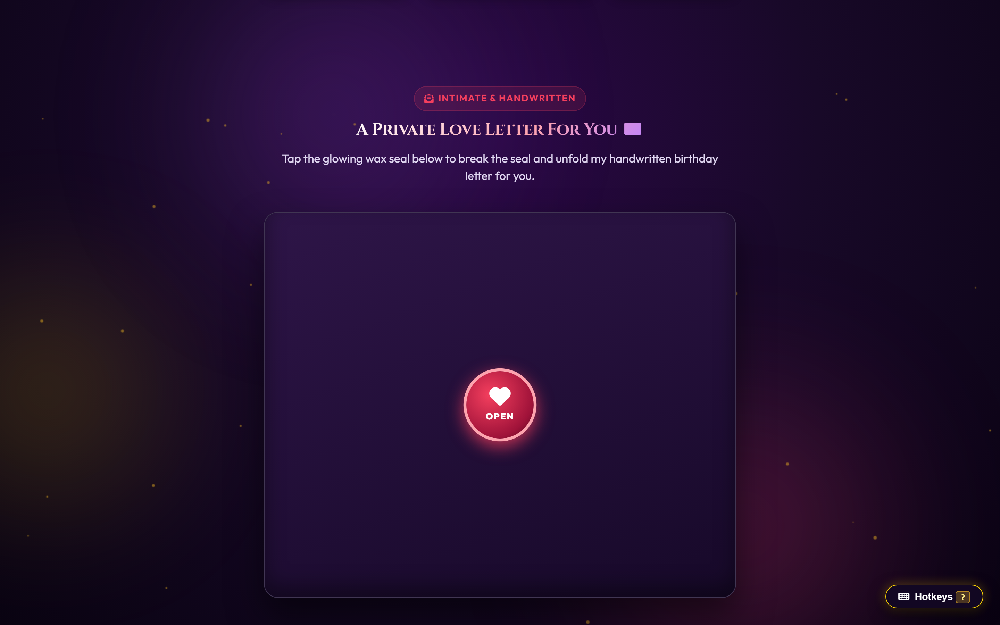](screenshots/07-royal-love-letter.png)

---

### 🎡 8. Romantic Fortune Roulette & Ambient Soundscapes
*Interactive 2D canvas spinning wheel with audio clickers paired with dynamic multi-track ambient soundscape synthesizer.*

[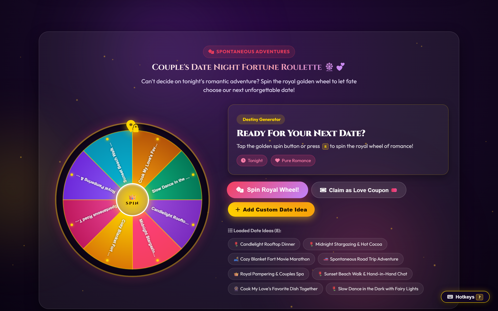](screenshots/08-fortune-roulette.png)

---

### 🌌 9. Constellation Sky & Official Star Registry
*Interactive night sky with custom star coordinates, glowing constellation links, and downloadable PDF celestial deed.*

[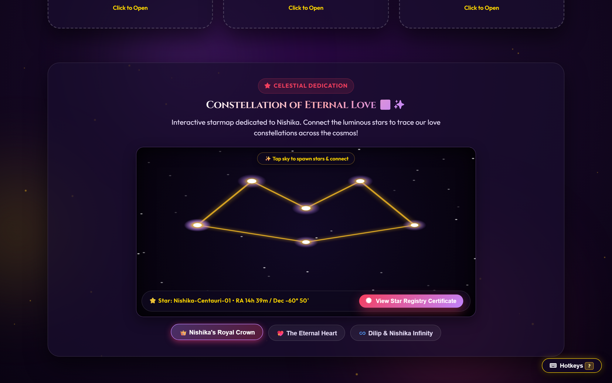](screenshots/09-constellation-star-registry.png)

---

### 📸 10. Live Photo Memories Pinboard & Guest Text Wishes
*Dynamic Polaroid gallery featuring instant Google Drive CDN image rendering, fullscreen lightbox, and instant text wish submissions.*

[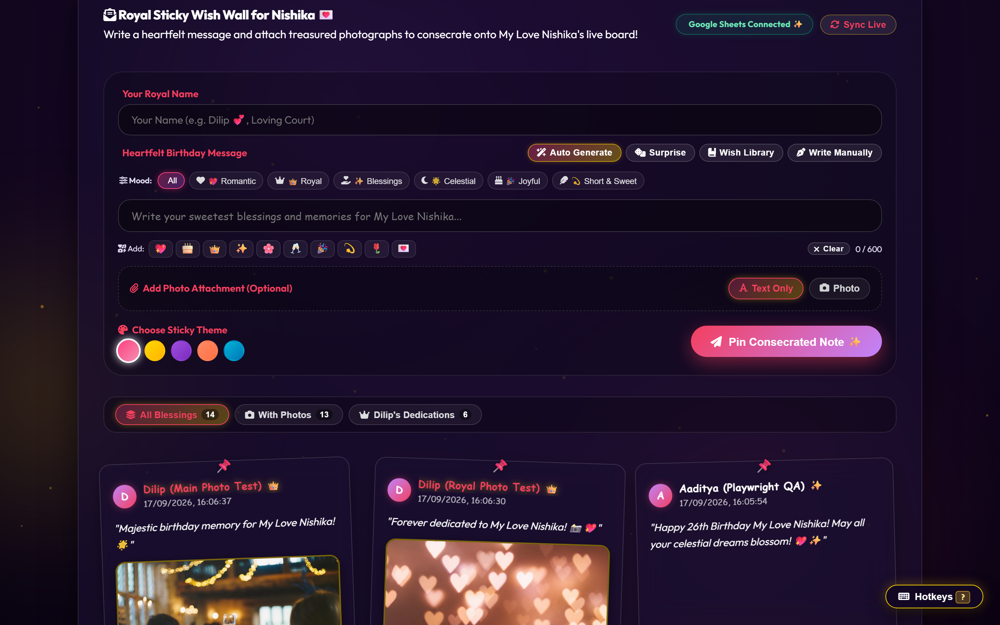](screenshots/10-photo-memories-pinboard.png)

---

### 📱 11. 100% Mobile-First Responsive Experience (iPhone 14)
*Pixel-perfect fluid layouts across all smartphones, tablets, foldables, and ultra-wide desktop monitors.*

[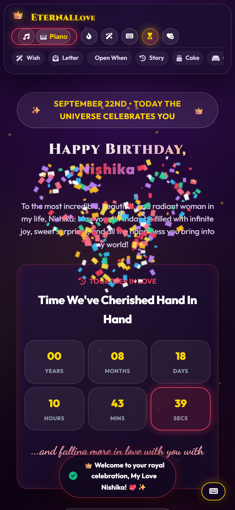](screenshots/11-mobile-responsive-experience.png)

</div>

---

## 🎬 Interactive Hover Pop-Out Fullscreen Cinema

The platform includes a dedicated **Hover Pop-Out Fullscreen Cinema Portal** for memories and uploaded photos:

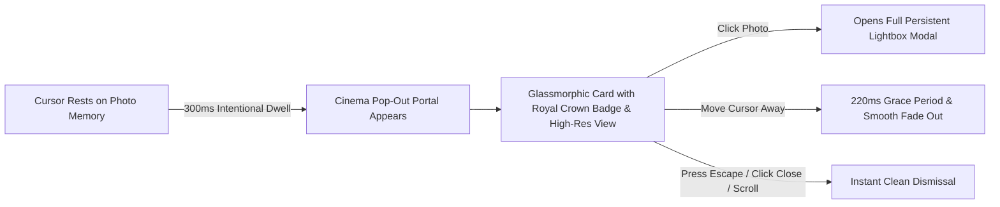

- **✨ Smart Dwell Detection (300ms)**: Passing the cursor casually across a card avoids unwanted popups; resting on a memory reveals the high-res cinema preview.
- **🛡️ 220ms Grace Transition Window**: Bi-directional cursor tracking between the origin photo and pop-out card ensures smooth interaction with **zero flickering or rapid blinking**.
- **🔍 Click-to-Lightbox Bridge**: Tapping or clicking the image in the Cinema Pop-Out expands it immediately into the full-screen `#mediaLightboxModal`.
- **⌨️ Accessible Controls**: Dismiss seamlessly via backdrop click, `✕` button, `Escape` key, or page scrolling.

---

## 💎 Interactive Feature Matrix

<details open>
<summary><strong>✨ Primary Modules & Interactive Capabilities (Click to Expand/Collapse)</strong></summary>

| Module | Category | Description & Interactive Highlights |
|---|:---:|---|
| **Countdown & VIP Keypad** | `Pre-Launch` | Live countdown down to the exact second + 4-digit glass keypad authentication. |
| **Comic Sans Sticky Wall** | `Pre-Launch` | Interactive pinboard for guest wishes with color picker, rotation, and sound FX. |
| **Hover Pop-Out Cinema** | `Media` | 300ms dwelling pop-out with royal author badges, wish captions, and lightbox bridge. |
| **3D Gift Box Unboxing** | `Celebration` | Animated ribbon untying, lid popping, and custom confetti explosion. |
| **Relationship Clock** | `Celebration` | Live ticking timer calculating exact days, hours, minutes, and seconds of love. |
| **3D Cake Cutting** | `Interactive` | Knife slicing across canvas with real-time cake split, candle extinguish, and fanfare. |
| **100 Love Reasons Jar** | `Interactive` | Glass jar with category filter (Smile, Soul, Memories) and random reason drawing. |
| **Royal Love Letter** | `Storytelling` | Wax seal stamp breaker, Comic Sans typography, typewriter audio, and PDF keepsake. |
| **Open When Envelopes** | `Storytelling` | 6 interactive letters to open when happy, sad, missing me, or needing a hug. |
| **Milestone Love Timeline** | `Storytelling` | Vertical interactive timeline highlighting pivotal relationship milestones. |
| **Virtual Cuddle Corner** | `Mini-Game` | Interactive hug button with heartbeat rumble and floating heart particles. |
| **Love Coupons Vault** | `Interactive` | Digital scratch-off coupons with custom redemption stamps and copyable codes. |
| **Couple Bucket List** | `Interactive` | Checkable bucket list of romantic dreams with progress bar calculation. |
| **Flower Bouquet Builder** | `Interactive` | Interactive floral garden where visitors pick roses, lilies, and orchids to build a bouquet. |
| **Love Quiz & Trivia** | `Mini-Game` | Romantic trivia quiz with real-time score calculation and custom congratulatory badges. |
| **Catch Falling Hearts** | `Mini-Game` | Canvas arcade game where users control a cup to catch falling celestial hearts. |
| **Photo Memories Pinboard** | `Media` | High-res photo album with Google Drive CDN resolution and zoomable lightbox. |
| **Fortune Roulette** | `Mini-Game` | Physics-based spinning wheel awarding romantic date ideas and perks. |
| **Ambient Soundscapes** | `Audio` | Procedural Web Audio synthesizer generating Rain, Ocean, Forest, and Heartbeat. |
| **Constellation Star Sky** | `Celestial` | Interactive canvas planetarium with custom star registration certificate. |
| **Floating Sky Lanterns** | `Interactive` | Lantern release tool that launches illuminated paper lanterns into a starry night sky. |
| **Love Claw Machine** | `Mini-Game` | Arcade claw drop mini-game to grab plush hearts and reveal surprise messages. |
| **Romantic Projector** | `Media` | Nostalgic slide projector that advances memories with authentic mechanical clicks. |
| **Magic Compliment Mirror**| `Interactive` | Dynamic mirror that reveals charming personalized affirmations upon touching. |
| **Time Capsule Vault** | `Keepsake` | Digital vault locked until future anniversaries with secret wish submissions. |

</details>

---

## 🎨 Bespoke Comic Sans Typography

Per royal request, all wishes, sticky notes, and romantic letters feature handcrafted Comic Sans typography for warmth, authenticity, and handwritten charm:

```css
/* Core Comic Sans Font Stack */
--font-comic: 'Comic Sans MS', 'Comic Sans', 'Comic Neue', cursive, sans-serif;

.letter-body,
.sticky-note-text,
.wish-card-message,
.time-capsule-message,
.reason-quote {
  font-family: var(--font-comic) !important;
  line-height: 1.8;
  letter-spacing: 0.3px;
}
```

<div align="center">
  <table>
    <tr>
      <td align="center"><strong>📜 Love Letter</strong></td>
      <td align="center"><strong>📝 Sticky Wall</strong></td>
      <td align="center"><strong>💌 Guest Wishes</strong></td>
      <td align="center"><strong>🍯 Love Reasons</strong></td>
    </tr>
    <tr>
      <td align="center"><code>Comic Sans MS</code></td>
      <td align="center"><code>Comic Sans MS</code></td>
      <td align="center"><code>Comic Sans MS</code></td>
      <td align="center"><code>Comic Sans MS</code></td>
    </tr>
  </table>
</div>

---

## 🎵 Dual-Mode Web Audio Synthesizer

The platform includes a 100% native, zero-dependency Web Audio API synthesizer capable of generating rich melodies in real time without downloading bulky MP3 files:

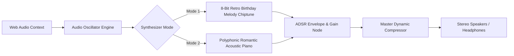

- **Mode 1: Birthday Synth Chiptune** — Classic polyphonic celebration melody.
- **Mode 2: Romantic Acoustic Piano** — Deep, warm sine/triangle harmonics with natural exponential decay.
- **Micro-Interactions** — Integrated click ticks, confetti pops, card flips, and wax seal breaking acoustics.

---

## ⚡ High-Performance Zero-Lag Engine

Engineered for blazing fast 60FPS performance on all mobile hardware:

1. **Page Visibility API Gating**: All canvas animation loops automatically pause when the browser tab is hidden or backgrounded, saving 100% idle CPU/GPU usage.
2. **Batched Canvas Particle Draw Calls**: Sparkles, confetti, and floating hearts are rendered using single-pass canvas batches instead of heavy individual DOM nodes.
3. **Optimized Passive Event Listeners**: Tilt cards, mouse parallax, and touch drag gestures utilize throttled `requestAnimationFrame` and `{ passive: true }` listeners.
4. **CSS `content-visibility: auto`**: Off-screen celebration modules skip layout calculation until scrolled into the viewport.
5. **Zero External CSS Frameworks**: Built with 100% Vanilla CSS3 and ES6 JavaScript for instant first contentful paint (< 0.2s).

---

## ☁️ Google Sheets & Cloud Backend

The platform connects to Google Sheets and Google Drive via [Code.gs](Code.gs) for instant, live, serverless data synchronization:

```
                  ┌───────────────────────────────────────────────┐
                  │          Google Spreadsheet Database          │
                  ├───────────────────────────────────────────────┤
                  │  📄 'Wishes'        : Live Guest Messages     │
                  │  📸 'Photos'        : Photo Memories & Drive  │
                  │  🔒 'Secret Wishes' : Future Time Capsule     │
                  └───────────────────────┬───────────────────────┘
                                          │
                                   [ Code.gs API ]
                                          │
                  ┌───────────────────────┴───────────────────────┐
                  │           Frontend Web Application            │
                  │       (index.html & main.html Client)         │
                  └───────────────────────────────────────────────┘
```

### 🛠️ Google Apps Script Setup Guide

1. Open your Google Sheet → Go to **Extensions** → **Apps Script**.
2. Replace all script code with the contents of [Code.gs](Code.gs).
3. Select the `setupSheet` function from the toolbar dropdown and click **Run** (this creates the 3 required tabs with headers).
4. Click **Deploy** → **New Deployment**.
5. Select **Web App**:
   - **Execute as**: *Me*
   - **Who has access**: *Anyone*
6. Copy your **Web App URL** and paste it into the `APPS_SCRIPT_URL` variable in [script.js](script.js) and [index.html](index.html).

---

## 🛡️ Code Architecture & Quality Standards

The platform is built with **100% native Vanilla HTML5, CSS3, and modern ES6+ JavaScript** with **ZERO external npm dependencies**:

- **🔒 Privacy & Security**: Passcode hash validation, strictly protected VIP gatekeeper, and sanitized inputs.
- **🎨 Bespoke Typography**: Comic Sans MS for wishes, love letters, and sticky notes; luxury display serif for royal headings.
- **📱 Universal Responsiveness**: Fluid `clamp()` typography, zero-overflow viewports, and mobile touch targets tested across all resolutions (320px to 4K).
- **⚡ High-Performance Rendering**: Hardware-accelerated canvas animations, Web Audio API synthesis, and 60FPS smooth transitions.

---

## 🚀 Local Development & Instant Hosting

### Option 1: Instant Local Dev Server (Zero Installation Required)

```bash
# Using Node.js npx live-server
npx -y live-server --port=8080

# Or using Python 3
python -m http.server 8080

# Or using Node.js http-server
npx -y http-server -p 8080 -c-1
```

Once running, open your browser to `http://localhost:8080`.

### Option 2: Deploy to GitHub Pages (One-Click)

1. Push this repository to GitHub.
2. Go to **Settings** → **Pages**.
3. Under **Build and deployment** → **Source**, select **Deploy from a branch**.
4. Set branch to `main` and folder to `/ (root)`.
5. Click **Save** — your site will be live within 60 seconds!

---

## ❓ Frequently Asked Questions & Diagnostics

<details>
<summary><strong>Q: How do I access the celebration before the launch date (September 21, 2026)?</strong></summary>

> **Answer:** You can unlock the celebration immediately in three ways:
> 1. Type `2912` or `22092000` into the glass keypad on `index.html`.
> 2. Open `main.html?preview=true` directly in your browser.
> 3. Click the VIP Unlock button located in the footer.
</details>

<details>
<summary><strong>Q: Why is Comic Sans used for all the wishes and love letters?</strong></summary>

> **Answer:** Comic Sans MS was specifically chosen to give the love letters, sticky notes, and guest wishes a warm, friendly, authentic handwritten feel that evokes nostalgic handwritten stationery.
</details>

<details>
<summary><strong>Q: How does the Hover Pop-Out Cinema work?</strong></summary>

> **Answer:** Hovering over any photo card for 300ms smoothly activates a glassmorphic cinema pop-out with author crown badge and wish caption. Clicking the photo or the pop-out opens the full high-resolution Lightbox modal.
</details>

<details>
<summary><strong>Q: Can guests submit photos and wishes from their phones?</strong></summary>

> **Answer:** Yes! The Sticky Notes Wall on `index.html` and the Photo Memories Pinboard on `main.html` allow guests to write wishes, attach photos, and submit them directly to Google Sheets in real time.
</details>

---

<div align="center">

### 👑 Crafted with Infinite Love & Precision for Queen Nishika 💖

```
              ♥   ♥   ♥   ♥   ♥   ♥   ♥   ♥   ♥   ♥   ♥
              ♥   Happy Birthday to the Queen of my Heart!  ♥
              ♥   ♥   ♥   ♥   ♥   ♥   ♥   ♥   ♥   ♥   ♥
```

**[⬆ Back to Top](#-eternal-love--ultra-premium-romantic-celebration-platform-)**

</div>
