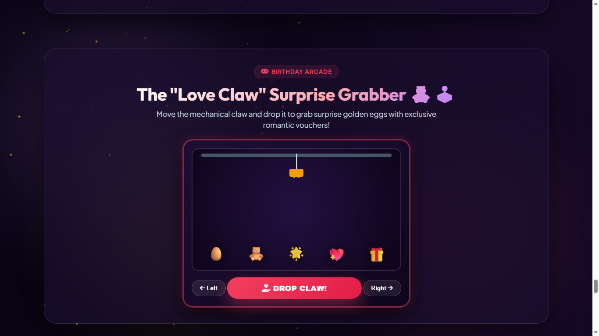
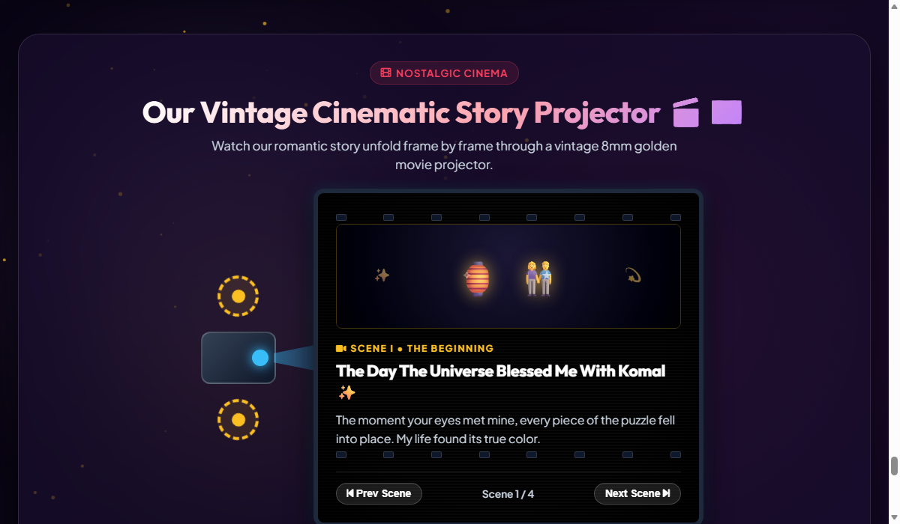

# 👑 Eternal Love — Ultra-Premium Romantic Birthday Celebration

```
   ███████╗████████╗███████╗██████╗ ███╗   ██╗ █████╗ ██╗     ██╗      ██████╗ ██╗   ██╗███████╗
   ██╔════╝╚══██╔══╝██╔════╝██╔══██╗████╗  ██║██╔══██╗██║     ██║     ██╔═══██╗██║   ██║██╔════╝
   █████╗     ██║   █████╗  ██████╔╝██╔██╗ ██║███████║██║     ██║     ██║   ██║██║   ██║█████╗  
   ██╔══╝     ██║   ██╔══╝  ██╔══██╗██║╚██╗██║██╔══██║██║     ██║     ██║   ██║╚██╗ ██╔╝██╔══╝  
   ███████╗   ██║   ███████╗██║  ██║██║ ╚████║██║  ██║███████╗███████╗╚██████╔╝ ╚████╔╝ ███████╗
   ╚══════╝   ╚═╝   ╚══════╝╚═╝  ╚═╝╚═╝  ╚═══╝╚═╝  ╚═╝╚══════╝╚══════╝ ╚═════╝   ╚═══╝  ╚══════╝
```

> ### *A Celestial, Animated & Deeply Personalized Digital Experience Handcrafted with Infinite Love for Komal*

[](http://localhost:8080)
[](#-overview)
[](#-overview)
[](#-pure-vanilla-architecture)

[](#-pure-vanilla-architecture)
[](#-connecting-your-free-google-sheet--google-drive-in-3-minutes)
[](#-connecting-your-free-google-sheet--google-drive-in-3-minutes)
[](#-polyphonic-web-audio-synthesizer)
[-10b981?style=flat-square&logo=googlechrome&logoColor=white)](#-responsive-engineering--audit-benchmark)
[](#-instant-interactive-deployment-matrix)

---

## 📸 Visual Showcase & Screen Previews

### 🖥️ Desktop Cinema View (1366px × 768px)
*Ultra-luxurious cosmic atmosphere, real-time relationship countdown, floating glowing lanterns & particles.*


---

### 📱 Mobile Experience (375px - 390px Viewport)
*Sleek 2-row sticky navigation header, thumb-friendly category chips, zero horizontal overflow.*

| 📱 2-Row Header & Hero | 🏺 Magic Reasons Jar | 🛋️ Cuddle Haven Cinema |
| :---: | :---: | :---: |
|  |  |  |

---

### 📲 Instant QR Code Access & Gift Card Asset
*Scan with your smartphone camera to immediately unbox the celebration or print directly on a greeting card for Queen Komal:*

<div align="center">
  <a href="webqr.png">
    
  </a>
  <p><strong>👑 Point Phone Camera to Scan & Launch Celebration Instantly</strong></p>
</div>

---

## 🌟 Overview

**Eternal Love** is an ultra-luxurious, production-grade romantic celebration website handcrafted specifically for **Komal's Birthday on September 5th**, dedicated with infinite devotion by **Dilip**.

Built from scratch with zero external UI frameworks, it combines high-performance native Web APIs (Web Audio API polyphonic sound synthesis, HTML5 Canvas particle physics, 3D CSS perspective stages, and local storage state management) into a permanent digital keepsake.

| Key Attribute | Specification |
| :--- | :--- |
| **👑 Birthday Celebrant** | **Komal** *(The Birthday Queen)* |
| **🎂 Birthday Date** | **September 5th** |
| **💖 Dedicated By** | **Dilip** |
| **⏳ Relationship Anniversary** | **December 29, 2025** *(Live Precision Counter)* |
| **🗝️ Secret Wish Vault PIN** | `2912` *(or 1-tap Queen's Heart Key)* |
| **⚡ Engine** | Pure Vanilla HTML5 + CSS3 + ES6+ (Zero NPM packages needed) |
| **📱 Viewport Support** | 320px (iPhone SE) to 4K Displays (Zero Horizontal Scroll) |

---

## 📚 Complete Project Documentation Suite

Explore the comprehensive 11-document engineering, user, and operational specifications:

| Document | Purpose & Target Audience | Direct Link |
| :--- | :--- | :---: |
| 🧭 **Documentation Index** | Master navigation hub, reading paths, and quality scorecards | [DOCUMENTATION_INDEX.md](file:///c:/Users/Himanshu/Documents/HTML/New%20folder/new/documentation/DOCUMENTATION_INDEX.md) |
| 🗺️ **Visual Project Structure** | Graphical file layout, Mermaid topologies & component map | [PROJECT_STRUCTURE.md](file:///c:/Users/Himanshu/Documents/HTML/New%20folder/new/documentation/PROJECT_STRUCTURE.md) |
| 📖 **User Guide & Handbook** | Step-by-step interactive manual for Queen Komal, Dilip & guests | [USER_GUIDE.md](file:///c:/Users/Himanshu/Documents/HTML/New%20folder/new/documentation/USER_GUIDE.md) |
| 🏛️ **Architecture & Procurement** | System design, serverless topology, and $0.00 zero-cost TCO blueprint | [ARCHITECTURE_AND_PROCUREMENT.md](file:///c:/Users/Himanshu/Documents/HTML/New%20folder/new/documentation/ARCHITECTURE_AND_PROCUREMENT.md) |
| 📡 **API & Backend Reference** | Google Apps Script webhook schemas, payloads & Code.gs functions | [API_DOCUMENTATION.md](file:///c:/Users/Himanshu/Documents/HTML/New%20folder/new/documentation/API_DOCUMENTATION.md) |
| 📜 **Software Requirements (SRS)** | IEEE-830 compliant functional requirements (FR-01 to FR-28) | [SOFTWARE_REQUIREMENTS_SPECIFICATION.md](file:///c:/Users/Himanshu/Documents/HTML/New%20folder/new/documentation/SOFTWARE_REQUIREMENTS_SPECIFICATION.md) |
| 🔒 **Security & Privacy Policy** | Threat model, XSS defense, local storage sandboxing & zero tracking | [SECURITY_AND_PRIVACY_POLICY.md](file:///c:/Users/Himanshu/Documents/HTML/New%20folder/new/documentation/SECURITY_AND_PRIVACY_POLICY.md) |
| 🧪 **Verification & Test Report** | Multi-device matrix audit (320px-1920px), CDP automation & zero defects | [TESTING_REPORT.md](file:///c:/Users/Himanshu/Documents/HTML/New%20folder/new/documentation/TESTING_REPORT.md) |
| 🚀 **Deployment Guide** | Official step-by-step GitHub Pages deployment guide (.nojekyll, DNS, QR) | [DEPLOYMENT.md](file:///c:/Users/Himanshu/Documents/HTML/New%20folder/new/documentation/DEPLOYMENT.md) |
| 🛠️ **Maintenance & Operations** | Annual birthday rollover runbook, cloud quota tracking & archival | [MAINTENANCE_AND_OPERATIONS.md](file:///c:/Users/Himanshu/Documents/HTML/New%20folder/new/documentation/MAINTENANCE_AND_OPERATIONS.md) |
| 💻 **Developer & Contributor Guide**| Code standards, CSS tokens, adding new themes/melodies | [CONTRIBUTING.md](file:///c:/Users/Himanshu/Documents/HTML/New%20folder/new/documentation/CONTRIBUTING.md) |
| 📋 **Changelog** | Semantic release history from v1.0.0 to v2.1.0 | [CHANGELOG.md](file:///c:/Users/Himanshu/Documents/HTML/New%20folder/new/documentation/CHANGELOG.md) |
| ❓ **FAQ & Troubleshooting** | Audio unlock, Google Sheet sync diagnostics & display fixes | [FAQ_AND_TROUBLESHOOTING.md](file:///c:/Users/Himanshu/Documents/HTML/New%20folder/new/documentation/FAQ_AND_TROUBLESHOOTING.md) |
| ✨ **Coming Soon Launch Page** | September 20 grand reveal teaser with live countdown & VIP pass | [coming-soon.html](file:///c:/Users/Himanshu/Documents/HTML/New%20folder/new/coming-soon.html) |

---

## 🚀 Official GitHub Pages Deployment Guide

Deploy this celebration in **less than 60 seconds** to GitHub Pages with automatic free HTTPS and Fastly Edge CDN:

1. **Create GitHub Repository**:
   - Navigate to [github.com/new](https://github.com/new).
   - Name your repo (e.g. `happy-birthday-komal` or `eternal-love`).
   - Set repository visibility to **Public**.

2. **Push Your Code**:
   ```bash
   # Initialize git repository
   git init
   git add .
   git commit -m "feat: Eternal Love celebration release 👑💖"
   
   # Set main branch and push
   git branch -M main
   git remote add origin https://github.com/<YOUR-USERNAME>/<REPO-NAME>.git
   git push -u origin main
   ```

3. **Activate GitHub Pages**:
   - Go to your repository **Settings** $\rightarrow$ **Pages**.
   - Under **Build and deployment** $\rightarrow$ **Source**, choose **Deploy from a branch**.
   - Set **Branch** to `main` and directory to `/ (root)`, then click **Save**.
   - 🎉 **Your live celebration URL:** `https://<YOUR-USERNAME>.github.io/<REPO-NAME>/`

4. **⏳ Automatic September 20 Launch Transition**:
   - Prior to September 20, 2026: The URL displays the live countdown on [`coming-soon.html`](file:///c:/Users/Himanshu/Documents/HTML/New%20folder/new/coming-soon.html). (Queen Komal can bypass with PIN `2912` or `?preview=true`).
   - On & after September 20, 2026: The URL automatically serves the full [`index.html`](file:///c:/Users/Himanshu/Documents/HTML/New%20folder/new/index.html) celebration without any manual intervention!

---

<details>
<summary><b>💻 Local Testing & Mobile Phone Preview (Click to Expand)</b></summary>

You can test and preview the celebration immediately on your computer or phone without installing external packages:

* **Direct Browser Launch**: Double-click `index.html` to open in any web browser.
* **Python Server**:
  ```bash
  python -m http.server 8080
  ```
  Open `http://localhost:8080` in your browser.
* **Previewing on Your Smartphone via Local Wi-Fi**:
  1. Run `python -m http.server 8080`.
  2. Find your computer's local IP address (`ipconfig` on Windows or `ifconfig` on Mac/Linux), e.g. `192.168.1.50`.
  3. Open `http://192.168.1.50:8080` on your smartphone browser connected to the same Wi-Fi.

</details>

---

## 📊 Connecting Your Free Google Sheet & Google Drive in 3 Minutes

Every wish written on the Celebration Pinboard, real couple photo uploaded into the Polaroid Gallery, and secret birthday wish locked inside the Starry Time Capsule can be automatically saved in your **personal, free Google Sheet & Google Drive** in real-time — with **zero subscriptions, zero monthly fees, and zero server maintenance**!

### 🌟 Why This Cloud Sync Engine is Full-Proof:
* **100% Free Forever**: Zero monthly subscriptions, zero paid API keys, and zero limits.
* **Serverless Google Apps Script (GAS)**: Executes serverless code directly on your Google Account with Google's enterprise reliability.
* **Auto Google Drive Folder Storage**: Google Sheets cells have a 50,000-character ceiling, which causes base64 images to fail in typical apps. Our script automatically saves high-resolution uploaded images into a dedicated Google Drive folder (`Eternal Love Memories (Komal)`), marks them viewable with link, and places the direct link + a live `=IMAGE(url)` thumbnail preview formula directly inside the spreadsheet!
* **Offline & Local-First Resilience**: Even without a Google Sheet URL, or when offline, every submission saves instantly to browser `localStorage`. No celebration freeze, no audio drop, and zero data loss.

<br/>

### 🛠️ Step-by-Step Setup Guide (Takes Under 3 Minutes):

<details open>
<summary><b>1️⃣ Step 1: Create Your Free Google Sheet</b></summary>

1. Go to [sheets.new](https://sheets.new) (opens a fresh Google Sheet in your Google account).
2. Name your spreadsheet (e.g. `Eternal Love — Komal's Birthday Archive 👑`).
3. *(Optional)* You do not need to create columns or tabs manually — our script will automatically create the **Wishes**, **Photos**, and **Secret Wishes** tabs with formatted pastel pink headers on the very first submission!

</details>

<details>
<summary><b>2️⃣ Step 2: Open Google Apps Script Editor</b></summary>

1. In your Google Sheet menu bar, click **Extensions** $\rightarrow$ **Apps Script**.
2. A new tab will open titled *Untitled project*.
3. Rename the project to `Eternal Love Cloud Collector` at the top left.

</details>

<details open>
<summary><b>3️⃣ Step 3: Paste the Turnkey Collector Script (`Code.gs`)</b></summary>

1. Delete any existing code inside `Code.gs`.
2. Copy and paste the complete code below (also available directly in [`Code.gs`](file:///Code.gs)):

```javascript
/**
 * 👑 ETERNAL LOVE — GOOGLE APPS SCRIPT CLOUD COLLECTOR (Code.gs)
 * Handcrafted for Komal's Birthday & Dedicated by Dilip.
 */

// GET Health Check Endpoint
function doGet(e) {
  return ContentService.createTextOutput(JSON.stringify({
    status: 'online',
    title: 'Eternal Love Cloud Collector 👑💖',
    message: 'Active & ready to receive wishes and photos!'
  })).setMimeType(ContentService.MimeType.JSON);
}

// POST Webhook Receiver
function doPost(e) {
  try {
    if (!e || !e.postData || !e.postData.contents) {
      return ContentService.createTextOutput(JSON.stringify({ status: 'error', message: 'No payload' })).setMimeType(ContentService.MimeType.JSON);
    }

    var data = JSON.parse(e.postData.contents);
    var type = data.type || 'wish';
    var ss = SpreadsheetApp.getActiveSpreadsheet();

    // 💌 WISHES PINBOARD
    if (type === 'wish') {
      var sheet = ss.getSheetByName('Wishes') || ss.insertSheet('Wishes');
      if (sheet.getLastRow() === 0) {
        sheet.appendRow(['Timestamp', 'Local Time', 'Celebrant', 'Dedicated By', 'Author / Sender', 'Heartfelt Message', 'Sticky Note Style']);
        sheet.getRange(1, 1, 1, 7).setFontWeight('bold').setFontFamily('Arial').setFontColor('#831843').setBackground('#fce7f3').setHorizontalAlignment('center');
        sheet.setFrozenRows(1);
      }
      sheet.appendRow([new Date(), data.localTime || new Date().toLocaleString(), data.celebrant || 'Komal', data.dedicatedBy || 'Dilip', data.author || 'Anonymous', data.message || '', data.styleClass || '']);
      return ContentService.createTextOutput(JSON.stringify({ status: 'success', type: 'wish' })).setMimeType(ContentService.MimeType.JSON);
    }

    // 📸 POLAROID PHOTO UPLOAD (Saved to Drive + Logged in Sheet)
    else if (type === 'photo') {
      var sheet = ss.getSheetByName('Photos') || ss.insertSheet('Photos');
      if (sheet.getLastRow() === 0) {
        sheet.appendRow(['Timestamp', 'Local Time', 'Celebrant', 'Dedicated By', 'Photo Caption', 'Moment Tag', 'Google Drive Link', 'Image Preview']);
        sheet.getRange(1, 1, 1, 8).setFontWeight('bold').setFontFamily('Arial').setFontColor('#831843').setBackground('#fce7f3').setHorizontalAlignment('center');
        sheet.setFrozenRows(1);
      }

      var fileUrl = '';
      var directImgUrl = '';
      var imageFormula = '';

      if (data.dataUrl && data.dataUrl.indexOf(',') !== -1) {
        var folderName = 'Eternal Love Memories (Komal)';
        var folders = DriveApp.getFoldersByName(folderName);
        var folder = folders.hasNext() ? folders.next() : DriveApp.createFolder(folderName);

        var mimeType = data.dataUrl.substring(5, data.dataUrl.indexOf(';')) || 'image/jpeg';
        var base64Data = data.dataUrl.substring(data.dataUrl.indexOf(',') + 1);
        var dateFormatted = Utilities.formatDate(new Date(), Session.getScriptTimeZone() || 'GMT+0530', 'yyyy-MM-dd_HH-mm-ss');
        var fileName = 'Komal_Memory_' + dateFormatted + '.jpg';

        var blob = Utilities.newBlob(Utilities.base64Decode(base64Data), mimeType, fileName);
        var file = folder.createFile(blob);
        file.setSharing(DriveApp.Access.ANYONE_WITH_LINK, DriveApp.Permission.VIEW);
        
        fileUrl = file.getUrl();
        directImgUrl = 'https://drive.google.com/uc?export=view&id=' + file.getId();
        imageFormula = '=IMAGE("' + directImgUrl + '")';
      }

      sheet.appendRow([new Date(), data.localTime || new Date().toLocaleString(), data.celebrant || 'Komal', data.dedicatedBy || 'Dilip', data.caption || 'Our memory', data.tag || 'Real Moment', fileUrl, imageFormula]);
      sheet.setRowHeight(sheet.getLastRow(), 90);
      return ContentService.createTextOutput(JSON.stringify({ status: 'success', type: 'photo', fileUrl: fileUrl })).setMimeType(ContentService.MimeType.JSON);
    }

    // 🔮 SECRET TIME CAPSULE WISH
    else if (type === 'secret_wish') {
      var sheet = ss.getSheetByName('Secret Wishes') || ss.insertSheet('Secret Wishes');
      if (sheet.getLastRow() === 0) {
        sheet.appendRow(['Timestamp', 'Local Time', 'Celebrant', 'Dedicated By', 'Secret Birthday Wish']);
        sheet.getRange(1, 1, 1, 5).setFontWeight('bold').setFontFamily('Arial').setFontColor('#831843').setBackground('#fce7f3').setHorizontalAlignment('center');
        sheet.setFrozenRows(1);
      }
      sheet.appendRow([new Date(), data.localTime || new Date().toLocaleString(), data.celebrant || 'Komal', data.dedicatedBy || 'Dilip', data.wish || '']);
      return ContentService.createTextOutput(JSON.stringify({ status: 'success', type: 'secret_wish' })).setMimeType(ContentService.MimeType.JSON);
    }

    return ContentService.createTextOutput(JSON.stringify({ status: 'ignored' })).setMimeType(ContentService.MimeType.JSON);
  } catch (err) {
    return ContentService.createTextOutput(JSON.stringify({ status: 'error', message: err.toString() })).setMimeType(ContentService.MimeType.JSON);
  }
}
```

3. Click the **💾 Save** icon (or press `Ctrl + S`).

</details>

<details>
<summary><b>4️⃣ Step 4: Deploy as a Web App (Public Access)</b></summary>

1. In the upper right corner of Google Apps Script, click **Deploy** $\rightarrow$ **New deployment**.
2. Click the gear icon ⚙️ next to *Select type* and select **Web app**.
3. Fill in the deployment configuration:
   * **Description**: `Eternal Love Cloud Sync v1`
   * **Execute as**: `Me (<your-email>@gmail.com)` *(Ensures permissions to write to your Sheet & Drive)*
   * **Who has access**: `Anyone` *(Crucial: Allows the website to send wishes and photos without requiring user Google logins)*
4. Click **Deploy**.
5. Click **Authorize access**, select your Google account, click **Advanced** $\rightarrow$ **Go to Eternal Love Cloud Collector (unsafe)** *(standard for personal scripts)*, and click **Allow**.
6. **Copy the Web app URL** (it looks like: `https://script.google.com/macros/s/AKfycb.../exec`).

</details>

<details open>
<summary><b>5️⃣ Step 5: Connect It to Your Celebration Website</b></summary>

Choose either of the two easy methods:

* **Method A: In the Website UI (Instant & Easy)**:
  1. Open your live website in any browser.
  2. Click the **⚙️ Settings** button in the top navigation bar.
  3. Paste your Web App URL into the **Google Sheets Webhook URL** field.
  4. Click **Apply All Changes**.
  5. The sync badges next to the Wish Board and Polaroid Gallery will instantly switch to:
     `Google Sheets Connected ✨` and `Google Drive Connected 📸`!

* **Method B: Via Shareable URL Parameter**:
  Simply append `&sheet=<YOUR-URL>` to your celebration link:
  ```
  https://<your-domain>/?name=Komal&sender=Dilip&sheet=https%3A%2F%2Fscript.google.com%2Fmacros%2Fs%2FAKfycb...%2Fexec
  ```

</details>

---

## 🎨 Interactive URL Personalization Engine

You can personalize the recipient, sender, anniversary date, birthday headline, and atmospheric color scheme dynamically via URL parameters without modifying code:

```
https://<your-domain>/?name=Komal&sender=Dilip&date=2025-12-29&theme=theme-magical
```

### 🔗 URL Parameters Reference

| Parameter | Default Value | Description | Example |
| :--- | :---: | :--- | :--- |
| `name` | `Komal` | Name of the birthday celebrant | `?name=Komal` |
| `sender` | `Dilip` | Name of the person dedicating the gift | `?sender=Dilip` |
| `date` | `2025-12-29` | Anniversary date for live counter | `?date=2025-12-29` |
| `theme` | `theme-magical` | Atmosphere color scheme | `?theme=theme-sunset` |
| `sheet` | `None` *(Local-only)* | Google Apps Script Web App URL for live cloud sync | `?sheet=https://script.google.com/macros/s/.../exec` |
| `msg` | *(Handcrafted)* | Custom birthday headline | `?msg=Happy+Birthday+My+Queen` |

<br/>

### 🌌 9 Pre-Curated Luxury Atmosphere Themes

| Theme ID | Aesthetic Name | Visual Palette | Mood |
| :--- | :--- | :--- | :--- |
| `theme-magical` *(Default)* | 💜 **Magical Violet Romance** | Deep Royal Purple, Neon Pink, Star Gold | Cosmic & Dreamy |
| `theme-emerald` | 🌌 **Emerald Aurora** | Starlit Northern Lights, Mint, Cyan | Celestial & Serene |
| `theme-sunset` | 🌅 **Sunset Rose Gold** | Warm Coral, Tangerine, Golden Amber | Intimate & Nostalgic |
| `theme-midnight` | 🌃 **Midnight Indigo** | Deep Navy Stardust, Electric Blue | Elegant & Quiet |
| `theme-rococo` | 👑 **Versailles Palace Rococo** | 24K Antique Gold, Imperial Burgundy | Royal & Opulent |
| `theme-sakura` | 🌸 **Kyoto Moonlit Sakura** | Cherry Blossom Pink, Washi Paper Ivory | Delicate & Soft |
| `theme-jazz` | ☕ **Parisian Midnight Jazz** | Edison Lamp Amber, Roasted Mahogany | Warm & Soulful |
| `theme-cyber` | 🪐 **Cyber-Starlight Luminescence** | Electric Cyan, Neon Magenta, Void Black | Futuristic & Vibrant |
| `theme-fairy` | 🌿 **Enchanted Fairy Forest** | Bioluminescent Emerald, Firefly Gold | Mythical & Organic |

---

## ✨ 20 Handcrafted Interactive Modules & Previews

### 1. 🎁 3D Surprise Gift Unboxing Ceremony
Interactive 3D gift box with satin ribbons, golden bow, and ambient pulsating glow rings. Tapping triggers lid-opening physics, chime audio, fireworks, and a 110-particle confetti burst.


---

### 2. ⏳ Hero & Live Relationship Milestone Clock
Real-time precision ticker calculating **Years, Months, Days, Hours, Minutes, and Seconds** from **December 29, 2025**. Includes interactive cheer chips (`🥂 Send Cheers`, `💖 Send Infinite Love`, `🎆 Launch Fireworks`).


---

### 3. 💌 Section 1: The Wax-Sealed Romantic Love Letter
Deep velvet 3D envelope with a glowing crimson wax seal stamped `OPEN`. Clicking the seal cracks the wax with audio FX, unfolds the flap, and types out a handwritten letter.


---

### 4. 💌 Section 2: "Open When..." Situation Letters & Reader
4 luxury situation envelopes with glowing wax seals (*When You Miss Me, When You've Had A Stressful Day, When You Can't Sleep, When You Need A Smile*). Opens a luxury stationery reader modal.


---

### 5. 📖 Section 3: "Our Love Story" Milestone Journey Timeline
Glowing vertical milestone ribbon tracing the journey of your relationship across 5 story chapters with custom badges and memories.


---

### 6. 🎂 Section 4: 3D Cake Ceremony, Candle Blowout & Secret Wish Vault
3-tier cake with flickering candle flames with blowout puff audio and smoke particles. Includes interactive golden knife cutting ceremony and the celestial **Secret Wish Time Capsule Vault**.


---

### 7. 🛋️ Section 5: Cozy Starlit Cuddle Haven (3D Couple Cinema)
3D animated scene of Dilip & Komal cuddling on a plush sofa under a moonlit skylight with a warm fireside glow. Features rhythmic breathing animation, custom monogrammed blanket, and camera angle switcher.


---

### 8. 🏺 Section 6: "100 Reasons Why I Love You" Magic Jar & 3D Origami Heart
Glowing glass jar with floating fireflies and sweet love notes. Features 3D origami heart unfold physics and categorized confession pills (*Pure Romance, Cute Habits, Safe Haven, Queen Komal, Little Things, Forever*).


---

### 9. 🎟️ Section 7: Redeemable Couple Love Coupons
Perforated love vouchers for real-life romantic treats (*Midnight Ice Cream Run, Unlimited Cuddles & Back Rub, Candlelight Rooftop Date, Movie Marathon*). Stamped `REDEEMED 💖` with fanfare audio and persistent storage.


---

### 10. 🎹🎸📼 Section 8: Tri-Instrument Romantic Music Lounge
* **🎹 Grand Piano**: Polyphonic piano keyboard with live key depression, keyboard hotkeys (`1-8`, `Q-U`), and automated romantic song playback.
* **🎸 Acoustic Guitar**: 6 strummable strings with acoustic sound decay and 1-tap instant chord buttons.
* **📼 Vintage Mixtape**: Retro cassette player with spinning reels, real-time counter, procedural vinyl crackle, and 8 mixtape tracks.


---

### 11. 🌸 Section 9: 3D Forever Flower Bouquet Studio & Gifting Ceremony
Interactive flower garden where you pick Red Roses, Peonies, Orchids, and Sunflowers with custom satin ribbons. Features full-screen royal presentation ceremony with gold-embossed dedication card.


---

### 12. 🧩 Section 10: "How Well Do You Know Dilip & Us?" Couple Trivia
Interactive 5-question couple quiz with instant feedback badges, score calculation, and custom love commentary.


---

### 13. 📷 Section 11: Vintage Polaroid Romantic Photo Gallery
Polaroid snapshots with realistic paper tilts, handwritten captions, and instant client-side photo uploader with auto-downscaling to prevent storage crashes.


---

### 14. ✨ Section 12: Constellation of Our Love & Star Registry
Interactive celestial night sky with twinkling stars and an official printable "Star Registry Certificate" registered in Komal's name.


---

### 15. 🏮 Section 13: Floating Birthday Sky Lantern Release
Write a birthday wish on a paper lantern and launch it into the night sky with floating physics.


---

### 16. 🕹️ Section 14: The "Love Claw" Surprise Arcade Grabber
Controllable mechanical crane with `Left`, `Right`, and `DROP CLAW` buttons to grab golden surprise eggs with exclusive romantic vouchers.



---

### 17. 📽️ Section 15: Vintage Cinematic 8mm Story Projector
Retro movie projector with spinning golden reels and flickering vintage film grain narrating your love story frame by frame.



---

### 18. 🪞 Section 16: The Enchanted "Mirror of Queen Komal"
Interactive ornate gold mirror reflecting randomized royal daily affirmations for the Queen of your heart.


---

## 🔬 Polyphonic Web Audio Synthesizer

The celebration features a **zero-dependency polyphonic audio synthesizer** built entirely with the browser's native **Web Audio API**:

* **Grand Piano**: Dual-oscillator (`sine` + `triangle`) with an ADSR envelope (Attack: 5ms, Decay: 1.2s, Sustain: 0.15, Release: 800ms) and warm low-pass filtering.
* **Acoustic Guitar**: Resonant dual-triangle oscillator with natural string decay.
* **Analog Vinyl Crackle**: Procedural white noise buffer passed through a highpass filter (800 Hz) with random gain spikes.
* **Autoplay Compliance**: Audio remains dormant until the user unlocks it by tapping **"Open My Birthday Surprise"**, complying with mobile browser autoplay policies.

---

## 📱 Responsive Engineering & Audit Benchmark

Verified across 10 standard device viewports using automated Microsoft Edge Headless CDP emulation:

| Device Viewport | Dimensions | Layout Architecture | Horizontal Overflow | Result |
| :--- | :---: | :---: | :---: | :---: |
| **iPhone SE / Mini Android** | `320 × 667` | Fluid Single Column | **0px (None)** | 🟢 **100% Passed** |
| **Galaxy S8 / Mini Mobile** | `360 × 740` | Fluid Single Column | **0px (None)** | 🟢 **100% Passed** |
| **iPhone 13 / 14 / 15** | `375 × 812` | Fluid Single Column | **0px (None)** | 🟢 **100% Passed** |
| **iPhone 14 Pro / Dynamic Island** | `390 × 844` | Fluid Single Column | **0px (None)** | 🟢 **100% Passed** |
| **Large Mobile (Max / Plus)** | `414 × 896` | Fluid Single Column | **0px (None)** | 🟢 **100% Passed** |
| **iPad / Tablet Portrait** | `768 × 1024` | Adaptive 2-Column | **0px (None)** | 🟢 **100% Passed** |
| **iPad Pro / Small Laptop** | `1024 × 768` | Multi-Column Grid | **0px (None)** | 🟢 **100% Passed** |
| **Standard Laptop** | `1280 × 800` | Multi-Column Grid | **0px (None)** | 🟢 **100% Passed** |
| **Desktop Monitor** | `1440 × 900` | Multi-Column Grid | **0px (None)** | 🟢 **100% Passed** |
| **Full HD / 4K UHD** | `1920 × 1080` | Multi-Column Grid | **0px (None)** | 🟢 **100% Passed** |

---

## 📂 Repository Topology

```
eternal-love/
├── index.html        # Semantic HTML5 (20 modules, stationery modals, accessibility)
├── style.css         # Pure Vanilla CSS (Luxury design tokens, 3D stages, responsive breakpoints)
├── script.js         # Interactive engine (Web Audio API synth, confetti, game loop, state)
├── Code.gs           # Turnkey Google Apps Script (Saves wishes, photos & secrets to Sheets & Drive)
├── README.md         # Master interactive visual & deployment documentation
└── screenshots/      # 20 High-resolution showcase captures (Desktop, Mobile, Features)
    ├── 01-desktop-hero.png
    ├── 02-desktop-cake.png
    ├── 03-desktop-cuddle.png
    ├── 04-desktop-music.png
    ├── 05-desktop-coupons.png
    ├── 06-desktop-arcade.png
    ├── 07-mobile-hero.png
    ├── 08-mobile-jar.png
    ├── 09-mobile-cuddle.png
    ├── 10-unboxing-intro.png
    ├── 11-love-letter.png
    ├── 12-open-when-letters.png
    ├── 13-story-timeline.png
    ├── 14-bouquet-studio.png
    ├── 15-couple-quiz.png
    ├── 16-polaroid-gallery.png
    ├── 17-constellation-sky.png
    ├── 18-sky-lanterns.png
    ├── 19-story-projector.png
    └── 20-magic-mirror.png
```

---

## 👑 Royal Signature & Dedication

*“In all the universe, across all the stars and timelines, loving you is my greatest adventure.”*

### Handcrafted with Infinite Devotion for Queen Komal 👑
### Dedicated by Dilip 💕
*Anniversary: December 29, 2025 • Birthday: September 5th*
