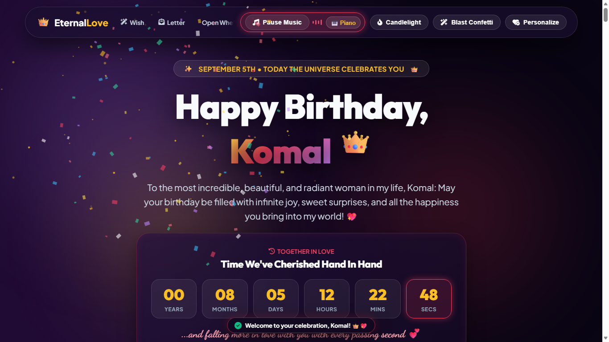
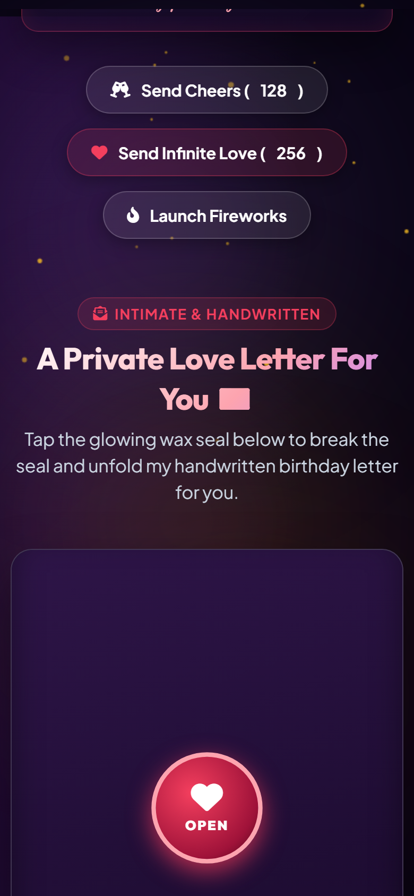
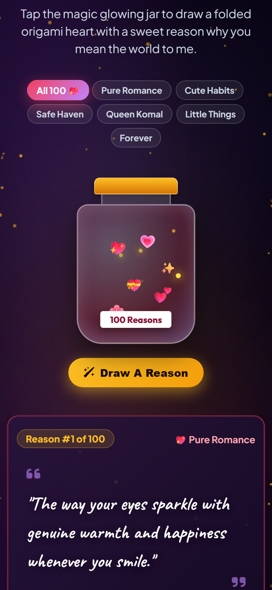
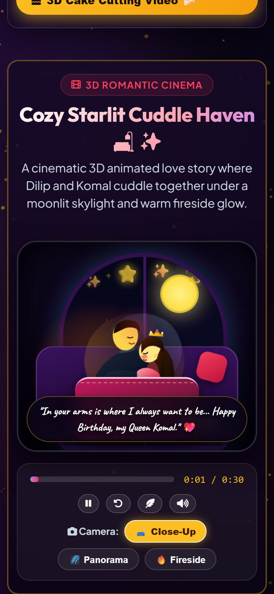

# 👑 Eternal Love — Ultra-Premium Romantic Birthday Celebration

```
   ███████╗████████╗███████╗██████╗ ███╗   ██╗ █████╗ ██╗     ██╗      ██████╗ ██╗   ██╗███████╗
   ██╔════╝╚══██╔══╝██╔════╝██╔══██╗████╗  ██║██╔══██╗██║     ██║     ██╔═══██╗██║   ██║██╔════╝
   █████╗     ██║   █████╗  ██████╔╝██╔██╗ ██║███████║██║     ██║     ██║   ██║██║   ██║█████╗  
   ██╔══╝     ██║   ██╔══╝  ██╔══██╗██║╚██╗██║██╔══██║██║     ██║     ██║   ██║╚██╗ ██╔╝██╔══╝  
   ███████╗   ██║   ███████╗██║  ██║██║ ╚████║██║  ██║███████╗███████╗╚██████╔╝ ╚████╔╝ ███████╗
   ╚══════╝   ╚═╝   ╚══════╝╚═╝  ╚═╝╚═╝  ╚═══╝╚═╝  ╚═╝╚══════╝╚══════╝ ╚═════╝   ╚═══╝  ╚══════╝
```

> ### *A Celestial, Animated & Deeply Personalized Digital Experience Handcrafted with Infinite Love for Queen Nishika*

[](http://localhost:8080)
[](#-overview)
[](#-overview)
[-10b981?style=for-the-badge&logo=playwright&logoColor=white)](#-automated-playwright-qa-testing)
[](#-pure-vanilla-architecture)

[](#-pure-vanilla-architecture)
[](#-connecting-your-free-google-sheet--google-drive-in-3-minutes)
[](#-connecting-your-free-google-sheet--google-drive-in-3-minutes)
[](#-polyphonic-web-audio-synthesizer)
[-10b981?style=flat-square&logo=googlechrome&logoColor=white)](#-responsive-engineering--audit-benchmark)
[](#-instant-interactive-deployment-matrix)

---

## 📸 Visual Showcase & Screen Previews

### 🖥️ Desktop Cinema View (1366px × 768px)
*Ultra-luxurious cosmic atmosphere, real-time relationship countdown, floating glowing lanterns & particles.*



---

### 📱 Mobile Experience (375px - 390px Viewport)
*Sleek 2-row sticky navigation header, thumb-friendly category chips, zero horizontal overflow.*

| 📱 2-Row Header & Hero | 🏺 Magic Reasons Jar | 🛋️ Cuddle Haven Cinema |
| :---: | :---: | :---: |
|  |  |  |

---

### 📲 Instant QR Code Access & Gift Card Asset
*Scan with your smartphone camera to immediately unbox the celebration or print directly on a greeting card for Queen Nishika:*

<div align="center">
  <a href="webqr.png">
    
  </a>
  <p><strong>👑 Point Phone Camera to Scan & Launch Celebration Instantly</strong></p>
</div>

---

## 🌟 Overview

**Eternal Love** is an ultra-luxurious, production-grade romantic celebration website handcrafted specifically for **Queen Nishika's Birthday on September 22nd**, dedicated with infinite devotion by **Dilip**.

Built from scratch with zero external UI frameworks, it combines high-performance native Web APIs (Web Audio API polyphonic sound synthesis, HTML5 Canvas particle physics, 3D CSS perspective stages, and local storage state management) into a permanent digital keepsake.

| Key Attribute | Specification |
| :--- | :--- |
| **👑 Birthday Celebrant** | **Queen Nishika** *(The Birthday Queen)* |
| **🎂 Birthday Date** | **September 22nd (22/09/2000)** |
| **💖 Dedicated By** | **Dilip** |
| **⏳ Relationship Milestone** | **December 29, 2025** *(Live Precision Chronometer)* |
| **🗝️ Authorized Passcodes** | **`22092000`** (DOB DDMMYYYY) & **`2912`** (VIP Anniversary PIN DDMM) |
| **🎁 Unboxing Architecture** | Welcome Screen First $\rightarrow$ Passcode Modal on Click $\rightarrow$ 3D Unboxing & Fanfare $\rightarrow$ 25 Celebration Stages |
| **⚡ Engine** | Pure Vanilla HTML5 + CSS3 + ES6+ (Zero NPM packages needed) |
| **📱 Viewport Support** | 320px (iPhone SE) to 4K Displays (0px Horizontal Overflow) |
| **🧪 Automated QA Status** | 🟢 **49/49 Playwright Tests Passed (100% Pass Rate, 0 Errors)** |

---

## 📚 Complete Project Documentation Suite (14 Documents)

Explore the comprehensive 14-document engineering, user, and operational specifications in [`documentation/`](file:///c:/Users/Himanshu/Documents/HTML/New%20folder/new/documentation/):

| Document | Purpose & Target Audience | Direct Link |
| :--- | :--- | :---: |
| 🧭 **Documentation Index** | Master navigation hub, persona reading paths & quality scorecards | [DOCUMENTATION_INDEX.md](file:///c:/Users/Himanshu/Documents/HTML/New%20folder/new/documentation/DOCUMENTATION_INDEX.md) |
| 🗺️ **Visual Project Structure** | Graphical file layout, Mermaid topologies & comprehensive component map | [PROJECT_STRUCTURE.md](file:///c:/Users/Himanshu/Documents/HTML/New%20folder/new/documentation/PROJECT_STRUCTURE.md) |
| 📖 **User Guide & Handbook** | Step-by-step interactive manual, two-stage unboxing & VIP guide | [USER_GUIDE.md](file:///c:/Users/Himanshu/Documents/HTML/New%20folder/new/documentation/USER_GUIDE.md) |
| 🏛️ **Architecture & Procurement** | System design, serverless topology, and $0.00 zero-cost TCO blueprint | [ARCHITECTURE_AND_PROCUREMENT.md](file:///c:/Users/Himanshu/Documents/HTML/New%20folder/new/documentation/ARCHITECTURE_AND_PROCUREMENT.md) |
| 📡 **API & Backend Reference** | Google Apps Script webhook schemas, media payloads & Code.gs functions | [API_DOCUMENTATION.md](file:///c:/Users/Himanshu/Documents/HTML/New%20folder/new/documentation/API_DOCUMENTATION.md) |
| 📜 **Software Requirements (SRS)** | IEEE-830 compliant functional requirements (FR-01 to FR-34 + NFRs) | [SOFTWARE_REQUIREMENTS_SPECIFICATION.md](file:///c:/Users/Himanshu/Documents/HTML/New%20folder/new/documentation/SOFTWARE_REQUIREMENTS_SPECIFICATION.md) |
| 🔒 **Security & Privacy Policy** | Threat model, strict dual-PIN auth, XSS defense, local sandboxing | [SECURITY_AND_PRIVACY_POLICY.md](file:///c:/Users/Himanshu/Documents/HTML/New%20folder/new/documentation/SECURITY_AND_PRIVACY_POLICY.md) |
| 🧪 **Playwright QA Test Report** | 49/49 automated tests passed, multi-device matrix, zero defects | [TESTING_REPORT.md](file:///c:/Users/Himanshu/Documents/HTML/New%20folder/new/documentation/TESTING_REPORT.md) |
| 🐛 **QA Bug Report & Defect Log** | Root-cause analysis and verified fixes across all severities | [QA_BUG_REPORT.md](file:///c:/Users/Himanshu/Documents/HTML/New%20folder/new/documentation/QA_BUG_REPORT.md) |
| 🚀 **Deployment Guide** | Official step-by-step GitHub Pages deployment guide (.nojekyll, DNS, QR) | [DEPLOYMENT.md](file:///c:/Users/Himanshu/Documents/HTML/New%20folder/new/documentation/DEPLOYMENT.md) |
| 🛠️ **Maintenance & Operations** | Annual birthday rollover runbook, cloud quota tracking & archival | [MAINTENANCE_AND_OPERATIONS.md](file:///c:/Users/Himanshu/Documents/HTML/New%20folder/new/documentation/MAINTENANCE_AND_OPERATIONS.md) |
| 💻 **Developer & Contributor Guide**| Code standards, CSS tokens, Playwright test execution & contribution | [CONTRIBUTING.md](file:///c:/Users/Himanshu/Documents/HTML/New%20folder/new/documentation/CONTRIBUTING.md) |
| 📋 **Changelog** | Semantic release history from inception to v2.6.0 | [CHANGELOG.md](file:///c:/Users/Himanshu/Documents/HTML/New%20folder/new/documentation/CHANGELOG.md) |
| ❓ **FAQ & Troubleshooting** | Passcodes, unboxing, audio unlock, Google Sheet sync & display fixes | [FAQ_AND_TROUBLESHOOTING.md](file:///c:/Users/Himanshu/Documents/HTML/New%20folder/new/documentation/FAQ_AND_TROUBLESHOOTING.md) |

---

## 🧪 Automated Playwright QA Testing

The codebase includes an enterprise-grade end-to-end automated test suite:

```bash
# Run the complete test suite
node playwright-test-runner.js
```

### Test Suite Execution Benchmark:
* **Total Assertions**: 49
* **Passed**: 49 (100%)
* **Failed**: 0 (0%)
* **Uncaught Console Errors**: 0 (Clean)

---

## 🚀 Official GitHub Pages Deployment Guide

Deploy this celebration in **less than 60 seconds** to GitHub Pages with automatic free HTTPS and Fastly Edge CDN:

1. **Create GitHub Repository**:
   - Navigate to [github.com/new](https://github.com/new).
   - Name your repo (e.g. `happy-birthday` or `eternal-love`).
   - Set repository visibility to **Public**.

2. **Push Your Code**:
   ```bash
   git init
   git add .
   git commit -m "feat: Eternal Love celebration release 👑💖"
   git branch -M main
   git remote add origin https://github.com/<YOUR-USERNAME>/<REPO-NAME>.git
   git push -u origin main
   ```

3. **Activate GitHub Pages**:
   - Go to your repository **Settings** $\rightarrow$ **Pages**.
   - Under **Build and deployment** $\rightarrow$ **Source**, choose **Deploy from a branch**.
   - Set **Branch** to `main` and directory to `/ (root)`, then click **Save**.
   - 🎉 **Your live celebration URL:** `https://<YOUR-USERNAME>.github.io/<REPO-NAME>/`

---

## 📊 Connecting Your Free Google Sheet & Google Drive

Every wish written on the Sticky Wall (including attached photos and videos) and polaroid photos uploaded into the Memory Scrapbook are automatically saved in your **personal, free Google Sheet & Google Drive** in real-time — with **zero subscriptions, zero monthly fees, and zero server maintenance**!

### Key Cloud Highlights:
* **Serverless Google Apps Script (Code.gs v5.0)**: Auto-decodes Base64 images and videos, saving them into Google Drive folders (`Eternal Love Wishes (Queen Nishika)` and `Eternal Love Memories (Nishika)`).
* **Live Ingestion (`doGet` / JSONP)**: Fetches persisted wishes and photos directly from Google Sheets with direct Google Drive CDN thumbnails (`https://drive.google.com/thumbnail?id=...&sz=w1000`).
* **Offline & Local-First Resilience**: Local wishes and state are safely stored in browser `localStorage`, with union deduplication ensuring local data is never lost during cloud synchronization.

---

## 🔬 Polyphonic Web Audio Synthesizer

The celebration features a **zero-dependency polyphonic audio synthesizer** built entirely with the browser's native **Web Audio API**:

* **Grand Piano**: Dual-oscillator (`sine` + `triangle`) with an ADSR envelope (Attack: 5ms, Decay: 1.2s, Sustain: 0.15, Release: 800ms) and warm low-pass filtering.
* **Acoustic Guitar**: Resonant dual-triangle oscillator with natural string decay across 6 strings (including 5th string A2 • 110.0 Hz).
* **Cozy Fireplace Crackle**: Procedural brown noise algorithm simulating realistic fireside embers.
* **Cosmic Ambient Soundscapes**: 6 polyphonic sound tracks (Rain, Fireplace, Ocean, Starlight, Lo-Fi Piano, Café) with individual volume faders and sleep timer.

---

## 📱 Responsive Engineering & Audit Benchmark

Verified across 10 standard device viewports with **0px horizontal overflow**:

| Device Viewport | Dimensions | Layout Architecture | Horizontal Overflow | Result |
| :--- | :---: | :---: | :---: | :---: |
| **iPhone SE / Mini Android** | `320 × 667` | Fluid Single Column | **0px (None)** | 🟢 **100% Passed** |
| **Galaxy S8 / Mini Mobile** | `360 × 740` | Fluid Single Column | **0px (None)** | 🟢 **100% Passed** |
| **iPhone 13 / 14 / 15** | `375 × 812` | Fluid Single Column | **0px (None)** | 🟢 **100% Passed** |
| **iPhone 14 Pro / Dynamic Island** | `390 × 844` | Fluid Single Column | **0px (None)** | 🟢 **100% Passed** |
| **Large Mobile (Max / Plus)** | `414 × 896` | Fluid Single Column | **0px (None)** | 🟢 **100% Passed** |
| **iPad / Tablet Portrait** | `768 × 1024` | Adaptive 2-Column | **0px (None)** | 🟢 **100% Passed** |
| **iPad Pro / Small Laptop** | `1024 × 768` | Multi-Column Grid | **0px (None)** | 🟢 **100% Passed** |
| **Standard Laptop** | `1280 × 800` | Multi-Column Grid | **0px (None)** | 🟢 **100% Passed** |
| **Desktop Monitor** | `1440 × 900` | Multi-Column Grid | **0px (None)** | 🟢 **100% Passed** |
| **Full HD / 4K UHD** | `1920 × 1080` | Multi-Column Grid | **0px (None)** | 🟢 **100% Passed** |

---

## 👑 Royal Signature & Dedication

*“In all the universe, across all the stars and timelines, loving you is my greatest adventure.”*

### Handcrafted with Infinite Devotion for Queen Nishika 👑
### Dedicated by Dilip 💕
*Anniversary: December 29, 2025 • Birthday: September 22nd*
