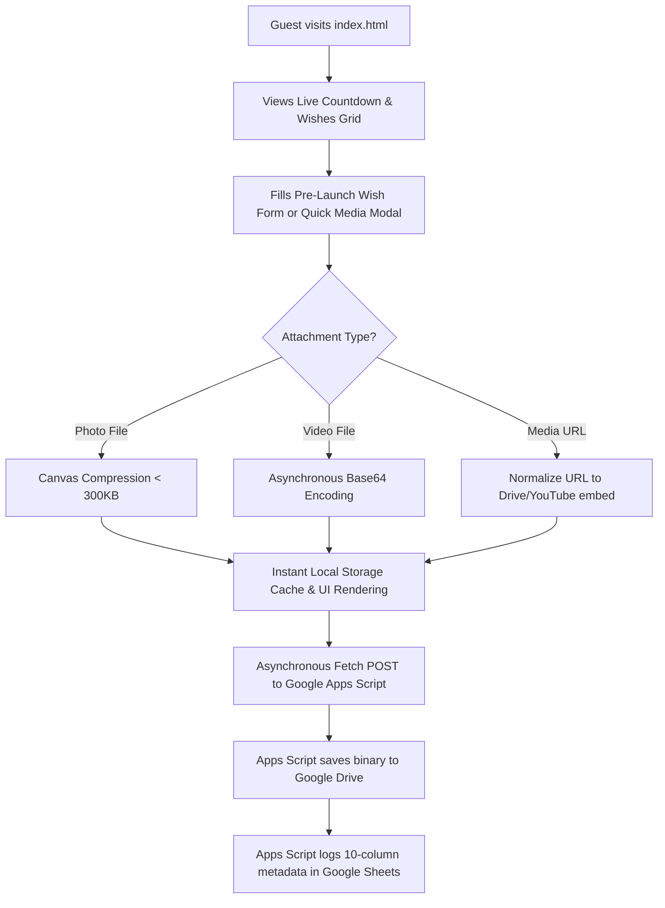
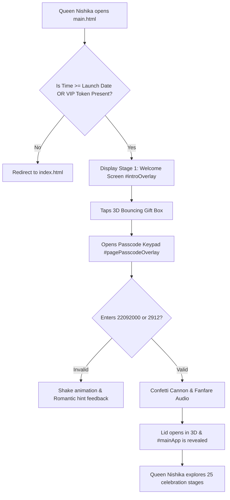

# 01. Project Overview & Business Case

> **Document Status**: `[VERIFIED]` • Production Baseline v3.0.0  
> **Repository**: `dilipk2026/happy-birthday`  
> **Target Celebrant**: Queen Nishika 👑  
> **Author / Project Sponsor**: Dilip 💖  

---

## 1. Executive Summary

**Eternal Love** is a bespoke, digital celebration web application built as an enduring anniversary and birthday tribute for **Queen Nishika** on September 22nd. Departing from conventional, ephemeral social media greetings or static electronic greeting cards, Eternal Love provides an interactive multi-sensory environment.

The system combines dual-tier access gating (a Pre-Launch Countdown Portal on `index.html` and a 25-stage interactive celebration arena on `main.html`), procedural Web Audio sound synthesis, Canvas 2D particle physics, 3D CSS spatial animations, and real-time cloud synchronization via Google Apps Script, Google Sheets, and Google Drive.

---

## 2. Background & Problem Statement

### 2.1 The Problem
- **Transient and Disposable Greetings**: Standard digital birthday greetings (messaging app stickers, generic cards) lack emotional resonance, custom interactivity, and permanent archival capability.
- **Premature Access Risk**: Deploying celebration portals before the target birth date exposes surprises prematurely without time-locked gatekeeping.
- **Device Inconsistency & Data Loss**: Web applications handling multimedia dedications often suffer from local storage stripping, cross-origin resource failures (e.g. broken `blob:` URLs), and mobile horizontal viewport overflow.
- **Heavy Infrastructure Dependencies**: Standard web apps frequently require heavy server runtimes (Node.js/Python/PHP), SQL databases, and paid cloud hosting that require ongoing maintenance or risk deprecation.

### 2.2 The Proposed Solution
- **Two-Stage Timed Launch Routing**: `index.html` operates as a pre-launch countdown portal until the target launch date of **September 21, 2026 at 23:00 IST**, while enforcing VIP passcode protection (`2912`) for early previewers.
- **Zero-Cost Serverless Persistence**: Google Apps Script (`Code.gs`) operates as a free serverless backend integrating directly with Google Sheets for structured data and Google Drive for binary file archival (Base64 decoded MP4/WebM videos and compressed JPEG photos).
- **Pure Native Web Architecture**: 100% pure vanilla HTML5, CSS3, and ES6+ JavaScript. No third-party UI framework dependencies (React, Vue, Tailwind, Angular), resulting in sub-millisecond load times, zero bundle build steps, and permanent long-term browser compatibility.

---

## 3. Business & Domain Objectives

| Objective ID | Description | Success Metric | Verification |
| :--- | :--- | :--- | :--- |
| **OBJ-01** | Create an ultra-luxurious, romantic digital celebration dedicated to Queen Nishika. | 25 distinct celebration stages, 9 custom aesthetic themes. | `[VERIFIED]` |
| **OBJ-02** | Prevent unauthorized or premature access before Sept 21, 2026, 23:00 IST. | Automatic redirect to `index.html` unless VIP PIN `2912` or DOB `22092000` is provided. | `[VERIFIED]` |
| **OBJ-03** | Provide zero-data-loss multimedia dedication submission. | Photos Canvas-compressed (<300KB), videos Base64-encoded and synced to Google Drive. | `[VERIFIED]` |
| **OBJ-04** | Deliver 100% responsive user experience across all form factors. | 0px horizontal overflow from 320px (iPhone SE) to 2560px+ (4K). | `[VERIFIED]` |
| **OBJ-05** | Maintain $0.00 infrastructure cost with zero ongoing maintenance fees. | Hosted on GitHub Pages with Google Apps Script backend. | `[VERIFIED]` |

---

## 4. Scope of the System

### 4.1 In Scope
- **Pre-Launch Portal (`index.html`)**:
  - Precision countdown timer to Sept 21, 2026, 23:00 IST.
  - Interactive VIP virtual keypad modal for anniversary PIN `2912` authentication.
  - Pre-launch Sticky Wish Wall with live like counter, color theme swatches, and media preview.
  - Quick Media Modal for adding photos and YouTube/Vimeo/Google Drive video streams.
  - Ambient particle background and procedural Web Audio melody synthesizer.
- **Main Celebration Arena (`main.html` & `script.js`)**:
  - Two-stage welcome screen (`#introOverlay`) with 3D animated bouncing gift box and passcode lock (`#pagePasscodeOverlay`).
  - 25 celebration stages including 3D Cake Cutting, 100 Reasons Love Jar, Love Coupons, Fortune Roulette, Web Audio Synthesizer, Time Capsule Vault, Keepsake Certificate, and Star Registry deed generator.
  - Full-screen media lightbox modal (`#mediaLightboxModal`) for photo and video expansions.
- **Backend Services (`Code.gs`)**:
  - `doGet` endpoint supporting JSON and JSONP formats with Google Drive thumbnail/preview conversion.
  - `doPost` endpoint logging structured data across `"Wishes"`, `"Photos"`, and `"Videos"` tabs, with Base64 binary file creation in Google Drive folder `"Eternal Love Wishes (Queen Nishika)"`.

### 4.2 Out of Scope
- Multi-user administrative role management or enterprise IAM/OAuth.
- User account registration, passwords resets, or payment gateway processing.
- Real-time WebRTC peer-to-peer video streaming (streaming is handled via Google Drive `/preview` and YouTube/Vimeo embeds).

---

## 5. Target Users & User Roles

| Role | Profile & Permissions | Primary Workflows |
| :--- | :--- | :--- |
| **👑 The Birthday Queen (Queen Nishika)** | Primary celebrant. Full access to explore all 25 stages, cut cake, claim coupons, unseal love letters, spin roulette, and view certificates. | Enters DOB `22092000` or PIN `2912`, triggers 3D unboxing, interacts with celebration modules. |
| **💖 Author & Dedicator (Dilip)** | Creator and sponsor. Access to customize celebration parameters via URL query parameters, personalize letters, and manage Google Sheet sync. | Submits royal wishes, shares QR code links, manages Google Drive media. |
| **🌟 Royal Guests & Well-Wishers** | Friends, family, and court well-wishers visiting `index.html`. | View countdown, submit blessings, attach photos/videos, like existing sticky notes. |

---

## 6. Business Workflows

### 6.1 Guest Dedication Workflow

### 6.2 Queen Nishika Unboxing Workflow

---

## 7. Assumptions, Constraints & Risks

### 7.1 Assumptions
- `[VERIFIED]` Celebrant possesses a modern web browser supporting HTML5, CSS Grid, and Web Audio API (Chrome, Safari, Firefox, Edge).
- `[VERIFIED]` Google Apps Script free quota tier (20,000 URL fetch calls/day, 100MB daily Drive upload) is sufficient for personal celebration usage.

### 7.2 Constraints
- Single-page application must run without local server runtimes (zero Node.js backend required).
- Google Apps Script web app endpoint requires `no-cors` mode on direct frontend `fetch()` POST requests due to Google's redirect mechanism.

### 7.3 Risks & Mitigations
| Risk | Severity | Mitigation Strategy | Status |
| :--- | :--- | :--- | :--- |
| Google Sheet endpoint cold start latency | Low | Instant LocalStorage cache hydration renders UI before cloud sync response arrives. | `[VERIFIED]` |
| Large video upload exceeding memory limits | Medium | Frontend limits file selector to 25MB and provides video URL input alternative. | `[VERIFIED]` |
| Cross-device dead `blob:` URLs | High | Discontinued `blob:` URL submission; all files converted to asynchronous Base64. | `[VERIFIED]` |
