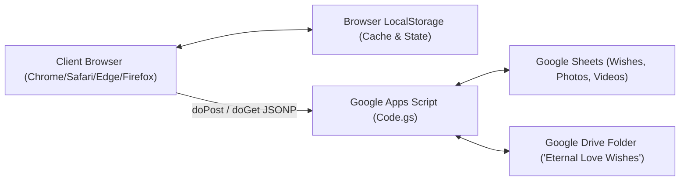

# 02. Software Requirements Specification (SRS)

> **Standard**: IEEE-830 Compliant Specification  
> **Status**: `[VERIFIED]` Production Baseline v3.0.0  
> **System Name**: Eternal Love ✨ Queen Nishika Celebration Platform  

---

## 1. Introduction

### 1.1 Purpose
This document specifies the software requirements for the **Eternal Love** web application. It defines functional requirements (FR-001 to FR-035) and non-functional requirements governing the Pre-Launch Countdown Portal (`index.html`), the 25-Stage Celebration Arena (`main.html`), the client-side JavaScript engine (`script.js`), and the serverless Google Apps Script backend (`Code.gs`).

### 1.2 Scope
The system provides:
- Time-gated launch routing and VIP passcode authentication.
- Real-time relationship chronometers and countdown timers.
- Interactive Web Audio sound synthesis and background music players.
- Multimedia dedication submission (Canvas compressed photos, Base64 videos).
- Full-screen media theater lightbox modal.
- 25 interactive celebration modules (3D cake cutting, fortune roulette, time capsules, coupons, love jar, stargazing, acoustic guitar).
- Google Sheets and Google Drive serverless cloud synchronization.

### 1.3 Definitions and Acronyms
- **IST**: Indian Standard Time (`UTC+05:30`).
- **VIP PIN**: 4-digit anniversary passcode (`2912` representing December 29th).
- **Birthday Passcode**: 8-digit date-of-birth passcode (`22092000` representing September 22, 2000).
- **GAS**: Google Apps Script (`Code.gs`).
- **NFR**: Non-Functional Requirement.
- **RTM**: Requirements Traceability Matrix.

---

## 2. Overall Description

### 2.1 Product Perspective
Eternal Love is an independent, client-side rich web application interacting with a cloud serverless webhook endpoint (Google Apps Script). It requires no proprietary database server installation and operates natively on all modern web standards.

### 2.2 Operating Environment
- **Client OS**: Windows, macOS, iOS, Android, Linux.
- **Supported Browsers**: Chrome 90+, Safari 14+, Firefox 88+, Edge 90+.
- **Hardware Minimum**: 320px viewport width, 1GB RAM, Audio output hardware.

---

## 3. Functional Requirements

### 3.1 Pre-Launch Portal & Launch Routing

#### `FR-001`: Target Launch Date Gatekeeping
- **Description**: The system shall evaluate the current system timestamp against the target launch date (`2026-09-21T23:00:00+05:30`).
- **Actor**: Any web visitor.
- **Preconditions**: User navigates to `main.html`.
- **Main Flow**: If `now < TARGET_LAUNCH_DATE` and no VIP bypass token exists in URL or session storage, the router immediately replaces window location with `index.html`.
- **Alternative Flow**: If URL contains `?vip=unlocked`, `?preview=true`, `?passcode=22092000`, or `?pin=2912`, redirect is bypassed.
- **Expected Result**: Unauthorized visitors are prevented from viewing celebration stages prematurely. `[VERIFIED]`

#### `FR-002`: Live Precision Countdown Chronometer
- **Description**: `index.html` shall calculate and display remaining Days, Hours, Minutes, and Seconds until September 21, 2026 at 23:00 IST.
- **Actor**: Visitor on `index.html`.
- **Preconditions**: JavaScript enabled.
- **Main Flow**: Computes time difference `TARGET_LAUNCH_DATE - now` and updates `#daysVal`, `#hoursVal`, `#minutesVal`, `#secondsVal` every 1,000ms.
- **Expected Result**: Four animated numerical cards showing accurate countdown. `[VERIFIED]`

#### `FR-003`: VIP Virtual Keypad Modal Authentication
- **Description**: `index.html` shall provide a modal keypad to accept the 4-digit VIP Anniversary PIN (`2912`).
- **Actor**: VIP User / Dilip / Queen Nishika.
- **Preconditions**: `#vipUnlockTrigger` clicked.
- **Main Flow**: User enters `2912` on virtual keypad or laptop keyboard; system plays audio chime, validates PIN, stores `sessionStorage.setItem('eternal_love_vip_unlocked', 'true')`, and routes to `main.html?vip=unlocked`.
- **Alternative Flow**: User enters incorrect PIN; system triggers CSS shake animation, plays error tone, and displays romantic clue.
- **Expected Result**: Secure preview routing without exposing plaintext codes. `[VERIFIED]`

---

### 3.2 Dedication Forms & Media Uploads

#### `FR-004`: Pre-Launch Wish Submission Form
- **Description**: `index.html` shall allow guests to submit name, message, color theme, and optional photo/video.
- **Actor**: Well-wisher / Guest.
- **Preconditions**: `#preLaunchWishForm` loaded.
- **Main Flow**: User fills name and message, selects media attachment, and clicks submit. The note renders immediately on `#stickyNotesGrid` and dispatches asynchronously to Google Apps Script.
- **Expected Result**: Instant UI update without page reload; cloud persistence queued. `[VERIFIED]`

#### `FR-005`: Client-Side Canvas Image Compression
- **Description**: Image uploads shall be compressed client-side using HTML5 Canvas before dispatch.
- **Actor**: Submitting User.
- **Preconditions**: User selects an image file.
- **Main Flow**: File is drawn onto an in-memory Canvas with max dimensions $1200\text{px}\times1200\text{px}$ and exported as JPEG with quality factor `0.85`, ensuring file size $<300\text{KB}$.
- **Expected Result**: Fast upload times and low Google Drive storage consumption. `[VERIFIED]`

#### `FR-006`: Asynchronous Base64 Video Encoding
- **Description**: Device video uploads shall be asynchronously converted to Base64 data URLs via `readFileAsBase64(file)` prior to form submission.
- **Actor**: Submitting User.
- **Preconditions**: User selects MP4 or WebM video file ($\le 25\text{MB}$).
- **Main Flow**: `readFileAsBase64` resolves data string; form handler awaits resolution before dispatching payload to Google Apps Script.
- **Exception Flow**: If file $>25\text{MB}$, user is alerted to paste a YouTube or Google Drive link instead.
- **Expected Result**: Elimination of dead `blob:` URLs in Google Sheets. `[VERIFIED]`

#### `FR-007`: Universal Video URL Normalization
- **Description**: The system shall parse YouTube (standard, shorts, embed), Vimeo, Google Drive (`/file/d/`, `open?id=`, `uc?id=`, `thumbnail?id=`), and direct MP4/WebM URLs.
- **Actor**: Browser rendering engine.
- **Preconditions**: Wish or memory contains a video link.
- **Main Flow**: Formats Google Drive links to `https://drive.google.com/file/d/<ID>/preview` and renders an HTML5 `<iframe>` player.
- **Expected Result**: Responsive, playable in-card video players across all platforms. `[VERIFIED]`

---

### 3.3 Main Celebration Arena & Unboxing

#### `FR-008`: Two-Stage Welcome Screen & 3D Gift Box Unboxing
- **Description**: `main.html` shall display `#introOverlay` with a 3D animated bouncing gift box upon arrival.
- **Actor**: Queen Nishika.
- **Preconditions**: Arriving on `main.html`.
- **Main Flow**: Tapping gift box triggers `#pagePasscodeOverlay`; entering `22092000` or `2912` unlocks celebration, fires confetti cannons, plays victory fanfare, rotates 3D gift box lid open, and reveals `#mainApp`.
- **Expected Result**: Interactive unboxing experience before celebration access. `[VERIFIED]`

#### `FR-009`: Interactive 3D Birthday Cake Cutting Simulation
- **Description**: Stage 2 (`#cakeSec`) shall provide an interactive cake slicing simulation.
- **Actor**: Queen Nishika.
- **Preconditions**: `#cakeSec` loaded.
- **Main Flow**: User drags or clicks cake knife; knife animates through cake, slices a strawberry cream wedge, deposits slice onto golden porcelain plate, and unlocks "Feed to Nishika" interaction.
- **Expected Result**: Physics-based cake cutting with sound effects and confetti shower. `[VERIFIED]`

#### `FR-010`: Magic 100 Reasons Love Jar
- **Description**: Stage 3 (`#jarSec`) shall contain 100 handcrafted romantic reasons why Dilip loves Nishika.
- **Actor**: Queen Nishika.
- **Preconditions**: `#jarSec` loaded.
- **Main Flow**: Tapping the magic glass jar animates glowing paper star unfolding into an intimate love note. Counter increments and progress is saved to LocalStorage.
- **Expected Result**: 100 unique, sequential romantic affirmations. `[VERIFIED]`

#### `FR-011`: Date Night Fortune Roulette Wheel
- **Description**: Stage 4 (`#rouletteSec`) shall render a 3D Canvas-based spinning roulette wheel.
- **Actor**: Queen Nishika / Dilip.
- **Preconditions**: `#rouletteSec` loaded.
- **Main Flow**: User clicks "Spin Royal Wheel" or presses <kbd>R</kbd>; wheel decelerates with realistic rotational physics, ticking indicator triggers audio clicks, and lands on a selected date adventure.
- **Expected Result**: Randomized date night selection with option to claim as love coupon. `[VERIFIED]`

#### `FR-012`: Polyphonic Web Audio Soundscape & Synthesizer
- **Description**: Stage 5 (`#soundscapeSec`) shall synthesize procedural ambient soundscapes using native Web Audio API oscillators and gain nodes.
- **Actor**: User.
- **Preconditions**: User adjusts audio sliders (Rain, Fireplace, Ocean Waves, Chimes, Piano).
- **Main Flow**: Dynamically modulates white noise filters, biquad bandpass filters, and polyphonic sine/triangle oscillators in real time.
- **Expected Result**: Soothing multi-track ambient audio without external MP3 audio file dependencies. `[VERIFIED]`

#### `FR-013`: Romantic Love Coupons System
- **Description**: Stage 7 (`#couponsSec`) shall render interactive redeemable love coupons.
- **Actor**: Queen Nishika.
- **Preconditions**: `#couponsSec` loaded.
- **Main Flow**: Queen Nishika taps "Redeem Coupon"; coupon animates with golden stamp, plays chime sound, and persists claimed status in LocalStorage.
- **Expected Result**: Permanent tracking of redeemed romantic promises. `[VERIFIED]`

#### `FR-014`: Celestial Time Capsule Vault
- **Description**: Stage 6 (`#capsuleSec`) shall allow sealing encrypted future letters time-locked until future anniversaries.
- **Actor**: Queen Nishika / Dilip.
- **Preconditions**: `#capsuleSec` loaded.
- **Main Flow**: User enters letter and milestone date; capsule is locked in LocalStorage and only decrypts on or after the specified unlock timestamp.
- **Expected Result**: Future-dated romantic time capsule mechanism. `[VERIFIED]`

---

## 4. Non-Functional Requirements (NFR)

### 4.1 Performance Requirements (`NFR-P`)
- **`NFR-P01` (Load Time)**: Static bundle initial DOMContentLoaded time shall be $<500\text{ms}$ on standard 4G connections. `[VERIFIED]`
- **`NFR-P02` (Rendering FPS)**: Canvas particle physics, 3D cake cutting, and roulette wheel shall maintain $\ge 58\text{ FPS}$ on standard 60Hz displays. `[VERIFIED]`
- **`NFR-P03` (Audio Latency)**: Web Audio API tone generation latency shall be $<30\text{ms}$ upon user key/click trigger. `[VERIFIED]`

### 4.2 Security Requirements (`NFR-S`)
- **`NFR-S01` (Input Sanitization)**: All user-submitted strings rendered into DOM shall pass through `escapeHtml()` to eliminate XSS injection. `[VERIFIED]`
- **`NFR-S02` (No Hardcoded Secrets)**: No private API keys, database credentials, or OAuth tokens exist in client source code. `[VERIFIED]`
- **`NFR-S03` (Access Sandboxing)**: Pre-launch router strictly denies unauthenticated access to `main.html` prior to launch date. `[VERIFIED]`

### 4.3 Reliability & Availability Requirements (`NFR-R`)
- **`NFR-R01` (Zero Runtime Dependencies)**: Absence of external npm libraries guarantees zero build breakages or supply chain vulnerabilities. `[VERIFIED]`
- **`NFR-R02` (Offline / Cached Degradation)**: If Google Apps Script is unreachable, the system hydrates from LocalStorage cache without breaking UI. `[VERIFIED]`

### 4.4 Compatibility Requirements (`NFR-C`)
- **`NFR-C01` (Multi-Device Matrix)**: 0px horizontal overflow across viewports from 320px (iPhone SE) to 2560px (4K Ultra-Wide). `[VERIFIED]`
- **`NFR-C02` (Cross-Browser)**: Full feature parity across Chromium, WebKit (Safari), and Gecko (Firefox) rendering engines. `[VERIFIED]`
