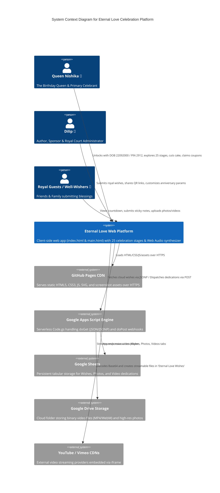
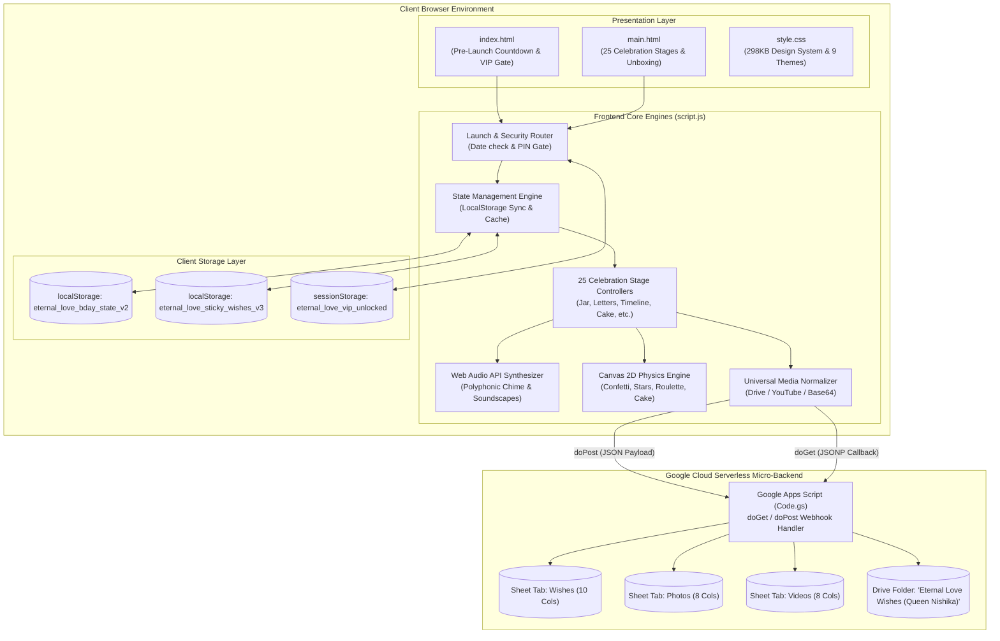
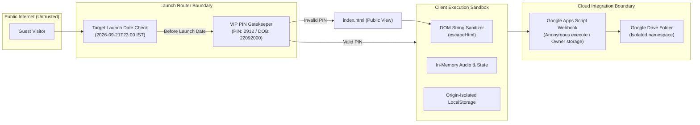

# 03. System Architecture & Component Topology

> **Status**: `[VERIFIED]` • Production Baseline v3.0.0  
> **Architecture Pattern**: Pure Client-Side Jamstack + Serverless Cloud Micro-Backend  
> **Hosting & Infrastructure**: GitHub Pages (Static Delivery) + Google Apps Script Engine + Google Cloud Storage  

---

## 1. Architectural Philosophy & Overview

**Eternal Love** is engineered under a high-performance, zero-maintenance architectural philosophy. It delivers an ultra-luxurious, animated, and responsive web application without requiring traditional dedicated application servers (e.g., Node.js/Express, Python/Django) or paid database instances.

### Key Architectural Pillars
1. **Pure Native Browser Execution**: Leverages native browser capabilities (Web Audio API, Canvas 2D, CSS 3D matrix transformations, RequestAnimationFrame physics loops) for smooth 60 FPS animation.
2. **Serverless Dual-Storage Persistence**:
   - **Structured Data**: Real-time logging into Google Sheets (`"Wishes"`, `"Photos"`, `"Videos"` tabs).
   - **Binary Media Archival**: Direct ingestion of Base64 video/image data into Google Drive folder `"Eternal Love Wishes (Queen Nishika)"` with automated public streaming links.
3. **Optimistic Local Cache Hydration**: State is cached in browser `localStorage`, ensuring instant, zero-latency rendering on page refreshes and graceful offline degradation.

---

## 2. System Context Diagram (C4 Level 1)



---

## 3. Component Architecture (C4 Level 2)



---

## 4. Frontend Architecture Details

### 4.1 Modularity & Separation of Concerns
- **`index.html` (144KB)**: Self-contained pre-launch portal containing inline luxury styling for instant zero-FOUC (Flash of Unstyled Content) initial render, particle canvas background, and the pre-launch wish wall.
- **`main.html` (198KB)**: Master DOM document housing all 25 celebration stages, modals, audio control docks, and unboxing overlays.
- **`style.css` (298KB)**: Comprehensive design token system featuring CSS Custom Properties (`--primary-pink`, `--accent-gold`, `--royal-purple`), 9 atmospheric theme classes, CSS 3D perspective cards, and mobile media queries.
- **`script.js` (323KB)**: Monolithic, highly optimized JavaScript engine orchestrating state persistence, canvas physics loops, polyphonic Web Audio generation, and cloud sync.

### 4.2 State Management Architecture
The client application implements a unified reactive-like state store:
```javascript
const state = {
  recipientName: 'Nishika',
  senderName: 'Dilip',
  startDate: '2025-12-29',
  message: '...',
  theme: 'theme-magical',
  isMusicPlaying: false,
  musicMode: 'piano',
  candlesLit: true,
  poppedCount: 0,
  cheers: 128,
  loves: 256,
  reasonsExplored: 1,
  claimedCoupons: [],
  pinnedWishes: [],
  uploadedPhotos: [],
  secretWish: '',
  soundscapeVolumes: { master: 80, rain: 70, fire: 45, ocean: 0, chimes: 60, piano: 50, cafe: 0 },
  timeCapsules: [],
  customJourneyPins: [],
  googleSheetUrl: '...'
};
```
Every mutation triggers `saveState()` which safely syncs to `localStorage` with quota overflow handling.

---

## 5. Backend & Cloud Integration Architecture

### 5.1 Google Apps Script Serverless Service (`Code.gs`)
`Code.gs` acts as the cloud micro-backend executing within Google's V8 runtime:
- **`doGet(e)`**:
  - Serves structured JSON or JSONP containing persisted dedications.
  - Automatically formats Google Drive IDs into high-res CDN thumbnails (`drive.google.com/thumbnail?id=...&sz=w1000`) for images and streaming preview endpoints (`drive.google.com/file/d/.../preview`) for videos.
  - Sanitizes dead `blob:` strings.
- **`doPost(e)`**:
  - Parses incoming JSON payload from `index.html` and `main.html`.
  - Dispatches Base64 video data to `saveBase64ToDrive()`, generating binary MP4/WebM files in Queen Nishika's Google Drive folder with public view permissions.
  - Logs 10-column tabular rows into `"Wishes"` and cross-logs attachments into `"Photos"` and `"Videos"` tabs.

---

## 6. Security Boundaries & Data Isolation


