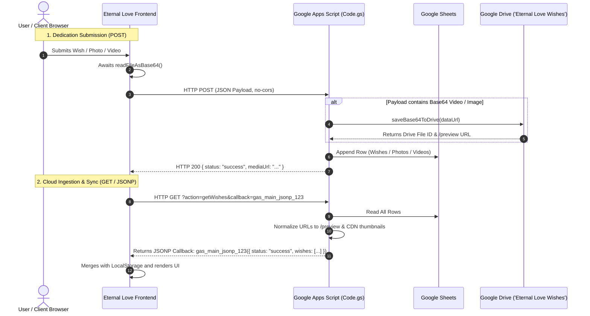

# 05. API & Backend Webhook Documentation

> **Status**: `[VERIFIED]` • Production Baseline v3.1.0  
> **Backend Implementation**: Google Apps Script (`Code.gs`)  
> **Production Webhook URL**: `https://script.google.com/macros/s/AKfycbwPnRNoIYc1b8E2loZiXZhwlDXn3H2ZjH5b_t-C328paUo8u2mcGewGJKscj1W71zW-/exec`  

---

## 1. API Architecture & Overview

The backend is implemented as a serverless Google Apps Script Web App operating under Google's V8 execution engine. It provides standard HTTP `GET` endpoints (supporting both direct JSON responses and cross-origin JSONP callbacks) and `POST` endpoints for structured data persistence and Base64 binary file ingestion.



---

## 2. API Endpoint Matrix

| Method | Endpoint | Auth | Purpose | Response Format |
| :--- | :--- | :--- | :--- | :--- |
| `GET` | `/exec` (or `?action=getWishes`) | None (Public) | Ingests all wishes, photos, and videos | `application/json` or JSONP |
| `GET` | `/exec?action=ping` | None (Public) | Health check & diagnostic status | `application/json` |
| `POST` | `/exec` | None (Public) | Submits wish, photo, or video dedication | `application/json` |
| `POST` | `/exec` (`type: "uploadVideoChunk"`) | None (Public) | High-speed 3.5MB parallel chunk ingestion | `application/json` |

---

## 3. Detailed Endpoint Specifications

### 3.1 `GET /exec` (Get Wishes, Photos & Videos)

- **Description**: Retrieves all stored dedications from Google Sheets, converts file IDs to high-res Google Drive thumbnails and streaming `/preview` URLs, and filters out dead `blob:` references.
- **Authentication**: None.
- **Query Parameters**:
  | Parameter | Type | Required | Description |
  | :--- | :--- | :--- | :--- |
  | `action` | `string` | Optional | Action name: `getWishes`, `getPhotos`, `getVideos`, or `ping`. Defaults to `getWishes`. |
  | `callback` | `string` | Optional | JSONP callback function name (e.g., `gas_main_jsonp_1725940000_1234`). |

#### Example Request
```http
GET /macros/s/AKfycbwPnRNoIYc1b8E2loZiXZhwlDXn3H2ZjH5b_t-C328paUo8u2mcGewGJKscj1W71zW-/exec?action=getWishes&callback=gas_main_jsonp_123 HTTP/1.1
Host: script.google.com
```

#### Example Response (JSONP Mode)
```javascript
gas_main_jsonp_123({
  "status": "success",
  "total": 5,
  "wishes": [
    {
      "id": "wish_1725941000",
      "name": "Dilip (With Infinite Devotion 👑)",
      "author": "Dilip (With Infinite Devotion 👑)",
      "message": "Happy Birthday to my eternal Queen Nishika! 💕✨",
      "color": "gold",
      "mediaType": "photo",
      "mediaUrl": "https://drive.google.com/thumbnail?id=1BxiMVs0XRA5nFMdKvBdBZjgmUUqptlbs74OgvE2upms&sz=w1000",
      "likes": 52,
      "isRoyal": true,
      "localTime": "September 22, 2026",
      "timestamp": "2026-09-22T00:00:00.000Z"
    }
  ],
  "photos": [ ... ],
  "videos": [
    {
      "id": "video_1725942000",
      "author": "Dilip",
      "title": "Royal Birthday Reel",
      "mediaUrl": "https://drive.google.com/file/d/1BxiMVs0XRA5nFMdKvBdBZjgmUUqptlbs74OgvE2upms/preview",
      "timestamp": "2026-09-22T00:05:00.000Z"
    }
  ]
});
```

---

### 3.2 `POST /exec` (Submit Dedication & Upload Media)

- **Description**: Receives user dedications. If Base64 media data is present, saves binary file into Google Drive folder `"Eternal Love Wishes (Queen Nishika)"`, generates public streaming embed link, and appends a 10-column row to Google Sheets.
- **Authentication**: None.
- **Headers**: `Content-Type: text/plain;charset=utf-8` (used with `fetch()` in `no-cors` mode).
- **Request Body Schema**:
  | Field | Type | Required | Description |
  | :--- | :--- | :--- | :--- |
  | `type` | `string` | Optional | `"wish"`, `"photo"`, or `"video"`. |
  | `name` / `author` | `string` | Yes | Name of the person dedicating the message. |
  | `message` / `caption` | `string` | Yes | Heartfelt dedication text. |
  | `color` | `string` | Optional | Sticky theme (`"pink"`, `"gold"`, `"purple"`, `"peach"`, `"sapphire"`). |
  | `mediaType` | `string` | Optional | `"none"`, `"photo"`, or `"video"`. |
  | `mediaUrl` / `videoUrl` | `string` | Optional | External URL (YouTube, Vimeo, Google Drive) or raw Base64 data URL. |
  | `dataUrl` / `mediaData` | `string` | Optional | Base64 encoded file string (`data:image/jpeg;base64,...` or `data:video/mp4;base64,...`). |
  | `celebrant` | `string` | Optional | `"Nishika"` |
  | `timestamp` | `string` | Optional | ISO-8601 creation timestamp. |

#### Example Request Body
```json
{
  "type": "video",
  "mediaType": "video",
  "name": "Dilip (Royal Video)",
  "author": "Dilip (Royal Video)",
  "message": "Forever dedicated to Queen Nishika! 🎬💖",
  "color": "gold",
  "dataUrl": "data:video/mp4;base64,AAAAHGZ0eXBtcDQyAAAAAG1wNDJpc29tYXZjMQ...",
  "celebrant": "Nishika",
  "dedicatedBy": "Dilip",
  "timestamp": "2026-09-22T00:10:00.000Z"
}
```

#### Example Response Body
```json
{
  "status": "success",
  "message": "Wish and video media successfully consecrated into Queen Nishika's Google Drive and Sheet!",
  "sheet": "Wishes",
  "driveUrl": "https://drive.google.com/file/d/1AbCdEfGhIjKlMnOpQrStUvWxYz123456/preview",
  "mediaUrl": "https://drive.google.com/file/d/1AbCdEfGhIjKlMnOpQrStUvWxYz123456/preview",
  "row": 6
}
```

---

### 3.3 `GET /exec?action=ping` (Diagnostic Health Check)

- **Description**: Returns execution environment metrics, active spreadsheet name, and storage folder status.
- **Example Response**:
```json
{
  "status": "online",
  "app": "Eternal Love — Queen Nishika Celebration API",
  "version": "3.1.0",
  "timestamp": "2026-09-22T00:00:00.000Z",
  "spreadsheet": "Eternal Love — Queen Nishika Celebration Wishes",
  "folder": "Eternal Love Wishes (Queen Nishika)"
}
```

---

### 3.4 `POST /exec` (High-Speed Chunked Video Upload Pipeline)

- **Description**: Ingests high-resolution video files split into **3.5 MB** (`3,670,016` bytes) Base64 chunks transmitted concurrently in parallel pairs (concurrency: 2). Non-final chunks are cached as temporary parts in `.temp_chunks/<uploadId>/`, and the final chunk reassembles the binary file, moves it to Google Drive, and appends the dedication row to Google Sheets.
- **Headers**: `Content-Type: text/plain;charset=utf-8` (used with `fetch()`).
- **Request Body Schema**:
  | Field | Type | Required | Description |
  | :--- | :--- | :--- | :--- |
  | `type` | `string` | Yes | Must be `"uploadVideoChunk"`. |
  | `uploadId` | `string` | Yes | Unique session identifier (e.g., `chunk_1725940000_12345`). |
  | `chunkIndex` | `number` | Yes | Zero-based index of current chunk (`0`, `1`, `2`, ...). |
  | `totalChunks` | `number` | Yes | Total number of chunks in the video payload. |
  | `fileName` | `string` | Yes | Original file name (e.g., `queen_nishika_birthday.mp4`). |
  | `mimeType` | `string` | Yes | MIME type (`video/mp4`, `video/webm`, `video/quicktime`). |
  | `chunkBase64` | `string` | Yes | Base64 string slice of the video file chunk. |
  | `isFinalChunk`| `boolean`| Yes | `true` for last chunk (`chunkIndex === totalChunks - 1`), `false` otherwise. |
  | `author` | `string` | Optional | Dedicator name (appended on final chunk). |
  | `message` | `string` | Optional | Dedication caption text (appended on final chunk). |

#### Example Request Body (Non-Final Chunk):
```json
{
  "type": "uploadVideoChunk",
  "uploadId": "vid_chunk_1725940000_abc123",
  "chunkIndex": 0,
  "totalChunks": 5,
  "fileName": "royal_tribute.mp4",
  "mimeType": "video/mp4",
  "chunkBase64": "AAAAHGZ0eXBtcDQyAAAAAG1wNDJpc29tYXZjMQ...",
  "isFinalChunk": false
}
```

#### Example Final Chunk Response:
```json
{
  "status": "success",
  "chunkIndex": 4,
  "isFinal": true,
  "fileId": "1BxiMVs0XRA5nFMdKvBdBZjgmUUqptlbs74OgvE2upms",
  "driveUrl": "https://drive.google.com/file/d/1BxiMVs0XRA5nFMdKvBdBZjgmUUqptlbs74OgvE2upms/preview",
  "mediaUrl": "https://drive.google.com/file/d/1BxiMVs0XRA5nFMdKvBdBZjgmUUqptlbs74OgvE2upms/preview",
  "message": "Video dedication successfully assembled and consecrated into Queen Nishika's Google Drive!"
}
```
