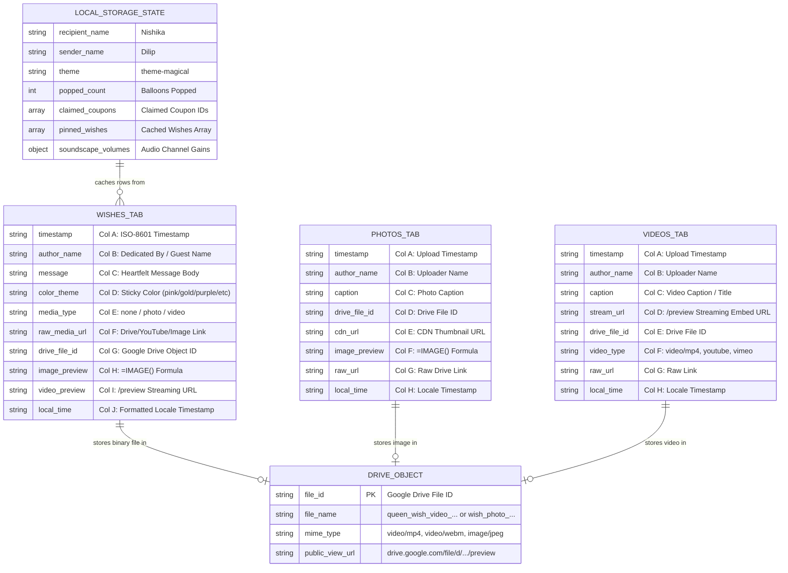

# 06. Database & Cloud Storage Schema Documentation

> **Status**: `[VERIFIED]` • Production Baseline v3.0.0  
> **Storage Layers**: Google Sheets Tabular Store + Google Drive Blob Store + Client LocalStorage  

---

## 1. Storage Architecture Overview

The Eternal Love platform utilizes a hybrid storage architecture:
1. **Google Sheets Tabular Database**: Acts as the shared, multi-user relational-like tabular database partitioned into three tabs: `"Wishes"`, `"Photos"`, and `"Videos"`.
2. **Google Drive Binary Object Store**: Dedicated folder `"Eternal Love Wishes (Queen Nishika)"` storing binary video clips (MP4/WebM) and high-resolution images.
3. **Browser LocalStorage**: Client-side key-value cache guaranteeing sub-millisecond local hydration and offline persistence.

---

## 2. Entity-Relationship Model (Mermaid ERD)



---

## 3. Google Sheets Schema Specifications

### 3.1 `"Wishes"` Sheet Tab (10 Columns)
| Col | Column Name | Data Type | Formula / Format | Example Value |
| :---: | :--- | :--- | :--- | :--- |
| **A** | `Timestamp` | `string` (ISO-8601) | Plain text | `2026-09-22T00:10:00.000Z` |
| **B** | `Author Name` | `string` (max 60) | Plain text | `Dilip (With Infinite Devotion 👑)` |
| **C** | `Message` | `string` (max 500) | Plain text | `Happy Birthday to my eternal Queen Nishika! 💕` |
| **D** | `Color Theme` | `enum` | `pink` \| `gold` \| `purple` \| `peach` \| `sapphire` | `gold` |
| **E** | `Media Type` | `enum` | `none` \| `photo` \| `video` | `video` |
| **F** | `Raw Media Link`| `string` (URL) | Plain text URL | `https://drive.google.com/file/d/1Bxi.../view` |
| **G** | `Drive File ID` | `string` | Plain text ID | `1BxiMVs0XRA5nFMdKvBdBZjgmUUqptlbs` |
| **H** | `Image Preview` | `formula` | `=IMAGE("https://drive.google.com/thumbnail?id=...&sz=w1000")` | Auto-rendered spreadsheet thumbnail |
| **I** | `Video Preview` | `string` (URL) | `https://drive.google.com/file/d/.../preview` | Direct streaming iframe endpoint |
| **J** | `Local Time` | `string` | Locale formatted date string | `22/09/2026, 05:40:00 AM` |

---

### 3.2 `"Photos"` Sheet Tab (8 Columns)
| Col | Column Name | Data Type | Formula / Format | Example Value |
| :---: | :--- | :--- | :--- | :--- |
| **A** | `Timestamp` | `string` | ISO-8601 | `2026-09-22T00:15:00.000Z` |
| **B** | `Author` | `string` | Plain text | `Dilip` |
| **C** | `Caption` | `string` | Plain text | `Our winter stargazing date 🌌` |
| **D** | `Drive File ID` | `string` | Plain text | `1xYz...` |
| **E** | `Direct Image URL`| `string` | `https://drive.google.com/thumbnail?id=...&sz=w1000` | Direct CDN link |
| **F** | `Preview Formula`| `formula` | `=IMAGE("https://drive.google.com/thumbnail?id=...&sz=w1000")` | Visual cell image |
| **G** | `Drive File URL` | `string` | `https://drive.google.com/file/d/.../view` | File view link |
| **H** | `Local Time` | `string` | Locale date string | `22/09/2026, 05:45:00 AM` |

---

### 3.3 `"Videos"` Sheet Tab (8 Columns)
| Col | Column Name | Data Type | Formula / Format | Example Value |
| :---: | :--- | :--- | :--- | :--- |
| **A** | `Timestamp` | `string` | ISO-8601 | `2026-09-22T00:20:00.000Z` |
| **B** | `Author` | `string` | Plain text | `Dilip` |
| **C** | `Title / Caption`| `string` | Plain text | `Queen Nishika Royal Celebration Reel 👑` |
| **D** | `Video Embed URL`| `string` | `https://drive.google.com/file/d/.../preview` | Streaming iframe link |
| **E** | `Drive File ID` | `string` | Plain text | `1AbC...` |
| **F** | `Media Type` | `string` | `video/mp4` \| `youtube` \| `vimeo` | `video/mp4` |
| **G** | `Drive Direct Link`| `string` | `https://drive.google.com/file/d/.../view` | File view link |
| **H** | `Local Time` | `string` | Locale date string | `22/09/2026, 05:50:00 AM` |

---

## 4. Client-Side LocalStorage Schemas

### 4.1 Key: `eternal_love_bday_state_v2`
```json
{
  "recipientName": "Nishika",
  "senderName": "Dilip",
  "startDate": "2025-12-29",
  "message": "To the most incredible, beautiful...",
  "theme": "theme-magical",
  "poppedCount": 15,
  "cheers": 128,
  "loves": 256,
  "reasonsExplored": 12,
  "claimedCoupons": ["c1", "c3"],
  "pinnedWishes": [ ... ],
  "uploadedPhotos": [ ... ],
  "secretWish": "Encrypted wish text...",
  "soundscapeVolumes": {
    "master": 80,
    "rain": 70,
    "fire": 45,
    "ocean": 0,
    "chimes": 60,
    "piano": 50,
    "cafe": 0
  },
  "timeCapsules": [ ... ],
  "customJourneyPins": [ ... ],
  "googleSheetUrl": "https://script.google.com/macros/s/.../exec"
}
```

### 4.2 Key: `eternal_love_sticky_wishes_v3`
Stores an array of normalized wish objects, ensuring external YouTube and Google Drive `/preview` links are cached locally for zero-latency presentation.
