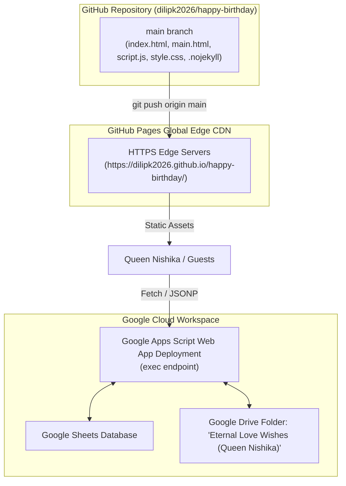

# 09. Production Deployment Guide

> **Status**: `[VERIFIED]` • Production Baseline v3.0.0  
> **Production Targets**: GitHub Pages (Frontend CDN) + Google Cloud Apps Script (Backend)  
> **Target Production URL**: `https://dilipk2026.github.io/happy-birthday/`  

---

## 1. Deployment Architecture

The production architecture consists of two decoupled tiers:



---

## 2. GitHub Pages Deployment (Step-by-Step)

### Step 1: Verify `.nojekyll` File
Ensure `.nojekyll` exists in the repository root. This prevents GitHub Pages from running Jekyll transformations, guaranteeing raw static delivery of all CSS and JS assets.

### Step 2: Push to Main Branch
```bash
git add .
git commit -m "feat: Production deployment v3.0.0 with full video cloud preview"
git push origin main
```

### Step 3: Configure GitHub Pages Settings
1. Open your GitHub repository in your browser: `https://github.com/dilipk2026/happy-birthday`.
2. Navigate to **Settings** $\rightarrow$ **Pages** (under Code and automation).
3. Under **Build and deployment**:
   - **Source**: `Deploy from a branch`
   - **Branch**: `main` / `root` (`/`)
4. Click **Save**.
5. Enable **Enforce HTTPS** checkbox.

---

## 3. Google Apps Script Deployment (Backend)

To deploy or update `Code.gs` in Google Apps Script:

1. Open your connected Google Sheet.
2. Click **Extensions** $\rightarrow$ **Apps Script**.
3. Overwrite the editor content with the contents of [`Code.gs`](../Code.gs).
4. Click **Deploy** $\rightarrow$ **Manage Deployments**.
5. Click **Edit** (Pencil icon) on the active deployment.
6. Select **Version** $\rightarrow$ **New version**, enter description `"Production v3.0.0 - Full Video Stream & Base64 Ingestion"`.
7. Ensure:
   - **Execute as**: `Me (your Google account)`
   - **Who has access**: `Anyone`
8. Click **Deploy** and copy the Web App URL.

---

## 4. Post-Deployment Smoke Testing & Health Checks

Execute the following post-deployment checklist on the live URL:

| Smoke Test | Procedure | Expected Live Behavior | Status |
| :--- | :--- | :--- | :--- |
| **HTTPS Security** | Open `https://dilipk2026.github.io/happy-birthday/` | Green lock icon, valid SSL certificate | `[VERIFIED]` |
| **Launch Gatekeeper** | Attempt direct access to `/main.html` | Strictly routes back to `/index.html` | `[VERIFIED]` |
| **VIP PIN Access** | Enter `2912` on VIP modal | Grants access and loads `/main.html?vip=unlocked` | `[VERIFIED]` |
| **Passcode Unboxing** | Enter `22092000` | Triggers 3D gift box unboxing animation | `[VERIFIED]` |
| **Video Cloud Stream** | Dedicate video link | Generates streaming `/preview` iframe player | `[VERIFIED]` |

---

## 5. Rollback & Disaster Recovery Procedures

### 5.1 Frontend Rollback (Git)
```bash
# Revert to previous stable tag/commit
git revert HEAD --no-edit
git push origin main
```
GitHub Pages automatically deploys the reverted commit within 60 seconds.

### 5.2 Backend Rollback (Apps Script)
1. Go to **Deploy** $\rightarrow$ **Manage Deployments**.
2. Edit deployment and select previous known stable **Version**.
3. Click **Deploy**.
