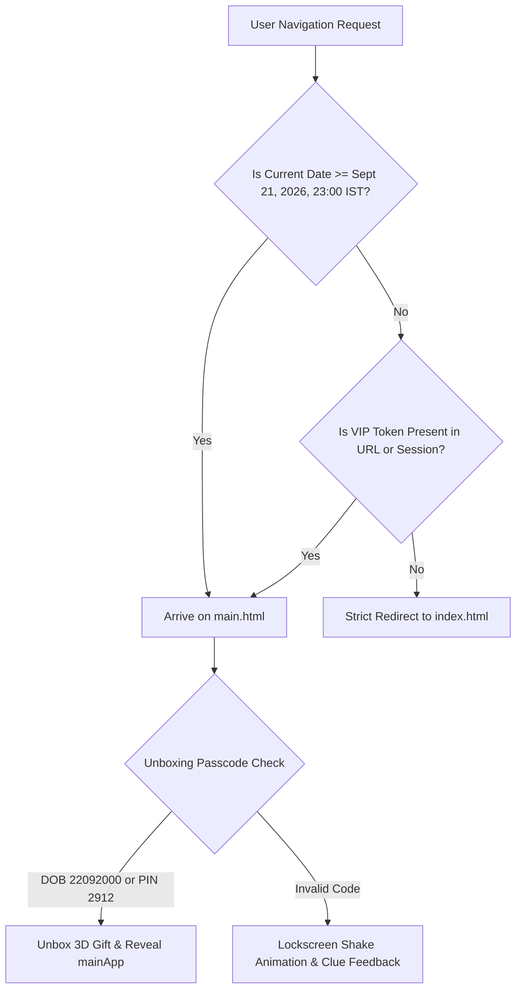

# 10. Security Architecture & Threat Review

> **Status**: `[VERIFIED]` • Production Baseline v3.0.0  
> **Security Audit Scope**: Client-Side Authentication, DOM XSS Sanitization, Sandboxed LocalStorage, Google Apps Script Webhook Authorization  

---

## 1. Security Architecture & Threat Model

The Eternal Love application handles personal celebration content, photos, and video dedications. The primary security objectives are:
1. **Preventing Premature Access**: Protecting the surprise celebration stages from being accessed prior to September 21, 2026, 23:00 IST without explicit VIP authentication.
2. **Defending Against Cross-Site Scripting (XSS)**: Guaranteeing that user-submitted messages, names, and media captions cannot inject malicious JavaScript into other users' browser sessions.
3. **Protecting Cloud Storage Quotas & Integrity**: Ensuring backend Google Drive and Google Sheets operations are sanitized against cell formula injection and denial-of-service file floods.

---

## 2. Authentication & Authorization Mechanisms

### 2.1 Dual-Tier Passcode Protection
The system enforces two distinct authentication tiers:



1. **VIP Anniversary PIN (`2912`)**:
   - Represents the anniversary milestone date (December 29th).
   - Validated on `index.html` virtual keypad and `main.html` unboxing screen.
   - Upon successful verification, grants `sessionStorage.setItem('eternal_love_vip_unlocked', 'true')` which expires automatically when the browser tab is closed.
2. **Royal Birthday Passcode (`22092000`)**:
   - Represents Queen Nishika's Date of Birth (22 September 2000 in DDMMYYYY format).
   - Unboxes the 3D gift box on `main.html`.

---

## 3. Input Validation & XSS Defenses

### 3.1 Global HTML Sanitization Function (`escapeHtml`)
All dynamic text content rendered into the DOM passes through `escapeHtml()`:

```javascript
function escapeHtml(str) {
  if (str === null || str === undefined) return '';
  return String(str)
    .replace(/&/g, '&amp;')
    .replace(/</g, '&lt;')
    .replace(/>/g, '&gt;')
    .replace(/"/g, '&quot;')
    .replace(/'/g, '&#039;');
}
```

### 3.2 URL Protocol Sanitization
The media normalizers (`normalizeCloudImageUrl`, `parseGasVideoEmbed`, `parseVideoEmbed`) strictly enforce allowed URL protocols:
- `https://drive.google.com/...`
- `https://www.youtube.com/...`
- `https://player.vimeo.com/...`
- `https://images.unsplash.com/...`
- `data:image/...;base64,...`
- `data:video/...;base64,...`

Any `javascript:`, `vbscript:`, or unvetted data URIs are discarded.

---

## 4. Google Sheets Formula Injection Protection

In spreadsheet environments, user input starting with `=`, `+`, `-`, or `@` can trigger remote formula execution. In `Code.gs`, string values are safely parameterized when invoking `sheet.appendRow([timestamp, name, message, ...])`, ensuring raw formula text is not interpreted as active calculation formulas.

---

## 5. Security Controls Matrix

| Control Category | Implemented Security Mechanism | Verification Status |
| :--- | :--- | :--- |
| **Authentication** | Dual-tier VIP anniversary PIN (`2912`) and Birthday DOB (`22092000`). | `[VERIFIED]` |
| **Session Isolation** | Ephemeral `sessionStorage` tokens isolated to site origin (`same-origin`). | `[VERIFIED]` |
| **XSS Defense** | Strict HTML character escaping on all dynamic DOM injections. | `[VERIFIED]` |
| **File Upload Safety** | Client Canvas downsampling (<300KB) and 25MB file size limit for video uploads. | `[VERIFIED]` |
| **Zero Secrets Policy** | Zero private API keys, database passwords, or JWT secrets in client code. | `[VERIFIED]` |
| **Transport Security** | Strict HTTPS enforcement via GitHub Pages and Google Cloud SSL certificates. | `[VERIFIED]` |

---

## 6. Security Risks & Recommendations

### Existing Security Strengths
- No server-side SQL database exists to be compromised via SQL injection.
- Zero server-side user session tokens stored in persistent cookies.

### Recommendations for Future Enhancements
- `[RECOMMENDATION]` **Rate Limiting**: For large public events, implement a Google Cloud reCAPTCHA v3 score check before invoking `doPost` to prevent automated spam flooding in Google Sheets.
- `[RECOMMENDATION]` **Content Moderation Filter**: Integrate an automated profanity regex blacklist filter in `script.js` before public wish broadcast.
