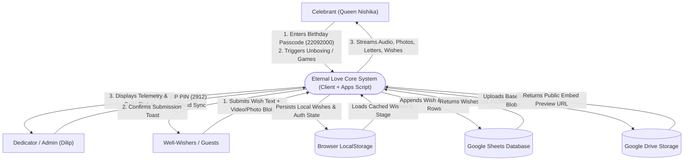
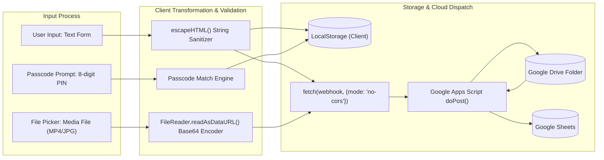
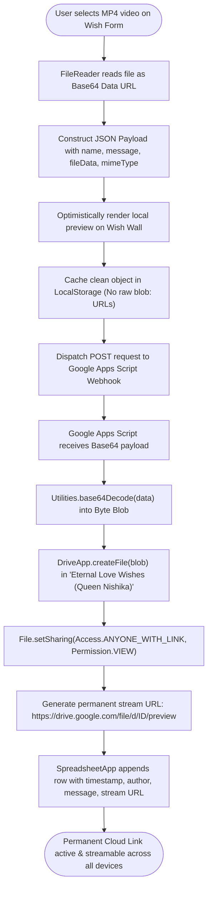

# Data Flow Diagrams (DFD) — Eternal Love (Queen Nishika Birthday Portal)

---

## 1. Level 0 Context DFD

[VERIFIED] The Level 0 DFD defines the information exchange between external actors (Celebrant, Dedicator, Guests) and the **Eternal Love** core system.

---

## 2. Level 1 Detailed Data Flow Diagram

---

## 3. Video Wish Upload & Cloud Sync Data Flow

