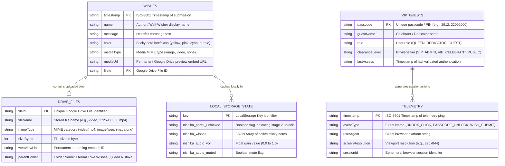

# Database Entity-Relationship (ER) Diagram — Eternal Love

---

## 1. Relational & Storage Entity Model

[VERIFIED] The following Mermaid Entity-Relationship (ER) diagram documents the schema structure of the Google Sheets tabular database, Google Drive blob storage, and client LocalStorage cache.

---

## 2. Table & Field Specifications

### 2.1 Table: `Wishes` (Google Sheets Tab 1)
| Column Name | Data Type | Constraints | Purpose / Semantic Content |
| :--- | :--- | :--- | :--- |
| `timestamp` | STRING (ISO-8601) | Primary Key / Required | Exact date and time when wish was recorded. |
| `name` | STRING (VarChar 100) | Required / Sanitized | Display name of the guest or dedicator. |
| `message` | STRING (Text) | Required / Sanitized | The body text of the birthday wish. |
| `color` | STRING (VarChar 20) | Enum ('yellow','pink','cyan') | Background color accent of the sticky note. |
| `mediaType` | STRING (VarChar 20) | Enum ('none','image','video') | Attached media category. |
| `mediaUrl` | STRING (URL) | Nullable | Permanent Google Drive embed streaming URL. |
| `fileId` | STRING (VarChar 64) | Foreign Key -> `DRIVE_FILES` | Unique Google Drive cloud file identifier. |

---

### 2.2 Table: `DRIVE_FILES` (Google Drive Blob Storage)
| Field Name | Data Type | Constraints | Description |
| :--- | :--- | :--- | :--- |
| `fileId` | STRING | Primary Key | Google Drive internal identifier. |
| `fileName` | STRING | Required | Auto-generated timestamped file name. |
| `mimeType` | STRING | Required | Extracted MIME format (e.g. `video/mp4`). |
| `sizeBytes` | INTEGER | Max <= 50MB | File binary payload size. |
| `webViewLink` | STRING | URL | `https://drive.google.com/file/d/<fileId>/preview` |
| `parentFolder`| STRING | Fixed Folder | Target folder: `"Eternal Love Wishes (Queen Nishika)"` |

---

### 2.3 Table: `LOCAL_STORAGE_STATE` (Client Browser Web Storage)
| Key Name | JSON Value Schema | Lifespan | Description |
| :--- | :--- | :--- | :--- |
| `nishika_portal_unlocked` | `"true"` / `"false"` | Persistent | Persists stage 2 unlocked status across reloads. |
| `nishika_wishes` | `Array<WishObject>` | Persistent | Cached list of wishes for instant zero-latency rendering. |
| `nishika_audio_vol` | `"0.5"` | Persistent | User-selected volume slider gain value. |
| `nishika_audio_muted` | `"true"` / `"false"` | Persistent | Tracks audio mute toggle state. |
