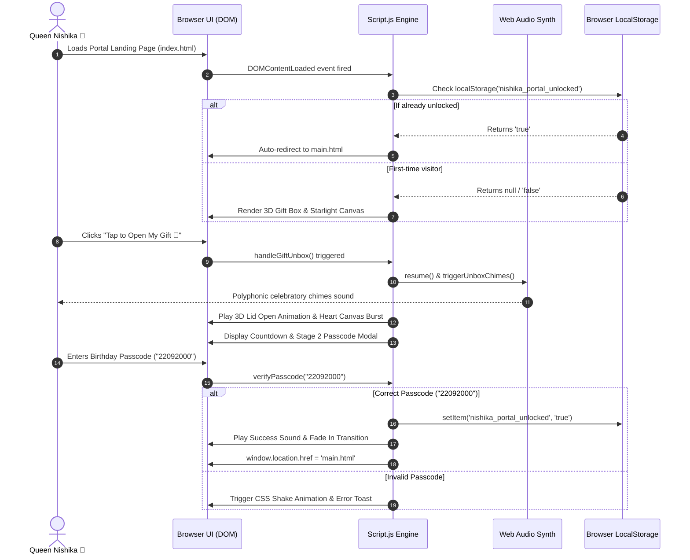
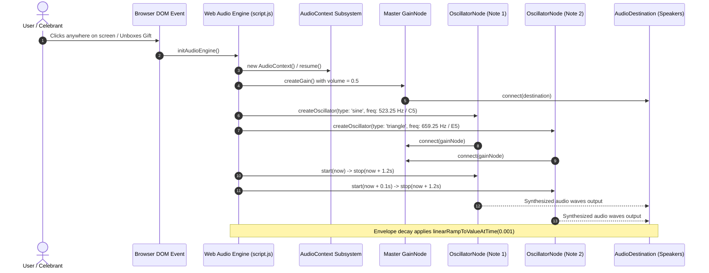
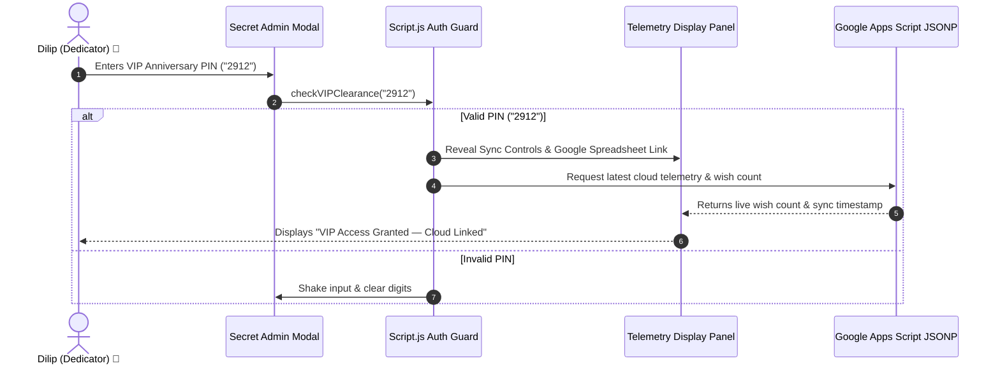

# Sequence Diagrams — Eternal Love (Queen Nishika Birthday Portal)

---

## 1. End-to-End Unboxing & Passcode Authentication Flow

[VERIFIED] The sequence below details Queen Nishika's unboxing interaction on `index.html` through passcode entry and transition to `main.html`.



---

## 2. Multimedia Wish Submission & Google Cloud Sync Sequence

```mermaid
sequenceDiagram
    autonumber
    actor Guest as Well-Wisher / Guest
    participant Form as Wish Form (DOM)
    participant Encoder as Base64 FileReader Engine
    participant Wall as Sticky Wish Wall
    participant Storage as LocalStorage
    participant Webhook as Google Apps Script (Code.gs)
    participant Drive as Google Drive Storage
    participant Sheets as Google Sheets Database

    Guest->>Form: Enters Name, Wish Message, and selects MP4 Video
    Guest->>Form: Clicks "Submit Royal Wish ✨"
    Form->>Encoder: readAsDataURL(videoFile)
    Encoder-->>Form: Returns Base64 String ("data:video/mp4;base64,...")
    
    Form->>Wall: Optimistically pin temporary sticky note
    Form->>Storage: Save wish item (clean data, no ephemeral blob URLs)
    
    Form->>Webhook: POST Base64 Payload via fetch(mode: 'no-cors')
    activate Webhook
    Webhook->>Webhook: Utilities.base64Decode(data)
    Webhook->>Drive: DriveApp.createFile(videoBlob) in Folder
    Drive->>Drive: setSharing(ANYONE_WITH_LINK, VIEW)
    Drive-->>Webhook: Returns File ID & Stream URL
    Webhook->>Sheets: SpreadsheetApp.appendRow([Timestamp, Name, Message, StreamURL])
    Sheets-->>Webhook: Transaction Committed
    deactivate Webhook
    
    Form-->>Guest: Displays "Wish Saved to Cloud ✨" Notification Toast
```

---

## 3. Web Audio Polyphonic Synthesizer Generation Sequence



---

## 4. VIP Dedicator Admin Authentication Sequence


