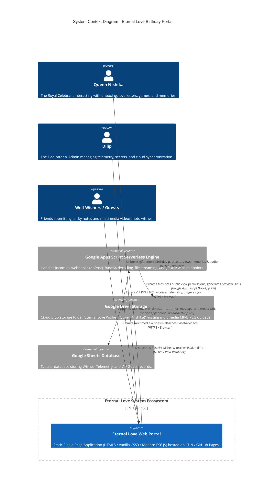
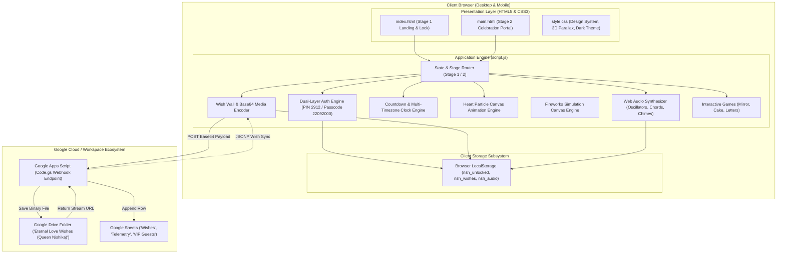
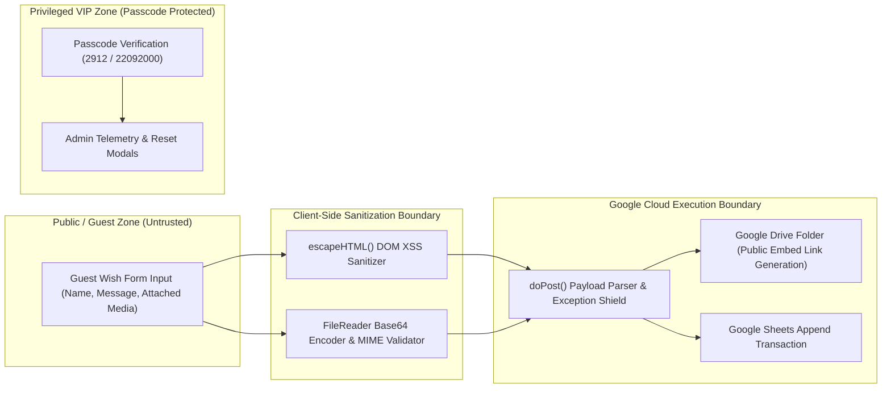
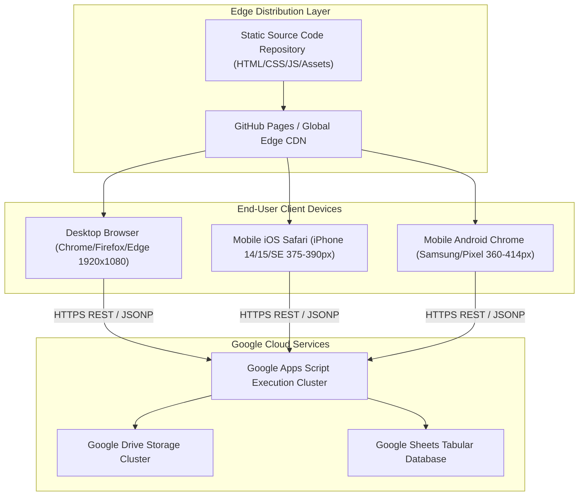

# System Architecture Diagrams — Eternal Love (Queen Nishika Birthday Portal)

---

## 1. System Context Diagram (C4 Level 1)

[VERIFIED] The following Mermaid diagram illustrates the high-level actors, external cloud ecosystems, and core system boundaries of the **Eternal Love** application.

---

## 2. Component Architecture Diagram (C4 Level 2)

---

## 3. Security Boundary & Data Trust Zone Model

---

## 4. Deployment Topology Diagram

