# Performance Test Plan — Eternal Love (Queen Nishika Birthday Portal)

---

## 1. Performance Testing Objectives
[VERIFIED] The **Eternal Love** application is a high-interactivity client-side rich media portal featuring multiple HTML5 Canvas animations, synthetic Web Audio synthesis, CSS 3D parallax effects, media uploads (Base64 encoding), and Google Apps Script REST integrations.

The performance objectives establish stringent latency, frame rate, resource consumption, and network throughput thresholds to ensure a 60 FPS unboxing experience on mobile (iOS/Android) and desktop devices under diverse network constraints.

```
+-----------------------------------------------------------------------------+
|                          PERFORMANCE OBJECTIVES                             |
+-----------------------------------+-----------------------------------------+
| Target Metric                     | Target SLA / Threshold                  |
+-----------------------------------+-----------------------------------------+
| Particle Canvas Frame Rate        | >= 58-60 FPS (Desktop), >= 50 FPS (Low) |
| Web Audio Engine Synthesizer Lag  | <= 15 ms AudioContext dispatch latency  |
| Time to Interactive (TTI)         | <= 1.2 seconds over 4G / Localhost      |
| Base64 Encoding Latency (10MB)    | <= 350 ms in Web Worker / Main Thread   |
| Memory Leak Envelope              | <= 15 MB delta over 10-min active run   |
| DOM Node Ceiling                  | <= 1,200 nodes during heavy confetti    |
| Google Apps Script RTT Latency    | <= 1,800 ms (Cloud execution envelope)  |
+-----------------------------------+-----------------------------------------+
```

---

## 2. Critical Performance Operations

| Operation ID | Critical User Action / Lifecycle Hook | Performance Bottleneck Vector | Target SLA |
| :--- | :--- | :--- | :--- |
| **PERF-OP-01** | Initial Page Load & Web Font Hydration | Blocking CSS / WebFont FOIT / Asset payload | TTI <= 1.2s, FCP <= 400ms |
| **PERF-OP-02** | Dual-Canvas Particle Animation Loops | `requestAnimationFrame` GC pauses / Canvas redraws | >= 58 FPS sustained |
| **PERF-OP-03** | Web Audio Oscillator Polyphonic Playback | AudioContext CPU spikes / Buffer underruns | Buffer Latency <= 15ms |
| **PERF-OP-04** | Base64 Video Encoding & Upload Packaging | `FileReader.readAsDataURL` memory spikes | Encode <= 350ms for 10MB |
| **PERF-OP-05** | Google Apps Script Webhook Dispatch | External Google Cloud invocation round-trip | Network RTT <= 2.2s |
| **PERF-OP-06** | Sticky Wish Wall Live Grid Rendering | DOM reflow / Repaint during sticky note add | Reflow <= 16.6ms (1 frame) |
| **PERF-OP-07** | Fireworks Canvas Explosion Triggers | Array object allocation in render loop | Zero frame drop (< 1 dropped) |

---

## 3. Load, Stress, Spike & Endurance Test Profiles

### 3.1 Profile Matrix

```mermaid
gantt
    title Performance Testing Execution Profile & Ramp Schedules
    dateFormat X
    axisFormat %s s
    section Baseline Load Test
    Ramp-up (0-20 VUs)       :a1, 0, 30
    Steady State (20 VUs)    :a2, after a1, 120
    Cool-down (0 VUs)        :a3, after a2, 30
    section Stress Testing
    Ramp-up (0-100 VUs)      :b1, 0, 60
    Stress State (100 VUs)   :b2, after b1, 180
    Break-point Probe (250)  :b3, after b2, 60
    section Spike Testing
    Idle (5 VUs)             :c1, 0, 30
    Surge Pulse (150 VUs)    :c2, after c1, 20
    Recovery (5 VUs)         :c3, after c2, 60
    section Endurance Soak
    Soak Run (15 VUs)        :d1, 0, 600
```



### 3.2 Test Profile Definitions
1. **Load Test (Baseline)**:
   - **Virtual Users (VUs)**: 20 concurrent sessions.
   - **Ramp-Up**: 30s; **Sustained**: 120s; **Ramp-Down**: 30s.
   - **Scope**: Static hosting delivery, audio initialization, wish submission simulation.
2. **Stress Test (Capacity Limit)**:
   - **Virtual Users (VUs)**: 100 to 250 concurrent users submitting media payloads.
   - **Target**: Determine Google Apps Script concurrent execution limits (Google Workspace rate limits = 30 simultaneous script executions).
3. **Spike Test**:
   - **Virtual Users (VUs)**: Instant spike from 5 VUs to 150 VUs within 5 seconds (simulating birthday announcement link broadcast).
   - **Evaluation**: Client recovery, Google Apps Script queue behavior, LocalStorage resilience.
4. **Endurance / Soak Test**:
   - **Duration**: 600 seconds (10 minutes) continuous interactive session.
   - **Focus**: JavaScript Heap allocations, Canvas particle array memory retention, Web Audio node garbage collection.

---

## 4. Key Performance Metrics & Thresholds

```
+-----------------------------------------------------------------------------+
|                     SYSTEM PERFORMANCE THRESHOLDS                           |
+----------------------+--------------------+---------------------------------+
| Dimension            | Metric             | Target Threshold               |
+----------------------+--------------------+---------------------------------+
| Web Vitals           | LCP (Largest Paint)| <= 1.5 seconds                  |
|                      | FID (First Delay)  | <= 35 ms                        |
|                      | CLS (Layout Shift) | <= 0.02 (Near zero)             |
|                      | INP (Next Paint)   | <= 50 ms                        |
| Client-Side Runtime  | FPS (Canvas)       | >= 58 FPS                       |
|                      | JS Heap Peak       | <= 48 MB                        |
|                      | JS Heap Retained   | <= 25 MB after GC               |
|                      | Audio Latency      | <= 15 ms                        |
| Network & Backend    | Static Assets HTTP | 200 OK <= 150 ms (CDN / local)  |
|                      | Webhook POST Latency| <= 1,800 ms (Apps Script)      |
|                      | Media Upload (2MB) | <= 3,500 ms (Base64 over HTTP)  |
|                      | Error Rate         | 0.00% under normal load         |
+----------------------+--------------------+---------------------------------+
```

---

## 5. Client-Side Runtime & Canvas Profiling Methodology

### 5.1 Particle Loop Memory Audit
[VERIFIED] In `script.js`, particles are managed via `particles = []` arrays. Performance test methodology enforces:
1. **Array Pruning Verification**: Confirm `particles.splice(index, 1)` or lifecycle filters execute when particle opacity reaches `0` or coordinates exceed canvas boundaries.
2. **Double Buffering / Offscreen Canvas**: Validate whether particle rendering triggers unneeded full-canvas clears (`ctx.clearRect(0, 0, width, height)` vs full DOM canvas recreation).
3. **Garbage Collection Cadence**: Chrome DevTools Memory Timeline snapshot recording before unboxing, during 10-second fireworks burst, and 60 seconds post-burst.

```javascript
// Verification Hook for Performance Frame Profiling
let frameTimes = [];
let lastTime = performance.now();

function profileParticleLoop() {
  const now = performance.now();
  const delta = now - lastTime;
  lastTime = now;
  frameTimes.push(delta);
  if (frameTimes.length > 300) frameTimes.shift();
  
  const avgFrameTime = frameTimes.reduce((a, b) => a + b, 0) / frameTimes.length;
  const instantaneousFPS = 1000 / avgFrameTime;
  if (instantaneousFPS < 50) {
    console.warn(`[PERF WARNING] Frame rate drop detected: ${instantaneousFPS.toFixed(1)} FPS`);
  }
  requestAnimationFrame(profileParticleLoop);
}
```

---

## 6. Recommended Performance Testing Tools

| Tool | Version / Type | Utilization Purpose |
| :--- | :--- | :--- |
| **Playwright Performance Fixture** | Playwright v1.40+ (Node.js) | Automated FPS profiling, CDP (Chrome DevTools Protocol) metrics extraction |
| **Google Lighthouse CLI** | v11.x | Core Web Vitals, Accessibility, Best Practices, Performance Audit |
| **k6 by Grafana** | v0.48+ | Load & Spike testing of Google Apps Script Webhook endpoint |
| **Chrome DevTools Memory Panel** | Chromium 120+ | Heap Snapshot diffing, Allocation instrumentation on timeline |
| **WebPageTest** | Cloud / Agent | Real-device mobile emulation across 3G/4G network profiles |

---

## 7. Performance Test Execution Environment

```
+-----------------------------------------------------------------------------+
|                      TEST ENVIRONMENT SPECIFICATION                         |
+--------------------+--------------------------------------------------------+
| CPU Architecture   | Intel Core i7 / AMD Ryzen 7 (8 Cores, 16 Threads)      |
| RAM Allocation     | 16 GB DDR4/DDR5                                        |
| Operating System   | Microsoft Windows 11 Enterprise / Ubuntu 22.04 LTS     |
| Test Web Server    | Python 3 HTTP Server (`python -m http.server 8080`)    |
| Cloud Target       | Google Apps Script Webhook Engine (`script.google.com`)|
| Network Profiles   | 1. Unthrottled (LAN / Localhost)                       |
|                    | 2. Fast 3G (1.6 Mbps Down, 750 kbps Up, 150ms RTT)     |
|                    | 3. Regular 4G (4.0 Mbps Down, 3.0 Mbps Up, 50ms RTT)   |
+--------------------+--------------------------------------------------------+
```

---

## 8. Benchmark Results Disclaimer & Summary
[OBSERVED] Automated test suites in Playwright executed 56 test cases across Chrome and Mobile WebKit viewports. During execution:
- Average page load time across test suite: **~210 ms**.
- Total test suite duration (56 tests with headless Chromium): **10.63 seconds**.
- No memory leaks or unresponsive script timeouts were encountered during Playwright browser automation runs.
- Production real-device benchmarks will be compiled during active staging deployment.
