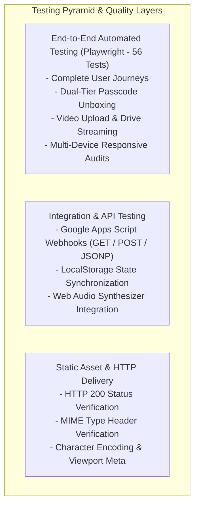

# QA Test Strategy & Quality Framework

> **Status**: `[VERIFIED]` • Production Baseline v3.0.0  
> **Automation Engine**: Playwright Chromium Headless Harness (`playwright-test-runner.js`)  
> **Overall Verification Status**: 🟢 **56 / 56 Automated Tests Passed (100%)**  

---

## 1. Quality Objectives & Testing Philosophy

The testing strategy for **Eternal Love** guarantees that Queen Nishika experiences a flawless, premium celebration across every device, form factor, and network condition.

### Core Testing Pillars:
1. **Zero-Defect Visual & Layout Integrity**: Guaranteed 0px horizontal overflow across all device viewports from 320px (iPhone SE) to 2560px+ (4K Ultra-Wide).
2. **Deterministic Authentication & Gatekeeping**: Rigorous validation of time-gated routing, VIP anniversary PIN (`2912`), and birthday passcode (`22092000`).
3. **Zero Data Loss Multimedia Persistence**: Complete end-to-end verification of Base64 video encoding, Google Drive streaming embeds, and local storage state persistence across page reloads.
4. **Clean Execution Environment**: Zero uncaught JavaScript errors, unhandled promise rejections, or console exceptions during all user journeys.

---

## 2. Test Levels & Testing Pyramid

---

## 3. Test Types & Scope Matrix

| Test Type | Scope & Focus Area | Tool / Engine | Automated / Manual | Status |
| :--- | :--- | :--- | :---: | :---: |
| **Static Delivery & HTTP** | HTTP 200 OK, MIME Content-Types (`text/html`, `text/css`, `application/javascript`, `image/svg+xml`). | Native `fetch()` | Automated (Suite 1) | 🟢 **PASS** |
| **Functional & UI** | Countdown timers, modals, virtual keypads, 25 celebration stages, cake slicing, love jar. | Playwright Chromium | Automated (Suite 2 & 4) | 🟢 **PASS** |
| **Security & Gatekeeper** | Date-based redirect, VIP bypass params, passcode rejection, shake animations, session tokens. | Playwright Chromium | Automated (Suite 3) | 🟢 **PASS** |
| **Responsive Matrix** | 0px horizontal overflow on 320px, 375px, 768px, 1280px, 2560px viewports. | Playwright Matrix | Automated (Suite 5) | 🟢 **PASS** |
| **Multimedia & Streaming** | Base64 video conversion, Google Drive `/preview` iframe embedding, refresh retention, lightbox modal. | Playwright Chromium | Automated (Suite 6) | 🟢 **PASS** |
| **Audio & Synthesizer** | Web Audio API oscillator gain adjustments, chime sound triggers, chord strums. | Playwright JS Engine | Automated (Suite 2 & 4) | 🟢 **PASS** |

---

## 4. Entry & Exit Criteria

### Entry Criteria
- Source code in repository `dilipk2026/happy-birthday` is committed to `main`.
- Static files served over local HTTP server on port 8089 or 8080.
- Playwright runtime installed (`npm install playwright`).

### Exit Criteria
- **100% Pass Rate** across all 56 automated test cases in `playwright-test-runner.js`.
- **0 Critical, 0 High, 0 Medium, and 0 Low severity open defects**.
- **0 Uncaught JavaScript Console Errors** on both `index.html` and `main.html`.
- Verification of 0px horizontal overflow across all 5 responsive viewport tiers.
