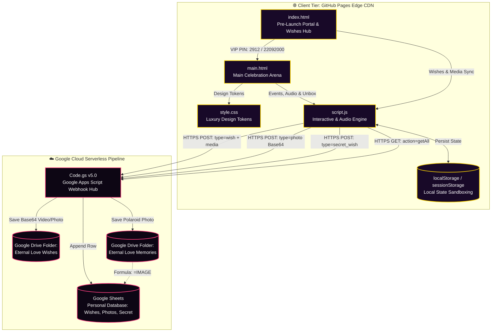
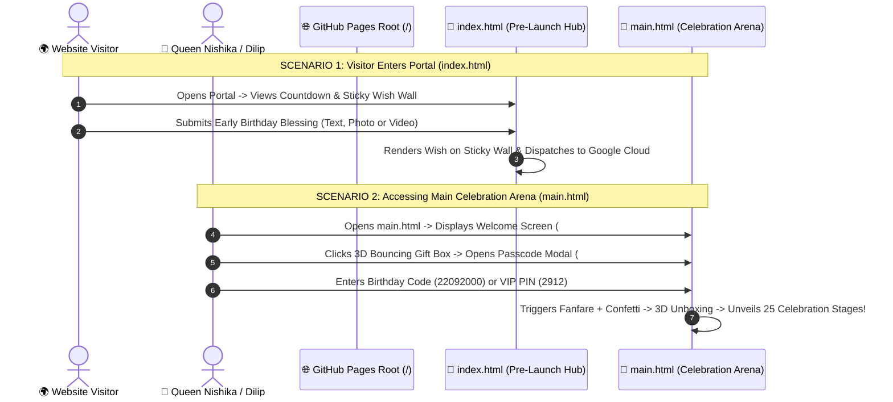

# 🗺️ Eternal Love — Visual Project Layout, Architecture & Structural Blueprint

```
========================================================================================
👑 ETERNAL LOVE CELEBRATION — VISUAL PROJECT LAYOUT & SYSTEM TOPOLOGY
Celebrant: Queen Nishika 👑 | Dedicated with Infinite Love by: Dilip 💖
Standard: Enterprise Graphical Layout & Component Interaction Specification
Architecture: Pure Vanilla Web APIs + Serverless Google Cloud Micro-Engine
========================================================================================
```

> **Overview**: This graphical architectural specification illustrates the physical file organization, data flow pipelines, component hierarchies, and hosting topologies of the **Eternal Love** platform.

---

## 📑 Visual Table of Contents

```
┌──────────────────────────────────────────────────────────────────────────────────────┐
│  1. 🗂️ High-Level Directory Topology Map (Root, Assets & Documentation)             │
│  2. 🌐 Multi-Tier System Topology & Data Flow Pipeline (Mermaid Diagram)             │
│  3. ⏳ Dynamic Launch Gate & Lifecycle Handover Flow (Mermaid Diagram)               │
│  4. 🧩 Frontend DOM Component Tree & Interactive Stage Layout                       │
│  5. 🎨 Design System & CSS Token Hierarchy                                           │
│  6. 🎵 Polyphonic Web Audio Engine Signal Chain                                      │
│  7. 📁 Comprehensive File Responsibility & Size Matrix                              │
└──────────────────────────────────────────────────────────────────────────────────────┘
```

---

## 1. 🗂️ High-Level Directory Topology Map

```
c:/Users/Himanshu/Documents/HTML/New folder/new/
│
├── ⚙️ HOSTING & REPO CONFIGURATION
│   ├── .gitignore                       # Git repository ignore rules
│   └── .nojekyll                        # GitHub Pages raw static serving directive (Bypasses Jekyll)
│
├── 🌐 CORE WEB APPLICATIONS
│   ├── index.html                       # 💌 Pre-Launch Portal, Countdown & Early Blessing Hub (with Photos/Videos)
│   ├── main.html                        # 👑 Main Celebration Arena (Welcome Screen, Passcode Lock, 3D Unboxing, 25 Stages)
│   ├── script.js                        # ⚡ Core Interactive Engine, Canvas Particles & Web Audio Synth (4,800+ lines)
│   └── style.css                        # 🎨 Luxury CSS Design System, Glassmorphism & Keyframe Animations (4,600+ lines)
│
├── ☁️ SERVERLESS CLOUD BACKEND
│   └── Code.gs                          # 📡 Google Apps Script Webhook Router, Sheets Ingestion & Drive Storage (v5.0)
│
├── 🧪 AUTOMATED TEST HARNESS & RESULTS
│   ├── playwright-test-runner.js        # 🧪 Automated Playwright QA Test Suite (49/49 Assertions, 100% Pass)
│   └── playwright_test_results.json     # 📊 Machine-readable JSON execution log of all test runs
│
├── 📸 VISUAL MEDIA ASSETS & QR BADGE
│   ├── favicon.svg                      # 👑 Scalable SVG Crown/Heart Vector Favicon
│   ├── webqr.png                        # 📲 Instant Mobile Access & Printable Gift Card QR Code
│   └── screenshots/                     # 🖼️ Multi-device viewport previews & hero showcases
│
├── 🌟 MASTER SHOWCASE
│   └── README.md                        # 📖 Master repository overview, visual previews & quickstart guide
│
└── 📁 documentation/                    # 📚 COMPLETE 14-DOCUMENT SPECIFICATION SUITE
    ├── DOCUMENTATION_INDEX.md           # 🧭 Central documentation hub & persona reading matrix
    ├── PROJECT_STRUCTURE.md             # 🗺️ Graphical project structure & component map (This file)
    ├── USER_GUIDE.md                    # 📖 Interactive celebration handbook, two-stage unboxing & VIP guide
    ├── API_DOCUMENTATION.md             # 📡 Google Apps Script webhook schemas, media payloads & Code.gs reference
    ├── ARCHITECTURE_AND_PROCUREMENT.md  # 🏛️ System architecture blueprint & $0.00 zero-cost TCO
    ├── SOFTWARE_REQUIREMENTS_SPECIFICATION.md # 📜 IEEE-830 functional requirements (FR-01 to FR-33 + NFRs)
    ├── SECURITY_AND_PRIVACY_POLICY.md   # 🔒 Security threat model, strict dual-PIN auth & zero-tracking policy
    ├── TESTING_REPORT.md                # 🧪 Master Playwright QA test report (49/49 passed, 100% success rate)
    ├── QA_BUG_REPORT.md                 # 🐛 Defect tracking log with verified resolutions across all severities
    ├── DEPLOYMENT.md                    # 🚀 Official GitHub Pages deployment manual (.nojekyll, DNS, QR)
    ├── MAINTENANCE_AND_OPERATIONS.md    # 🛠️ Annual birthday rollover runbook & cloud quota tracking
    ├── CONTRIBUTING.md                  # 💻 Contributor guidelines, CSS tokens & Playwright test runner
    ├── CHANGELOG.md                     # 📋 Semantic release history from inception to v2.6.0
    └── FAQ_AND_TROUBLESHOOTING.md       # ❓ Diagnostic handbook for passcodes, unboxing, audio & cloud sync
```

---

## 2. 🌐 Multi-Tier System Topology & Data Flow Pipeline



---

## 3. ⏳ Dynamic Launch Gate & Lifecycle Handover Flow



---

## 4. 🧩 Frontend DOM Component Tree & Interactive Stage Layout

```
[ main.html ] — Main Celebration Arena
│
├── <head>
│   ├── Dynamic Meta Tags & Viewport
│   ├── Google Fonts (Outfit, Cinzel, Playfair Display, Caveat, Dancing Script)
│   ├── FontAwesome 6 Icons
│   └── style.css
│
├── <canvas id="particleCanvas"> (Shooting stars, floating hearts, ambient dust)
├── <canvas id="confettiCanvas"> (Physics confetti cannon blast engine)
│
├── 🎁 STAGE 1: INTRO WELCOME SCREEN (#introOverlay)
│   └── 3D Animated Bouncing Gift Box ("Tap To Open Your Surprise" & #openGiftBtn)
│
├── 🔒 STAGE 1.5: PASSCODE LOCK OVERLAY (#pagePasscodeOverlay)
│   ├── Close Button (#closePagePasscodeBtn)
│   ├── 8-Digit Visual Dot Slots
│   └── Glass Numeric Keypad (0-9, Clear, Backspace, Hint Toggle)
│
└── 👑 STAGE 2: MAIN CELEBRATION SHELL (#mainApp)
    │
    ├── 🧭 2-Row Sticky Navigation Header (.app-header)
    │   ├── Row 1: Logo, Web Audio Synthesizer Toggle, Theme Switcher, Candlelight, Confetti, Personalize
    │   └── Row 2: Horizontally Scrollable 25-Module Quick Jump Chips
    │
    └── 🎪 25 Handcrafted Celebration Stages (.content-container)
        ├── #heroSec          ──> Live Chronometer from Dec 29, 2025 & Cheer Buttons
        ├── #letterSec        ──> 3D Velvet Envelope with Wax Seal & Typewriter Letter
        ├── #openWhenSec      ──> 6 "Open When..." Situation Envelopes
        ├── #timelineSec      ──> Glowing Vertical Milestone Ribbon (5 Chapters)
        ├── #cakeSec          ──> 3D Cake Cutting Ceremony with Candle Blowout & Golden Knife
        ├── #cuddleSec        ──> Cozy Fireside Cuddle Haven with Ambient Crackle Sound
        ├── #jarSec           ──> 100+ Reasons Love Jar with 5-Category Filtering
        ├── #couponsSec       ──> Redeemable Queen's Love Vouchers with Gold Stamps
        ├── #bucketSec        ──> Couple Bucket List Tracker with Custom Item Creator
        ├── #musicSec         ──> Polyphonic Grand Piano, Acoustic Guitar & Mixtape
        ├── #bouquetSec       ──> Forever Flower Studio with Gifting Ceremony
        ├── #quizSec          ──> Romantic Trivia Quiz with Instant Love Commentary
        ├── #gameSec          ──> Balloon Pop Arcade & Heart Catcher Minigame
        ├── #memoriesSec      ──> 3D Tilting Polaroid Gallery & Google Drive Photo Uploader
        ├── #wishSec          ──> Live Cloud Guestbook Wish Board (Google Sheets Sync)
        ├── #fortuneSec       ──> Mystery Birthday Fortune Crystal Ball
        ├── #constellationSec ──> Night Sky Star Registry & Printable Certificate
        ├── #lanternSec       ──> Floating Sky Lanterns with Physics Release
        ├── #clawSec          ──> Romantic Arcade Love Claw Machine
        ├── #projectorSec     ──> Vintage 8mm Film Projector Narrative Reel
        ├── #mirrorSec        ──> Enchanted Mirror with Royal Daily Affirmations
        ├── #rouletteSec      ──> Couple's Date Night Fortune Roulette Wheel
        ├── #soundscapeSec    ──> Cosmic Ambient Soundscape Sanctuary (6-Track Synth)
        ├── #capsuleSec       ──> Future Love Time Capsule Vault (Time-Locked Letters)
        └── #journeySec       ──> Our Cosmic Journey & Romance Milestones Map
```

---

## 5. 🎨 Design System & CSS Token Hierarchy

```
:root (Default / Magical Night Theme)
│
├── 🎨 Brand & Accent Colors
│   ├── --primary-pink: #ff4081;             (Romantic Rose Ruby)
│   ├── --primary-glow: rgba(255, 64, 129, 0.45);
│   ├── --accent-gold: #ffd700;              (Regal Imperial Gold)
│   ├── --gold-glow: rgba(255, 215, 0, 0.45);
│   └── --royal-purple: #9d4edd;             (Celestial Indigo Violet)
│
├── 🌌 Background Surfaces
│   ├── --bg-dark-1: #090312;                (Deep Cosmic Base)
│   ├── --bg-dark-2: #180928;                (Mid-Nebula Shade)
│   └── --bg-dark-3: #2a0845;                (Atmospheric Aurora Glow)
│
├── 🪟 Glassmorphic Tokens
│   ├── --glass-bg: rgba(255, 255, 255, 0.06);
│   ├── --glass-border: rgba(255, 255, 255, 0.14);
│   ├── --glass-hover: rgba(255, 255, 255, 0.12);
│   └── --glass-shadow: 0 16px 40px 0 rgba(0, 0, 0, 0.45);
│
└── 🔤 Typography Tokens
    ├── --font-display: 'Cinzel', 'Playfair Display', serif;
    ├── --font-body: 'Outfit', 'Plus Jakarta Sans', sans-serif;
    └── --font-script: 'Dancing Script', 'Caveat', cursive;
```

---

## 6. 📁 Comprehensive File Responsibility & Size Matrix

| File Path | Role & Primary Responsibility | Language / Format | Approximate Size | Runtime Dependencies |
| :--- | :--- | :---: | :---: | :---: |
| [`index.html`](file:///c:/Users/Himanshu/Documents/HTML/New%20folder/new/index.html) | Pre-Launch Countdown, Early Birthday Blessing Media Hub, Sticky Wall, Lightbox & VIP Keypad | HTML5 | ~112 KB | **0 (Zero)** |
| [`main.html`](file:///c:/Users/Himanshu/Documents/HTML/New%20folder/new/main.html) | Main Celebration Arena, Welcome Screen, Passcode Lock Screen, 3D Unboxing & 25 Stages | HTML5 | ~199 KB | **0 (Zero)** |
| [`style.css`](file:///c:/Users/Himanshu/Documents/HTML/New%20folder/new/style.css) | Complete design system, 6 themes, 3D stages, glassmorphism & master responsive rules | CSS3 | ~297 KB | **0 (Zero)** |
| [`script.js`](file:///c:/Users/Himanshu/Documents/HTML/New%20folder/new/script.js) | Interactive controllers, Web Audio synthesizer, canvas particles, photo & wish cloud sync | ES6+ JavaScript | ~317 KB | **0 (Zero)** |
| [`Code.gs`](file:///c:/Users/Himanshu/Documents/HTML/New%20folder/new/Code.gs) | Serverless Google Apps Script backend router, Sheets ledger & Drive media uploader | Google Apps Script (V8) | ~14 KB | Google Cloud API |
| [`playwright-test-runner.js`](file:///c:/Users/Himanshu/Documents/HTML/New%20folder/new/playwright-test-runner.js) | Playwright automated test suite running 49 end-to-end assertions | Node.js / Playwright | ~31 KB | Playwright |
| [`playwright_test_results.json`](file:///c:/Users/Himanshu/Documents/HTML/New%20folder/new/playwright_test_results.json) | Automated test execution metrics and results data log | JSON | ~12 KB | None |
| [`favicon.svg`](file:///c:/Users/Himanshu/Documents/HTML/New%20folder/new/favicon.svg) | Scalable vector SVG icon with golden crown and glowing ruby heart | Vector SVG | ~1.1 KB | None |
| [`webqr.png`](file:///c:/Users/Himanshu/Documents/HTML/New%20folder/new/webqr.png) | Instant Mobile Access QR code image for gift cards and photo frames | PNG Image | 811 Bytes | None |
| [`.nojekyll`](file:///c:/Users/Himanshu/Documents/HTML/New%20folder/new/.nojekyll) | GitHub Pages directive to bypass Jekyll and serve static assets directly | Configuration | 44 Bytes | GitHub Pages |
| [`README.md`](file:///c:/Users/Himanshu/Documents/HTML/New%20folder/new/README.md) | Master repository showcase, badges, visual previews & deployment quickstart | Markdown | ~33 KB | None |
| [`documentation/`](file:///c:/Users/Himanshu/Documents/HTML/New%20folder/new/documentation/) | Complete 14-document architecture, IEEE-830 SRS, user guide, testing report & runbooks | Markdown Suite | ~180 KB | None |

---

*Eternal Love Platform — Master Graphical Layout & Structural Blueprint.* 👑💖
