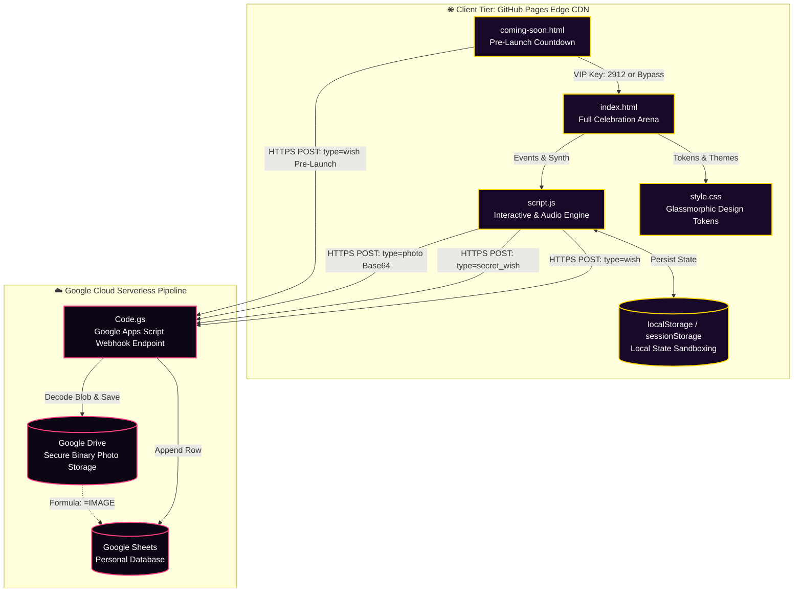
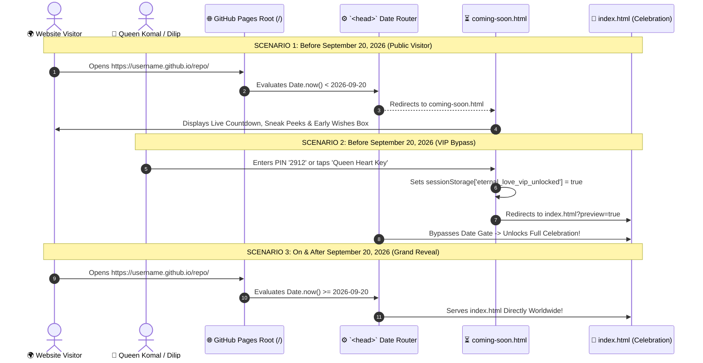

# 🗺️ Eternal Love — Visual Project Layout, Architecture & Structural Blueprint

```
========================================================================================
👑 ETERNAL LOVE CELEBRATION — VISUAL PROJECT LAYOUT & SYSTEM TOPOLOGY
Celebrant: Queen Komal 👑 | Dedicated with Infinite Love by: Dilip 💖
Standard: Enterprise Graphical Layout & Component Interaction Specification
Architecture: Pure Vanilla Web APIs + Serverless Google Cloud Micro-Engine
========================================================================================
```

> **Overview**: This graphical architectural specification illustrates the physical file organization, data flow pipelines, component hierarchies, and hosting topologies of the **Eternal Love** platform.

---

## 📑 Visual Table of Contents

```
┌──────────────────────────────────────────────────────────────────────────────────────┐
│  1. 🗂️ High-Level Directory Topology Map (Root, Assets & Documentation)             │
│  2. 🌐 Multi-Tier System Topology & Data Flow Pipeline (Mermaid Diagram)             │
│  3. ⏳ Dynamic Launch Gate & Lifecycle Handover (Pre-Sept 20 vs Post-Sept 20)         │
│  4. 🧩 Frontend DOM Component Tree & Interactive Stage Layout                       │
│  5. 🎨 Design System & CSS Token Hierarchy                                           │
│  6. 🎵 Polyphonic Web Audio Engine Signal Chain                                      │
│  7. 📁 Comprehensive File Responsibility & Size Matrix                              │
└──────────────────────────────────────────────────────────────────────────────────────┘
```

---

## 1. 🗂️ High-Level Directory Topology Map

```
c:/Users/Himanshu/Documents/HTML/New folder/new/
│
├── ⚙️ HOSTING & REPO DIRECTIVES
│   ├── .gitignore                       # Git repository ignore rules
│   └── .nojekyll                        # GitHub Pages raw static serving directive (Bypasses Jekyll)
│
├── 🌐 CORE WEB APPLICATIONS
│   ├── coming-soon.html                 # ⏳ Stage -1: Grand Launch Teaser & Live Countdown (Primary till Sept 20)
│   ├── index.html                       # 👑 Stage 0-20: Full Celebration Arena & 3D Stages (Primary on/after Sept 20)
│   ├── script.js                        # ⚡ Core Interactive Engine, Canvas Particles & Web Audio Synth (4,700+ lines)
│   └── style.css                        # 🎨 Luxury CSS Design System, Glassmorphism & Keyframe Animations (4,500+ lines)
│
├── ☁️ SERVERLESS BACKEND
│   └── Code.gs                          # 📡 Google Apps Script Webhook Router, Sheets Ingestion & Drive Storage
│
├── 📸 VISUAL MEDIA ASSETS & QR BADGE
│   ├── webqr.png                        # 📲 Instant Mobile Access & Printable Gift Card QR Code
│   └── screenshots/                     # 🖼️ Multi-device viewport previews & hero showcases
│       ├── 01-desktop-hero.png          # Desktop widescreen cinema view (1366px × 768px)
│       ├── 07-mobile-hero.png           # Mobile 2-row sticky navigation preview (375px)
│       ├── 08-mobile-jar.png            # Mobile 100+ Reasons Love Jar preview
│       └── 09-mobile-cuddle.png         # Mobile Cuddle Haven cinema preview
│
├── 🌟 MASTER SHOWCASE
│   └── README.md                        # 📖 Master repository overview, visual previews & quickstart guide
│
└── 📁 documentation/                    # 📚 COMPLETE 12-DOCUMENT SPECIFICATION SUITE
    ├── DOCUMENTATION_INDEX.md           # 🧭 Central documentation hub & persona reading matrix
    ├── PROJECT_STRUCTURE.md             # 🗺️ Graphical project structure & component map (This file)
    ├── USER_GUIDE.md                    # 📖 Interactive celebration handbook & VIP unlock instructions
    ├── API_DOCUMENTATION.md             # 📡 Google Apps Script webhook schemas, payloads & functions
    ├── ARCHITECTURE_AND_PROCUREMENT.md  # 🏛️ System architecture blueprint & $0.00 zero-cost TCO
    ├── SOFTWARE_REQUIREMENTS_SPECIFICATION.md # 📜 IEEE-830 functional requirements (FR-01 to FR-28)
    ├── SECURITY_AND_PRIVACY_POLICY.md   # 🔒 Security threat model, sandboxing & zero-tracking policy
    ├── TESTING_REPORT.md                # 🧪 Multi-device matrix verification & CDP test report
    ├── DEPLOYMENT.md                    # 🚀 Official GitHub Pages deployment manual (.nojekyll, DNS, QR)
    ├── MAINTENANCE_AND_OPERATIONS.md    # 🛠️ Annual birthday rollover runbook & cloud quota tracking
    ├── CONTRIBUTING.md                  # 💻 Contributor guidelines, CSS tokens & coding standards
    ├── CHANGELOG.md                     # 📋 Semantic release history from inception to v2.1.0
    └── FAQ_AND_TROUBLESHOOTING.md       # ❓ Diagnostic handbook for audio unlock, sync & display fixes
```

---

## 2. 🌐 Multi-Tier System Topology & Data Flow Pipeline



---

## 3. ⏳ Dynamic Launch Gate & Lifecycle Handover



---

## 4. 🧩 Frontend DOM Component Tree & Interactive Stage Layout

```
[ index.html ] — Single Page Application (SPA) Arena
│
├── <head>
│   ├── Dynamic Launch Router Script (Date Gate)
│   ├── Google Fonts (Outfit, Cinzel, Playfair Display, Caveat, Dancing Script)
│   ├── FontAwesome 6 Icons
│   └── style.css
│
├── <canvas id="particleCanvas"> (Shooting stars, floating hearts, ambient dust)
├── <canvas id="confettiCanvas"> (Physics confetti cannon blast engine)
│
├── 🎁 STAGE 1: INTRO UNBOXING OVERLAY (#introOverlay)
│   └── 3D Surprise Gift Box with lid-opening physics & audio fanfare
│
├── 👑 STAGE 2: MAIN CELEBRATION SHELL (#mainApp)
│   │
│   ├── 🧭 2-Row Sticky Navigation Header (.app-header)
│   │   ├── Row 1: Logo, Web Audio Synthesizer Toggle, Mode Switcher, Candlelight, Confetti, VIP Shortcuts
│   │   └── Row 2: Horizontally Scrollable 21-Module Quick Jump Chips
│   │
│   └── 🎪 21 Handcrafted Celebration Stages (.content-container)
│       ├── #heroSec          ──> Live Countdown from Dec 29, 2025 & Cheer Buttons
│       ├── #letterSec        ──> 3D Velvet Envelope with Monogram Wax Seal & Typewriter Letter
│       ├── #openWhenSec      ──> 6 "Open When..." Situation Envelopes
│       ├── #timelineSec      ──> Glowing Vertical Milestone Ribbon (5 Chapters)
│       ├── #cakeSec          ──> 3D Cake Cutting Ceremony with Candle Blowout & Golden Knife
│       ├── #cuddleSec        ──> Cozy Fireside Cuddle Haven with Ambient Crackle Sound
│       ├── #jarSec           ──> 100+ Reasons Love Jar with 5-Category Filtering
│       ├── #couponsSec       ──> Redeemable Queen's Love Vouchers with Gold Stamps
│       ├── #bucketSec        ──> Couple Bucket List Tracker with Custom Item Creator
│       ├── #musicSec         ──> Polyphonic Grand Piano, Acoustic Guitar & Mixtape
│       ├── #bouquetSec       ──> Forever Flower Studio with Gifting Ceremony
│       ├── #quizSec          ──> Romantic Trivia Quiz with Instant Love Commentary
│       ├── #gameSec          ──> Balloon Pop Arcade & Heart Catcher Minigame
│       ├── #memoriesSec      ──> 3D Tilting Polaroid Gallery & Google Drive Photo Uploader
│       ├── #wishSec          ──> Live Cloud Guestbook Wish Board (Google Sheets Sync)
│       ├── #fortuneSec       ──> Mystery Birthday Fortune Crystal Ball
│       ├── #constellationSec ──> Night Sky Star Registry & Printable Certificate
│       ├── #lanternSec       ──> Floating Sky Lanterns with Physics Release
│       ├── #clawSec          ──> Romantic Arcade Love Claw Machine
│       ├── #projectorSec     ──> Vintage 8mm Film Projector Narrative Reel
│       └── #mirrorSec        ──> Enchanted Mirror with Royal Daily Affirmations
│
└── 🪟 ACCESSIBLE MODAL DIALOGS
    ├── #wishModal            ──> Birthday Candle Secret Wish Composer
    ├── #customizeModal       ──> Dynamic Name, Anniversary Date & Theme Switcher
    ├── #keepsakeModal        ──> Royal Keepsake Love Certificate Printable Exporter
    ├── #openWhenLetterModal  ──> Gold Deckled Parchment Stationery Reader
    └── #secretWishVaultModal ──> Queen's Secret Vault (PIN 2912 / Queen's Heart Key)
```

---

## 5. 🎨 Design System & CSS Token Hierarchy

```
:root (Default / Magical Night Theme)
│
├── 🎨 Brand & Accent Colors
│   ├── --primary-pink: #ff4081;             (Romantic Rose Ruby)
│   ├── --primary-glow: rgba(255, 64, 129, 0.45);
│   ├── --accent-gold: #ffd700;              (Regal Imperial Gold)
│   ├── --gold-glow: rgba(255, 215, 0, 0.45);
│   └── --royal-purple: #9d4edd;             (Celestial Indigo Violet)
│
├── 🌌 Background Surfaces
│   ├── --bg-dark-1: #090312;                (Deep Cosmic Base)
│   ├── --bg-dark-2: #180928;                (Mid-Nebula Shade)
│   └── --bg-dark-3: #2a0845;                (Atmospheric Aurora Glow)
│
├── 🪟 Glassmorphic Tokens
│   ├── --glass-bg: rgba(255, 255, 255, 0.06);
│   ├── --glass-border: rgba(255, 255, 255, 0.14);
│   ├── --glass-hover: rgba(255, 255, 255, 0.12);
│   └── --glass-shadow: 0 16px 40px 0 rgba(0, 0, 0, 0.45);
│
└── 🔤 Typography Tokens
    ├── --font-display: 'Cinzel', 'Playfair Display', serif;
    ├── --font-body: 'Outfit', 'Plus Jakarta Sans', sans-serif;
    └── --font-script: 'Dancing Script', 'Caveat', cursive;
```

---

## 6. 🎵 Polyphonic Web Audio Engine Signal Chain

```
[ User Interaction Trigger ] 
       │
       ▼
[ AudioContext (Suspended -> Running) ]
       │
       ├─► [ Sine Oscillator ]     ──┐
       ├─► [ Triangle Oscillator ] ──┼─► [ ADSR Gain Envelope ] ─► [ Lowpass Biquad Filter ] ─► [ AudioContext Destination ]
       ├─► [ Harmonic Overtone ]   ──┘   (Attack/Decay/Sustain)     (Warm Resonance: 1200Hz)      (Stereo Speakers / Headset)
       │
       └─► [ Brown Noise Buffer ]  ──► [ Embers Filter ] ─────► [ Cozy Fireplace Ambient Crackle ]
```

---

## 7. 📁 Comprehensive File Responsibility & Size Matrix

| File Path | Role & Primary Responsibility | Language / Format | Size (Bytes) | Runtime Dependencies |
| :--- | :--- | :---: | :---: | :---: |
| [`index.html`](file:///c:/Users/Himanshu/Documents/HTML/New%20folder/new/index.html) | Main single-page application shell, semantic structure, 21 stages & modals | HTML5 | ~149.5 KB | **0 (Zero)** |
| [`coming-soon.html`](file:///c:/Users/Himanshu/Documents/HTML/New%20folder/new/coming-soon.html) | Pre-launch teaser, live countdown to Sept 20, VIP bypass keypad & blessing box | HTML5 + Embedded CSS/JS | ~40.1 KB | **0 (Zero)** |
| [`style.css`](file:///c:/Users/Himanshu/Documents/HTML/New%20folder/new/style.css) | Complete design system, 6 themes, 3D stages, glassmorphism & keyframes | CSS3 | ~197.4 KB | **0 (Zero)** |
| [`script.js`](file:///c:/Users/Himanshu/Documents/HTML/New%20folder/new/script.js) | Interactive controllers, Web Audio synthesizer, canvas particles, cloud sync | ES6+ JavaScript | ~195.2 KB | **0 (Zero)** |
| [`Code.gs`](file:///c:/Users/Himanshu/Documents/HTML/New%20folder/new/Code.gs) | Serverless Google Apps Script backend router, Sheets ledger & Drive uploader | Google Apps Script (V8) | ~7.4 KB | Google Cloud API |
| [`webqr.png`](file:///c:/Users/Himanshu/Documents/HTML/New%20folder/new/webqr.png) | Instant Mobile Access QR code image for gift cards and photo frames | PNG Image | 811 Bytes | None |
| [`.nojekyll`](file:///c:/Users/Himanshu/Documents/HTML/New%20folder/new/.nojekyll) | GitHub Pages directive to bypass Jekyll and serve static assets directly | Configuration | 44 Bytes | GitHub Pages |
| [`README.md`](file:///c:/Users/Himanshu/Documents/HTML/New%20folder/new/README.md) | Master repository showcase, badges, visual previews & deployment quickstart | Markdown | ~31.8 KB | None |
| [`documentation/`](file:///c:/Users/Himanshu/Documents/HTML/New%20folder/new/documentation/) | Complete 13-document architecture, IEEE-830 SRS, user guide, API & runbooks | Markdown Suite | ~150.0 KB | None |

---

*Eternal Love Platform — Master Graphical Layout & Structural Blueprint.* 👑💖
